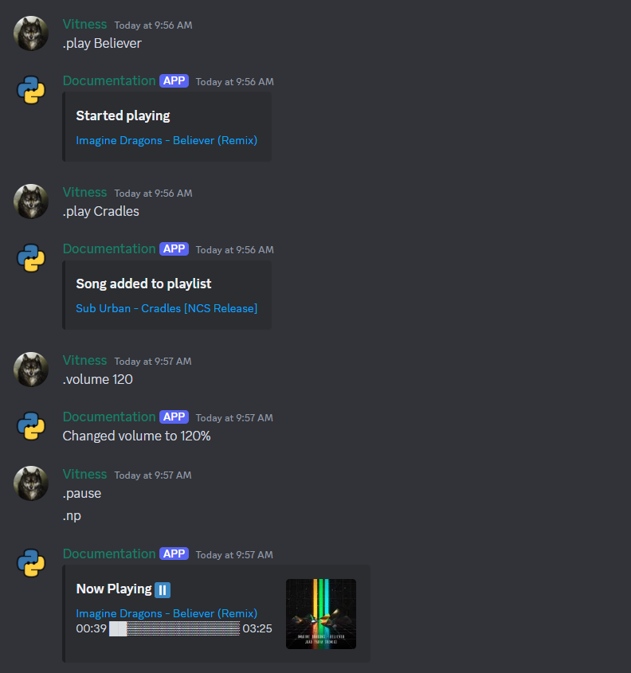

# Audio Playback

!!! warning "Reminder"
    Remember to install `discord.py[voice]` rather than just `discord.py` in order to obtain all necessary libraries for voice functionality.

## Installing ffmpeg

It's an executable needed to work with audio in discord.py. You can also use `avconv` instead

=== "Windows"

    Visit the [ffmpeg website](https://ffmpeg.org/download.html) and select the installation build.

    

    

    Unzip it and put where you like

=== "Linux"

    You can install ffmpeg using your package manager. An example of installing it with apt:
    
    ```bash
    sudo apt install ffmpeg
    ```

### Adding ffmpeg to PATH (for Windows)
    
The steps may vary slightly depending on your Windows version, but they are generally the same. If you're having trouble, you can find guides for your particular version on YouTube.

Press `Win` and search for "Edit environment variables"


Click `Path`, then click `Edit`


Click `New`


Enter your path to the `bin` directory of ffmpeg


    

## Voice basics

### Connecting to the voice channel

```python
@bot.command()
async def connect(ctx: commands.Context):
    await ctx.author.voice.channel.connect()
```

`ctx.author.voice` is `None` if user is not in the voice channel

### Disconnecting from the voice channel

```python
@bot.command()
async def disconnect(ctx: commands.Context):
    await ctx.voice_client.disconnect()
```

`ctx.voice_client` is `None` if bot is not in the voice channel

### Moving to another voice channel

```python
@bot.command()
async def disconnect(ctx: commands.Context, channel: discord.VoiceChannel):
    await ctx.voice_client.move_to(channel)
```

### Playing an audio

```python
@bot.command()
async def play(ctx: commands.Context):
    ctx.voice_client.play(discord.FFmpegPCMAudio("my-cool-music.mp3"))
```

If you need to set path to `ffmpeg` executable directly, use

```python
ctx.voice_client.play(discord.FFmpegPCMAudio("my-cool-music.mp3", executable="path/to/ffmpeg.exe"))
```

You can see other `FFmpegPCMAudio` possible arguments in the [docs](https://discordpy.readthedocs.io/en/stable/api.html#ffmpegpcmaudio). Instead of `FFmpegPCMAudio` also `FFmpegOpusAudio` can be used. 

#### What is PCM and Opus

[PCM](https://en.wikipedia.org/wiki/Pulse-code_modulation) - Think of this as raw audio; it is not encoded in anything special and is used by your computer at a lower level.

[Opus](https://en.wikipedia.org/wiki/Opus_(audio_format)) - This is a lossy audio format; it's an encoding applied to PCM that makes music playable over Discord. An Opus encoder generates Opus packets, which can play over Discord.

`FFmpegPCMAudio` produces PCM packets that need to be encoded to Opus.

`FFmpegOpusAudio` produces Opus packets, skipping the encoding step done by the library.

### Pause playing

```python
@bot.command()
async def pause(ctx: commands.Context):
    ctx.voice_client.pause()
```

### Resume playing

```python
@bot.command()
async def resume(ctx: commands.Context):
    ctx.voice_client.resume()
```

### Changing volume

If you want to have volume controls, use `PCMVolumeTransformer` when initializing the audio. Without that you won't be able to change the audio volume

```python
ctx.voice_client.play(discord.PCMVolumeTransformer(discord.FFmpegPCMAudio("my-cool-music.mp3")))
```

```python
@bot.command()
async def volume(ctx: commands.Context, volume: int):
    ctx.voice_client.source.volume = volume / 100
```

## Examples

### Putting all together

```python
import discord
from discord.ext import commands

intents = discord.Intents.default()
intents.message_content = True

bot = commands.Bot(command_prefix=".", intents=intents)


@bot.command()
async def connect(ctx: commands.Context):
    if ctx.author.voice is None:
        return await ctx.send("You are not connected to the voice channel!")
    await ctx.author.voice.channel.connect()
    await ctx.send("Connected!")


@bot.command()
async def disconnect(ctx: commands.Context):
    if ctx.voice_client is None:
        return await ctx.send("I am not connected to the voice channel!")
    await ctx.voice_client.disconnect()
    await ctx.send("Disconnected!")


@bot.command()
async def pause(ctx: commands.Context):
    if ctx.voice_client is None:
        return await ctx.send("I am not connected to the voice channel!")
    if ctx.voice_client.is_playing():
        ctx.voice_client.pause()
        await ctx.send("Paused!")


@bot.command()
async def resume(ctx: commands.Context):
    if ctx.voice_client is None:
        return await ctx.send("I am not connected to the voice channel!")
    if ctx.voice_client.is_paused():
        ctx.voice_client.resume()
        await ctx.send("Resumed playing!")


@bot.command()
async def play(ctx: commands.Context, file: str):
    if ctx.voice_client is None:
        return await ctx.send("I am not connected to the voice channel!")
    ctx.voice_client.play(discord.PCMVolumeTransformer(discord.FFmpegPCMAudio(f"music/{file}.mp3")))
    await ctx.send(f"Playing `{file}` :musical_note:")


@bot.command()
async def volume(ctx: commands.Context, volume: int):
    ctx.voice_client.source.volume = volume / 100
    await ctx.send(f"Changed volume to {volume}%")


bot.run("token")
```

!!! tip "Tip"
    You may improve the code better by using [custom checks](checks.md#custom-checks) rather than things like`if ctx.author.voice is None: ...`


### Creating custom voice client 

We can only play one song at a time right now. Let's extend `VoiceCLient` class to include a music queue

```python
class CustomVoiceClient(discord.VoiceClient):
    def __init__(self, *args, **kwargs):
        super().__init__(*args, **kwargs)
        self.queue = []

    def track_finished(self, error):
        self.queue.pop(0)
        if self.queue:
            self.play(self.queue[0], after=self.track_finished)

    def add_track(self, track: discord.AudioSource):
        self.queue.append(track)
        if len(self.queue) == 1:
            self.play(track, after=self.track_finished)

    def skip_track(self):
        if self.is_playing():
            self.stop()
        elif self.queue:
            self.queue.pop(0)
```

To use it instead of default one we need to pass the class in the `cls` argument when connecting to the channel

```python
await ctx.author.voice.channel.connect(cls=CustomVoiceClient)
```

### Adding buttons

```python
import discord
from discord.ext import commands

intents = discord.Intents.default()
intents.message_content = True

bot = commands.Bot(command_prefix=".", intents=intents)


class CustomVoiceClient(discord.VoiceClient):
    def __init__(self, *args, **kwargs):
        super().__init__(*args, **kwargs)
        self.queue = []

    def track_finished(self, error):
        self.queue.pop(0)
        if self.queue:
            self.play(self.queue[0], after=self.track_finished)

    def add_track(self, track: discord.AudioSource):
        self.queue.append(track)
        if len(self.queue) == 1:
            self.play(track, after=self.track_finished)

    def skip_track(self):
        if self.is_playing():
            self.stop()
        elif self.queue:
            self.queue.pop(0)


class PlayerView(discord.ui.View):
    def __init__(self, voice_client: CustomVoiceClient):
        super().__init__(timeout=None)
        self.voice_client = voice_client

    @discord.ui.button(emoji="🔉")
    async def reduce_volume(self, interaction: discord.Interaction, button: discord.Button):
        self.voice_client.source.volume -= 0.1
        await interaction.response.send_message(f"Volume is now {int(self.voice_client.source.volume * 100)}%", ephemeral=True)

    @discord.ui.button(emoji="⏯️")
    async def pause_or_resume(self, interaction: discord.Interaction, button: discord.Button):
        if self.voice_client.is_paused():
            self.voice_client.resume()
            await interaction.response.send_message("Resumed!", ephemeral=True)
        else:
            self.voice_client.pause()
            await interaction.response.send_message("Paused!", ephemeral=True)

    @discord.ui.button(emoji="🔊")
    async def increase_volume(self, interaction: discord.Interaction, button: discord.Button):
        self.voice_client.source.volume += 0.1
        await interaction.response.send_message(f"Volume is now {int(self.voice_client.source.volume * 100)}%", ephemeral=True)

    @discord.ui.button(emoji="⏭️")
    async def next_track(self, interaction: discord.Interaction, button: discord.Button):
        self.voice_client.skip_track()
        await interaction.response.send_message(f"Track skipped!", ephemeral=True)


@bot.command()
async def play(ctx: commands.Context, file: str):
    if ctx.author.voice is None:
        return await ctx.send("You are not connected to the voice channel!")
    if ctx.voice_client is None:
        voice_client = await ctx.author.voice.channel.connect(cls=CustomVoiceClient)
        voice_client.add_track(discord.PCMVolumeTransformer(discord.FFmpegPCMAudio(f"music/{file}.mp3")))
        await ctx.send(embed=discord.Embed(title="🎶 🎵 🎶 Playing music 🎶 🎵 🎶"), view=PlayerView(voice_client))
    else:
        ctx.voice_client.add_track(discord.PCMVolumeTransformer(discord.FFmpegPCMAudio(f"music/{file}.mp3")))


bot.run("token")
```

!!! tip "Tip"
    You can use your custom emojis to make the buttons look very cool


### Getting music from SoundCloud 

For that we will use a very nice wrapper of [Lavalink](https://github.com/lavalink-devs/Lavalink) for discord.py named wavelink. In addition, it can work with other platforms besides SoundCloud.

This is just a tiny sample of what you can do. Check out [wavelink docs](https://wavelink.dev/en/latest/) for more

Run this in a terminal to install it:

```bash
pip install wavelink
```

A Lavalink node will then be required. You can set it up by yourself, or you can find some in the internet. Actually, there are plenty of free ones.

```python
import discord
from discord.ext import commands
import wavelink

intents = discord.Intents.default()
intents.message_content = True

bot = commands.Bot(command_prefix=".", intents=intents)


def format_duration(mseconds):
    minutes, seconds = divmod(mseconds // 1000, 60)
    if minutes >= 60:
        hours, minutes = divmod(minutes, 60)
        return f"{hours:02}:{minutes:02}:{seconds:02}"
    return f"{minutes:02}:{seconds:02}"


def create_bar(position, duration):
    n = int(position * 15 // duration)
    return "█" * n + "▒" * (15 - n)


@bot.event
async def setup_hook():
    nodes = [wavelink.Node(uri="...", password="...")]
    await wavelink.Pool.connect(nodes=nodes, client=bot)


@bot.event
async def on_wavelink_track_end(payload: wavelink.TrackEndEventPayload):
    player = payload.player
    if player.queue:
        await player.play(player.queue.get())
    else:
        await player.disconnect()


@bot.command()
async def play(ctx: commands.Context, query: str):
    tracks = await wavelink.Pool.fetch_tracks(f"scsearch:{query}")
    if not tracks:
        return await ctx.send("Nothing found.")
    if ctx.author.voice is None:
        return await ctx.send("You are not connected to the voice channel!")
    if ctx.voice_client is None:
        player = await ctx.author.voice.channel.connect(cls=wavelink.Player)
    else:
        player = ctx.voice_client
    track = tracks[0]
    if player.playing:
        player.queue.put(track)
        embed = discord.Embed(title="Song added to playlist", description=f"[{track.title}]({track.uri})")
    else:
        await player.play(track)
        embed = discord.Embed(title="Started playing", description=f"[{track.title}]({track.uri})")
    await ctx.send(embed=embed)


@bot.command()
async def np(ctx: commands.Context):
    player = ctx.voice_client
    if not player or not player.playing:
        return await ctx.send("I am not playing anything now")
    track = player.current
    embed = discord.Embed(
        title=f"Now Playing {['▶️', '⏸️'][player.paused]}",
        description=f"[{track.title}]({track.uri})\n{format_duration(player.position)}  {create_bar(player.position, track.length)}  {format_duration(track.length)}")
    embed.set_thumbnail(url=track.artwork)
    await ctx.send(embed=embed)


@bot.command()
async def pause(ctx: commands.Context):
    if not ctx.voice_client:
        return await ctx.send("I am not playing anything now")
    await ctx.voice_client.pause(True)


@bot.command()
async def resume(ctx: commands.Context):
    if not ctx.voice_client:
        return await ctx.send("I am not playing anything now")
    await ctx.voice_client.pause(False)


@bot.command()
async def skip(ctx: commands.Context):
    if not ctx.voice_client:
        return await ctx.send("I am not playing anything now")
    await ctx.voice_client.skip()


@bot.command()
async def volume(ctx: commands.Context, volume: int):
    if not ctx.voice_client:
        return await ctx.send("I am not playing anything now")
    ctx.voice_client.set_volume(volume)
    await ctx.send(f"Changed volume to {volume}%")


bot.run("token")
```



