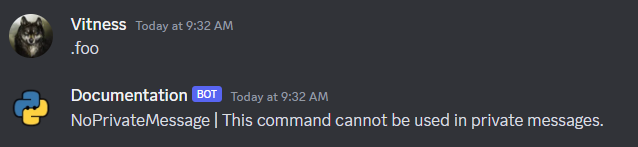
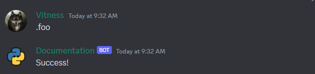
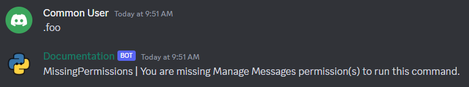
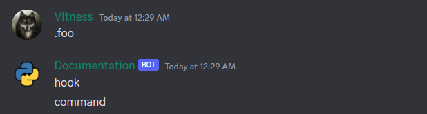
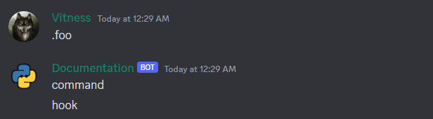
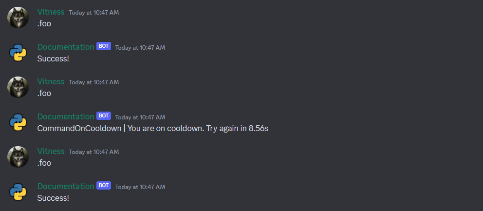
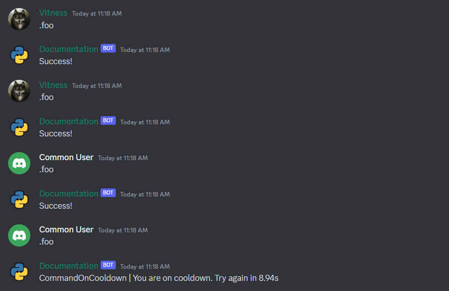
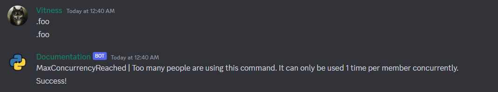

# Checks

[Checks](https://discordpy.readthedocs.io/en/stable/ext/commands/api.html?#checks) are utility decorators that are called before to the execution of commands.

These checks should be predicates that take in a single parameter taking a Context. If the check returns a False-like value then during invocation a
CheckFailure exception is raised.

If an exception should be thrown in the predicate then it should be a subclass of CommandError. Any exception not subclassed from it will be propagated.

## How to use?

Check is only a function that, based on the input, either throws an error or returns True/False.

You can apply them on your command by using [commands.check](https://discordpy.readthedocs.io/en/stable/ext/commands/api.html?#discord.ext.commands.check)
or [commands.check_any](https://discordpy.readthedocs.io/en/stable/ext/commands/api.html?#discord.ext.commands.check_any) decorator

## Built-in checks

You may view all of discord.py's relevant checks in the [documentation](https://discordpy.readthedocs.io/en/stable/ext/commands/api.html?#checks).

!!! note "Note"
    This error handler is used here for demonstration
    ```py
    @foo.error
    async def handler(ctx: commands.Context, error: commands.CommandError):
        await ctx.send(f"{error.__class__.__name__} | {error}")
    ```

### Roles

#### has_role

Checks if the member invoking the command has the role specified via the name or ID specified.

=== "Prefix Commands"
    === "With Name"
        ```py
        @bot.command()
        @commands.has_role("x")
        async def foo(ctx: commands.Context):
            await ctx.send(f"Success!")
        ```
    === "With ID"
        ```py
        @bot.command()
        @commands.has_role(1124650487942225970)
        async def foo(ctx: commands.Context):
            await ctx.send(f"Success!")
        ```
=== "Slash Commands"
    === "With Name"
        ```py
        @bot.tree.command()
        @app_commands.checks.has_role("x")
        async def foo(interaction: discord.Interaction):
            await interaction.response.send_message(f"Success!")
        ```
    === "With ID"
        ```py
        @bot.tree.command()
        @app_commands.checks.has_role(1124650487942225970)
        async def foo(interaction: discord.Interaction):
            await interaction.response.send_message(f"Success!")
        ```
=== "Hybrid Commands"
    === "With Name"
        ```py
        @bot.hybrid_command()
        @commands.has_role("x")
        async def foo(ctx: commands.Context):
            await ctx.send(f"Success!")
        ```
    === "With ID"
        ```py
        @bot.hybrid_command()
        @commands.has_role(1124650487942225970)
        async def foo(ctx: commands.Context):
            await ctx.send(f"Success!")
        ```






#### has_any_role

Similar to [has_role](#has_role), but takes unspecified amount of argument and returns True if the member invoking the command has **any** of the roles specified

#### bot_has_role

Similar to [has_role](#has_role) except checks if the bot itself has the role.

#### bot_has_any_role

Similar to [has_any_role](#has_any_role) except checks if the bot itself has the role.

### Permissions

!!! abstract "List of existing permissions"
    They are attributes of [discord.Permissions](https://discordpy.readthedocs.io/en/stable/api.html?#discord.Permissions)

    `add_reactions`, `administrator`, `attach_files`, `ban_members`, `change_nickname`, `connect`, `create_instant_invite`, `create_private_threads`, `create_public_threads`, `deafen_members`, `embed_links`, `external_emojis`, `external_stickers`, `kick_members`, `manage_channels`, `manage_emojis`, `manage_emojis_and_stickers`, `manage_events`, `manage_guild`, `manage_messages`, `manage_nicknames`, `manage_permissions`, `manage_roles`, `manage_threads`, `manage_webhooks`, `mention_everyone`, `moderate_members`, `move_members`, `mute_members`, `priority_speaker`, `read_message_history`, `read_messages`, `request_to_speak`, `send_messages`, `send_messages_in_threads`, `send_tts_messages`, `speak`, `stream`, `use_application_commands`, `use_embedded_activities`, `use_external_emojis`, `use_external_stickers`, `use_voice_activation`, `view_audit_log`, `view_channel`, `view_guild_insights`

#### has_permissions

Checks if the member has all of the permissions necessary.

=== "Prefix Commands"
    ```py
    @bot.command()
    @commands.has_permissions(manage_messages=True)
    async def foo(ctx: commands.Context):
        await ctx.send(f"Success!")
    ```
=== "Slash Commands"
    ```py
    @bot.tree.command()
    @app_commands.checks.has_permissions(manage_messages=True)
    async def foo(interaction: discord.Interaction):
        await interaction.response.send_message(f"Success!")
    ```
=== "Hybrid Commands"
    ```py
    @bot.hybrid_command()
    @commands.has_permissions(manage_messages=True)
    async def foo(ctx: commands.Context):
        await ctx.send(f"Success!")
    ```

!!! info "Note"
    This check operates on the current channel permissions, not the guild wide permissions




#### has_guild_permissions

Similar to [has_permissions](#has_permissions), but operates on guild wide permissions instead of the current channel permissions.

#### bot_has_permissions

Similar to [has_permissions](#has_permissions) except checks if the bot itself has the permissions listed.

#### bot_has_guild_permissions

Similar to [has_guild_permissions](#has_guild_permissions) except checks if the bot itself has the permissions listed.

### Channel

#### dm_only

Checks if command is invoked inside a DM

=== "Prefix Commands"
    ```py
    @bot.command()
    @commands.dm_only()
    async def foo(ctx: commands.Context):
        await ctx.send(f"Success!")
    ```
=== "Slash Commands"
    !!! question "Not check used"
        No equivalent check exists for application commands
=== "Hybrid Commands"
    ```py
    @bot.hybrid_command()
    @commands.dm_only()
    async def foo(ctx: commands.Context):
        await ctx.send(f"Success!")
    ```

#### guild_only

Checks if command is invoked inside a guild

=== "Prefix Commands"
    ```py
    @bot.command()
    @commands.guild_only()
    async def foo(ctx: commands.Context):
        await ctx.send(f"Success!")
    ```
=== "Slash Commands"
    ```py
    @bot.tree.command()
    @discord.app_commands.guild_only()
    async def foo(interaction: discord.Interaction):
        await interaction.response.send_message(f"Success!")
    ```

    !!! question "Not check used"
        No equivalent check exists for application commands

=== "Hybrid Commands"
    ```py
    @bot.hybrid_command()
    @commands.guild_only()
    async def foo(ctx: commands.Context):
        await ctx.send(f"Success!")
    ```

#### is_nsfw

Checks if the channel is a NSFW channel.

=== "Prefix Commands"
    ```py
    @bot.command()
    @commands.is_nsfw()
    async def foo(ctx: commands.Context):
        await ctx.send(f"Success!")
    ```
=== "Slash Commands"
    ```py
    @bot.tree.command(nsfw=True)
    async def foo(interaction: discord.Interaction):
        await interaction.response.send_message(f"Success!")
    ```
    !!! question "Not check used"
        No equivalent check exists for application commands
=== "Hybrid Commands"
    ```py
    @bot.hybrid_command()
    @commands.is_nsfw()
    async def foo(ctx: commands.Context):
        await ctx.send(f"Success!")
    ```

### Person

#### is_owner

Checks if the person invoking this command is the owner of the bot.

This is powered by [Bot.is_owner()](https://discordpy.readthedocs.io/en/stable/ext/commands/api.html?#discord.ext.commands.Bot.is_owner).

=== "Prefix Commands"
    ```py
    @bot.command()
    @commands.is_owner()
    async def foo(ctx: commands.Context):
        await ctx.send(f"Success!")
    ```
=== "Slash Commands"
    !!! question "Not check used"
        No equivalent check exists for application commands
=== "Hybrid Commands"
    ```py
    @bot.hybrid_command()
    @commands.is_owner()  
    async def foo(ctx: commands.Context):
        await ctx.send(f"Success!")
    ```

### Hooks

#### before_invoke

Registers a coroutine as a pre-invoke hook.

=== "Prefix Commands"
    ```py
    async def func(ctx: commands.Context):
        await ctx.send("hook")


    @bot.command()
    @commands.before_invoke(func)
    async def foo(ctx: commands.Context):
        await ctx.send("command")  
    ```
=== "Slash Commands"
    ```py
    async def func(interaction: discord.Interaction):
        await interaction.channel.send("hook")


    @bot.tree.command()
    @commands.before_invoke(func)
    async def foo(interaction: discord.Interaction):
        await interaction.response.send_message("command")  
    ```
=== "Hybrid Commands"
    ```py
    async def func(ctx: commands.Context):
        await ctx.send("hook")


    @bot.hybrid_command()
    @commands.before_invoke(func)
    async def foo(ctx: commands.Context):
        await ctx.send("command")  
    ```



#### after_invoke

Registers a coroutine as a post-invoke hook.

=== "Prefix Commands"
    ```py
    async def func(ctx: commands.Context):
        await ctx.send("hook")


    @bot.command()
    @commands.after_invoke(func)
    async def foo(ctx: commands.Context):
        await ctx.send("command")  
    ```
=== "Slash Commands"
    ```py
    async def func(interaction: discord.Interaction):
        await interaction.channel.send("hook")


    @bot.tree.command()
    @commands.after_invoke(func)
    async def foo(interaction: discord.Interaction):
        await interaction.response.send_message("command")  
    ```
=== "Hybrid Commands"
    ```py
    async def func(ctx: commands.Context):
        await ctx.send("hook")


    @bot.hybrid_command()
    @commands.after_invoke(func)
    async def foo(ctx: commands.Context):
        await ctx.send("command")  
    ```



### Cooldowns

A cooldown allows a command to only be used a specific amount of times in a specific time frame. These cooldowns can be based either on a per-guild,
per-channel, per-user, per-role or global basis. Denoted by the third argument of `type` which must be of enum
type [BucketType](https://discordpy.readthedocs.io/en/stable/ext/commands/api.html?highlight=cooldown#discord.ext.commands.BucketType).

#### cooldown

Adds a cooldown to a Command

=== "Prefix Commands"
    ```py
    @bot.command()
    @commands.cooldown(1, 10, commands.BucketType.user)
    async def foo(ctx: commands.Context):
        await ctx.send("Success!")
    ```
=== "Slash Commands"
    ```py
    @bot.tree.command()
    @app_commands.checks.cooldown(1, 10, key=lambda i: (i.user.id,))
    async def foo(ctx: commands.Context):
        await ctx.send("Success!")
    ```
=== "Hybrid Commands"
    ```py
    @bot.hybrid_command()
    @commands.cooldown(1, 10, commands.BucketType.user)
    async def foo(ctx: commands.Context):
        await ctx.send("Success!")
    ```



#### dynamic_cooldown

Adds a dynamic cooldown to a Command

This differs from [cooldown](#cooldown) in that it takes a function that accepts a single parameter of
type [Context](https://discordpy.readthedocs.io/en/stable/ext/commands/api.html?highlight=cooldown#discord.ext.commands.Context) ([Interaction](https://discordpy.readthedocs.io/en/stable/interactions/api.html#discord.Interaction) for slash) and must return
a [Cooldown](https://discordpy.readthedocs.io/en/stable/interactions/api.html#discord.app_commands.Cooldown) or `None`. If `None` is returned then that cooldown
is effectively bypassed.

=== "Prefix Commands"
    ```py
    def cooldown(ctx: commands.Context):
        """A cooldown for 10 seconds for everyone except listed users"""
        if ctx.author.id in (656919778572632094, 703327554936766554):
            return
        return commands.Cooldown(1, 10)


    @bot.command()
    @commands.dynamic_cooldown(cooldown, commands.BucketType.user)
    async def foo(ctx: commands.Context):
        await ctx.send("Success!")
    ```
=== "Slash Commands"
    ```py
    def cooldown(interaction: discord.Interaction):
        """A cooldown for 10 seconds for everyone except listed users"""
        if interaction.author.id in (656919778572632094, 703327554936766554):
            return
        return app_commands.Cooldown(1, 10)


    @bot.tree.command()
    @app_commands.checks.dynamic_cooldown(cooldown, commands.BucketType.user)
    async def foo(interaction: discord.Interaction):
        await interaction.response.send_message("Success!")
    ```
=== "Hybrid Commands"
    ```py
    def cooldown(ctx: commands.Context):
        """A cooldown for 10 seconds for everyone except listed users"""
        if ctx.author.id in (656919778572632094, 703327554936766554):
            return
        return commands.Cooldown(1, 10)


    @bot.hybrid_command()
    @commands.dynamic_cooldown(cooldown, commands.BucketType.user)
    async def foo(ctx: commands.Context):
        await ctx.send("Success!")
    ```



#### max_concurrency

Adds a maximum concurrency to a `Command`

This enables you to only allow a certain number of command invocations at the same time, for example if a command takes too long or if only one user can use it at a time. This differs from a cooldown in that there is no set waiting period or token bucket – only a set number of people can run the command.

=== "Prefix Commands"
    ```py
    @bot.command()
    @commands.max_concurrency(1, commands.BucketType.member, wait=False)
    async def foo(ctx: commands.Context):
        await asyncio.sleep(1)
        await ctx.send("Success!")
    ```
=== "Slash Commands"
    ```py
    @bot.tree.command()
    @commands.max_concurrency(1, commands.BucketType.member, wait=False)
    async def foo(interaction: discord.Interaction):
        await asyncio.sleep(1)
        await interaction.response.send_message("Success!")
    ```
=== "Hybrid Commands"
    ```py
    @bot.hybrid_command()
    @commands.max_concurrency(1, commands.BucketType.member, wait=False)
    async def foo(ctx: commands.Context):
        await asyncio.sleep(1)
        await ctx.send("Success!")
    ```



## Custom Checks

### Creating a new check

#### is_me

Creating a basic check to see if the command invoker is you.

```py
def check_if_it_is_me(ctx):
    return ctx.message.author.id == 85309593344815104


@bot.command()
@commands.check(check_if_it_is_me)
async def only_for_me(ctx):
    await ctx.send('I know you!')
```

#### safe_content

Checks if there are no banned words in the command's message content

```py
banwords = {"rabbit", "horse"}


async def safe_content(ctx):
    return not (set(ctx.message.content.lower().split()) & banwords)


@bot.command()
@commands.check(safe_content)
async def check_content(ctx):
    await ctx.send("Content is clean!")
```

### Extending existing checks

A special attribute named `predicate` is bound to the value returned
by [commands.check](https://discordpy.readthedocs.io/en/stable/ext/commands/api.html?#discord.ext.commands.check) decorator to retrieve the predicate passed to
the decorator.

```py
def owner_or_permissions(**perms):
    original = commands.has_permissions(**perms).predicate

    async def extended_check(ctx):
        if ctx.guild is None:
            return False
        return ctx.guild.owner_id == ctx.author.id or await original(ctx)

    return commands.check(extended_check)
```

This will create a check that uses `commands.has_permissions` with our custom check together to determine whether the user is the guild owner or he has the
required permissions.
