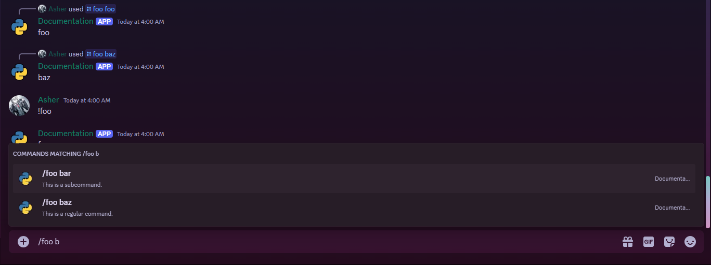

## What are cogs?

Cogs allow you to structure your bot's code into modules. They keep your code tidy and orderly while also preventing your bot code from becoming a monolithic monstrosity. Cogs are a technique to organize related commands, events, and tasks together, with the goal of making bot programming easier by using a few special methods.

## Difference between Cogs and Extensions

| Cogs                                         | Extensions                                                                                                        |
|----------------------------------------------|-------------------------------------------------------------------------------------------------------------------|
| A class that inherits from `commands.Cog`    | A Python module (file) that contains a Cog or a bunch of standalone callbacks (commands, events, listeners, etc.) |
| Used to organize commands, events, and tasks | Used to load cogs, commands, events, listeners, etc. into the bot, using the `setup` function as an entry point   |

## Extensions

An extension is a Python module that contains a Cog or a bunch of standalone callbacks (commands, events, listeners, etc.). To load an extension, you need to define a `setup` function in the extension that takes the bot as an argument using which you can add commands, cogs, and tasks to the bot.

### Loading extensions

To load an extension, you need to define a `setup` function in the extension that takes the bot as an argument. This function is called by the bot when you load the extension.

```py
from discord.ext import commands

@commands.command()
async def super_command(ctx: commands.Context):
    ...

class SuperCog(commands.Cog):
    ...

async def setup(bot):
    bot.add_command(super_command)
    await bot.add_cog(SuperCog(bot))
```

This setup function is the entry point for the extension. It is called by the bot when you load the extension.

To load an extension, you use `bot.load_extension()` method.

```python
await bot.load_extension("cogs.super_cog")
```

!!! note "Note"
    The extension path is similar to pythons import mechanism. The path is relative to the file where you are calling `load_extension` and folder names are separated by dots. The file extension is not required.
    So given the following folder structure:
    ```
    .
    ├── bot.py
    └── cogs
        └── super_cog.py
    ```
    The path to `super_cog.py` would be `cogs.super_cog`.

    Lets take another more complex example:
    ```
    .
    ├── bot.py
    └── cogs
        ├── super_cog.py
        └── subfolder
            └── sub_cog.py
    ```
    The path to `sub_cog.py` would be `cogs.subfolder.sub_cog`.

### Unloading extensions

To unload an extension, you use `bot.unload_extension()` method.

```python
await bot.unload_extension("cogs.super_cog")
```

!!! note "Note"
    Sometime you may need to perform some cleanup or be notified when an extension is unloaded. You can use the `teardown` function for this purpose.
    It is similar to the `setup` function but is called when the extension is being unloaded.

    ```python
    async def teardown(bot):
        print("Extension unloaded!")
    ```
    Any exception raised in the `teardown` function will be ignored and the bot will continue to unload the extension.

### Reloading extensions

You might make some changes to an extension like adding a new command or fixing a bug. In such cases, you can avoid restarting the whole bot by just reloading that particular extension.
This can be done using `bot.reload_extension()` method.

```python
await bot.reload_extension("cogs.super_cog")
```
If reloading fails due to an exception, the bot will continue to run with the old version of the extension.

???+ example "Hot reloading"
    Here is a small example of how you can use hot reloading to reload an extension when a file is modified and saved. This can be useful during development.

    ```python
    import os
    import time
    import pathlib
    import asyncio

    import discord
    from discord.ext import commands


    class MyBot(commands.Bot):
        _watcher: asyncio.Task

        def __init__(self, ext_dir: str, *args, **kwargs):
            super().__init__(*args, **kwargs)
            self.ext_dir = pathlib.Path(ext_dir)

        async def _load_extensions(self):
            print("Loading extensions...")
            for file in self.ext_dir.rglob("*.py"):
                if file.stem.startswith("_"):
                    continue
                try:
                    await self.load_extension(".".join(file.with_suffix("").parts))
                    print(f"Loaded {file}")
                except commands.ExtensionError as e:
                    print(f"Failed to load {file}: {e}")

        async def setup_hook(self):
            await self._load_extensions()
            self._watcher = self.loop.create_task(self._cog_watcher())

        async def _cog_watcher(self):
            print("Watching for changes...")
            last = time.time()
            while True:
                extensions: set[str] = set()
                for name, module in self.extensions.items():
                    if module.__file__ and os.stat(module.__file__).st_mtime > last:
                        extensions.add(name)
                for ext in extensions:
                    try:
                        await self.reload_extension(ext)
                        print(f"Reloaded {ext}")
                    except commands.ExtensionError as e:
                        print(f"Failed to reload {ext}: {e}")
                last = time.time()
                await asyncio.sleep(1)


    bot = MyBot("cogs", command_prefix="!", intents=discord.Intents.default())
    bot.run("TOKEN")
    ```

### Example Extension

Here is an example of a simple extension.

```python title="cogs/super_cog.py"
from discord.ext import commands

class SuperCog(commands.Cog):
    def __init__(self, bot):
        self.bot = bot

    @commands.command()
    async def super_command(self, ctx: commands.Context):
        ...

    @commands.Cog.listener()
    async def on_message(self, message: discord.Message):
        ...

    @tasks.loop(...)
    async def super_task(self):
        ...

async def setup(bot):
    await bot.add_cog(SuperCog(bot))

async def teardown(bot):
    print("Extension unloaded!")
```

Lets break this down.

#### `setup` function

This function is used to load the extension into your bot. It is called by the bot when you load the extension.

!!! note "Note"
    This function is required for the extension to work properly.

#### `teardown` function

This function is called when the extension is being unloaded. It is used to cleanup.

#### `bot.add_cog` method

This method is used to add the Cog to the bot.

#### `SuperCog` class

This is the `Cog` class. It inherits from `commands.Cog` and has a constructor that takes `bot` as an argument. This allows you to access the bot instance within the Cog.

#### How to load extensions from a folder

Lets say you have a folder called `cogs` and you want to load all extensions from it. We can use `os` module to get all files from the folder and then load them.

=== "Using os.listdir"
    ```python
    import os

    @bot.event
    async def setup_hook():
        for file in os.listdir("cogs"):
            if file.endswith(".py") and not file.startswith("_"):
                await bot.load_extension(f"cogs.{file[:-3]}")
    ```
=== "Using pathlib"
    ```python
    import pathlib

    @bot.event
    async def setup_hook():
        for file in pathlib.Path("cogs").rglob("*.py"):
            if file.stem.startswith("_"):
                continue
            await bot.load_extension(".".join(file.with_suffix("").parts))
    ```

!!! note "Note"
    We check if the file ends with `.py` and does not start with `_` to avoid loading files that are not extensions and files that are private.
    Prefer using `pathlib` over `os` as it resolves the path more accurately over different platforms and has a more modern and pythonic approach.

### Managing extensions using commands

#### Load extension

Loading an extension on demand can be useful when you want to add new features to your bot without restarting it or on certain events.

=== "Prefix command"
    ```python
    @bot.command()
    async def load(ctx: commands.Context, extension: str):
        await bot.load_extension(f"cogs.{extension}")
        await ctx.send(f"Loaded {extension}!")
    ```
=== "Slash command"
    ```python
    extensions: list[pathlib.Path] = [file for file in pathlib.Path("cogs").rglob("*.py") if not file.stem.startswith("_")]

    @bot.tree.command()
    async def load(inter: discord.Interaction, extension: str):
        await inter.bot.load_extension(f"cogs.{extension}")
        await inter.response.send_message(f"Loaded {extension}!")

    @load.autocomplete("extension")
    async def extension_autocomplete(inter: discord.Interaction, current: str) -> list[app_commands.Choice[str]]:
        options: list[app_commands.Choice[str]] = []
        for ext in extensions:
            if ext.stem.startswith(current):
                options.append(app_commands.Choice(name=ext.stem, value=ext.stem)
        return options[:25]
    ```

#### Reload extension

Reloading extensions can be useful when you are developing your bot and want to test changes on the fly.

=== "Prefix command"
    ```python
    @bot.command()
    async def reload(ctx: commands.Context, extension: str):
        await bot.reload_extension(f"cogs.{extension}")
        await ctx.send(f"Reloaded {extension}!")
    ```
=== "Slash command"
    ```python
    @bot.tree.command()
    async def reload(inter: discord.Interaction, extension: str):
        await inter.bot.reload_extension(f"cogs.{extension}")
        await inter.response.send_message(f"Reloaded {extension}!")

    @reload.autocomplete("extension")
    async def extension_autocomplete(inter: discord.Interaction, current: str) -> list[app_commands.Choice[str]]:
        extensions = list(inter.bot.extensions.keys())
        options: list[app_commands.Choice[str]] = []
        for ext in extensions:
            if ext.startswith(current):
                options.append(app_commands.Choice(name=ext, value=ext)
        return options[:25]
    ```

#### Unload extension

Unloading extension allows you to remove features from your bot on demand or when the feature is broken/obsolete.

=== "Prefix command"
    ```python
    @bot.command()
    async def unload(ctx: commands.Context, extension: str):
        await bot.unload_extension(f"cogs.{extension}")
        await ctx.send(f"Unloaded {extension}!")
    ```
=== "Slash command"
    ```python
    @bot.tree.command()
    async def unload(inter: discord.Interaction, extension: str):
        await inter.bot.unload_extension(f"cogs.{extension}")
        await inter.response.send_message(f"Unloaded {extension}!")

    @unload.autocomplete("extension")
    async def extension_autocomplete(inter: discord.Interaction, current: str) -> list[app_commands.Choice[str]]:
        extensions = list(inter.bot.extensions.keys())
        options: list[app_commands.Choice[str]] = []
        for ext in extensions:
            if ext.startswith(current):
                options.append(app_commands.Choice(name=ext, value=ext)
        return options[:25]
    ```

## Cogs

Cogs are a way to organize your bot's commands, events, and tasks into modules. They allow you to group related commands together and keep your code tidy and orderly and modular.

### Register command

We can register a command by defining a method inside the Cog and using the command types respective decorator.

=== "Prefix command"
    ```python
    class SuperCog(commands.Cog):
        @commands.command()
        async def super_command(self, ctx: commands.Context):
            ...
    ```
=== "Slash command"
    ```python
    class SuperCog(commands.Cog):
        @app_commands.command()
        async def super_command(self, inter: discord.Interaction):
            ...
    ```
=== "Hybrid command"
    ```python
    class SuperCog(commands.Cog):
        @commands.hybrid_command()
        async def super_command(self, ctx: commands.Context):
            ...
    ```

### Register event

To register an event we use `@commands.Cog.listener()` decorator. You can define any number of listeners as required. For a comprehensive list of events refer to the [this](https://discordpy.readthedocs.io/en/stable/api.html#event-reference).

```python
class SuperCog(commands.Cog):
    @commands.Cog.listener()
    async def on_message(self, message: discord.Message):
        ...
```

### Register task

To register a task we use `@tasks.loop()` decorator. Refer to the [tasks documentation](./tasks.md) for more information.

```python
class SuperCog(commands.Cog):
    @tasks.loop(...)
    async def super_task(self):
        ...
```

### Group Commands in Cogs

Cogs are a great way to group related commands together. Here are a few ways to group commands, for different types of commands.

=== "Prefix command"
    ```python
    class SuperCog(commands.Cog):
        # <prefix>super_group
        @commands.group()
        async def foo(self, ctx: commands.Context):
            if ctx.invoked_subcommand is None:
                await ctx.send("foo")

        @foo.group()
        async def bar(self, ctx: commands.Context):
            if ctx.invoked_subcommand is None:
                await ctx.send("bar")

        @bar.command()
        async def baz(self, ctx: commands.Context):
            await ctx.send("baz")
    ```
    
=== "Hybrid command"
    ```python
    class SuperCog(commands.Cog):
        # /foo foo | !foo or !foo foo
        @commands.hybrid_group(fallback="foo")
        async def foo(self, ctx: commands.Context):
            """This is a hybrid command group."""
            await ctx.send("foo")

        # /foo bar | !foo bar
        @foo.command()
        async def bar(self, ctx: commands.Context):
            """This is a subcommand."""
            await ctx.send("bar")

        # /foo baz | !foo baz
        @foo.command()
        async def baz(self, ctx: commands.Context):
            """This is a regular command."""
            await ctx.send("baz")
    ```
    
    !!! warning "Warning"
        Due to a limitation in discord, the parent/group command itself will not be listed and will not be able to be invoked. However, you can still use the parent/group command as a regular prefix command. To get around this limitation, you can use the `fallback` parameter to specify a subcommand that will be invoked if the parent/group command is invoked without a subcommand.
=== "Slash command"
    ```python
    class SuperCog(commands.GroupCog, name="foo", description="A super cog"):
        _bar = app_commands.Group(name="bar", description="A bar group")

        @app_commands.command()
        async def foo(self, inter: discord.Interaction):
            await inter.response.send_message("foo")

        @_bar.command()
        async def baz(self, inter: discord.Interaction):
            await inter.response.send_message("baz")
    ```
    

    !!! warning "Warning"
        There is no way to define a fallback command for a slash command group. You can only define subcommands. The `app_commands` also dosen't define any `group` decorator. So instead you can define a `GroupCog` class which is a subclass of `Cog` and all commands in the Cog will be registered as subcommands of the group or you can define a `Group` object and add commands to it. For more information refer to the [slash commands documentation](./slash-commands.md#slash-command-groups).

!!! warning "Warning"
    Group Cogs only work with slash commands and hybrid commands. If you define a prefixed command inside it will be defined at root level and not as a subcommand. Slash commands can currently be nested only one level deep. So for example `/foo bar baz` is the maximum depth you can go. Prefix commands do not have this limitation.

### Advanced settings

#### `cog_load` method

This method is called when the Cog is being loaded. It is used to start tasks and do other setup.

```python
class SuperCog(commands.Cog):
    async def cog_load(self):
        print("Cog loaded!")
```

#### `cog_unload` method

This method is called when the Cog is being unloaded. It is used to cancel tasks and do other cleanup.

```python
class SuperCog(commands.Cog):
    async def cog_unload(self):
        print("Cog unloaded!")
```

#### `cog_check` method

This method registers a check that will be used for all commands in the Cog. This method must take `ctx` as an argument.

```python
class SuperCog(commands.Cog):
    async def cog_check(self, ctx: commands.Context):
        return ctx.author.id == 1234567890
```

#### `interaction_check` method

This method registers a check that will be used for all interactions in the Cog. This method must take `interaction` as an argument.

```python
class SuperCog(commands.Cog):
    async def interaction_check(self, interaction: discord.Interaction):
        return interaction.user.id == 1234567890
```

#### `cog_before_invoke` method

This method registers a before invoke hook that will be used for all commands in the Cog. This method must take `ctx` as an argument.

```python
class SuperCog(commands.Cog):
    async def cog_before_invoke(self, ctx: commands.Context):
        print("Before invoke!")
```

#### `cog_after_invoke` method

This method registers a after invoke hook that will be used for all commands in the Cog. This method must take `ctx` as an argument.

```python
class SuperCog(commands.Cog):
    async def cog_after_invoke(self, ctx: commands.Context):
        print("After invoke!")
```

### Cogs metadata

#### `name` attribute

This attribute is used to set the name of the Cog. If not set, the name will be the class name.

```python
class SuperCog(commands.Cog, name="Super Cog"):
    ...
```

#### `description` attribute

This attribute is used to set the description of the Cog. If not set, the description will be empty.

=== "Keyword argument"
    ```python
    class SuperCog(commands.Cog, description="This is a super cog!"):
        ...
    ```
=== "Docstring"
    ```python
    class SuperCog(commands.Cog):
        """This is a super cog!"""
        ...
    ```

## Jishaku

Jishaku is an extension for bot developers that enables rapid prototyping, experimentation, and debugging of features for bots. It provides a set of commands that can be used to interact with the bot and the environment it is running in.

### Usage

To use Jishaku, first you need to install it using pip.

```bash
pip install jishaku
```

Then you can load it as an extension.

```python
await bot.load_extension("jishaku")
```

- [Github](https://github.com/Gorialis/jishaku)
- [PyPi](https://pypi.org/project/jishaku/)
- [Documentation](https://jishaku.readthedocs.io/en/latest/)
