# Introducing Components V2

Discord introduced a new components system known as Components V2, which enhances the interactivity and customization options for developers building bots and applications on the Discord platform. `discord.py` has been updated to support these new components as of version `2.6`. These new components allow defining custom layouts, mix rich text content, multimedia, and interactive elements in messages. For a comprehensive change log, refer to the [official Discord documentation](https://discord.com/developers/docs/change-log/2025-04-22-components-v2).

Some things to note while using Components V2:

- The `content`, `stickers`, `polls` and `embeds` fields cannot be used in conjunction with Components V2. Instead, use `TextDisplay` and `Container` as replacements.
- Attachments aren't previewed or shown by default and must be explicitly exposed using `MediaGallery`, `File`, `Thumbnail` etc.
- At the time of writing this guide, you can use upto `40` components in a single message with Components V2.

!!! note "Note"
    The legacy components system is still supported by Discord and `discord.py` so you can still use your existing `ui.View` based components and slowly migrate to the new system (`ui.LayoutView` based components) at your own pace.

## Types of Components

Components V2 introduces several new component types mainly for layout definition and customization of message content, these components fall into three major categories:

- **Layout Components**: These components help in structuring the message layout. Examples include `ActionRow`, `Container`, `Section`.
- **Display Components**: These components are used to display rich text and media content. Examples include `TextDisplay`, `MediaGallery`, `File`, `Thumbnail`.
- **Interactive Components**: These components allow user interaction. Examples include `Button`, `SelectMenu`, `TextInput`.

These components are also categorized into two main groups based on the location of their usage:

- **Top-level Components**: These components can be used directly in messages without needing to be nested inside other components i.e., directly under `ui.LayoutView`.
- **Non Top-level Components**: These components must be nested within other components and cannot be used directly in messages i.e., inside `Container`, `ActionRow`, etc.

## Creating a LayoutView

To create a message using Components V2, you need to define an instance of `ui.LayoutView` or a subclass of it. This class serves as the root container for your components. The methods available for a `LayoutView` are similar to those of a traditional `ui.View`, which you can refer to in the [views documentation](./views.md#creating-a-view), but with addition of two new methods:

- `content_length()`: Returns the total length of all text content in the layout. This must not exceed `4000` characters across all items.
- `find_item()`: Searches for a component within the layout by its custom ID.

### Basic Example

You may note that the following example is similar to the one shown in the [views documentation](./views.md#basic-example), but adapted for Components V2 using `ui.LayoutView` and other new components.

```python
from __future__ import annotations

import traceback
import typing

import discord

__all__: tuple[str, ...] = ("MyLayoutView",)


class MyLayoutView(discord.ui.LayoutView):
    count = 0
    message: discord.Message | None = None
    container = discord.ui.Container["MyLayoutView"](
        discord.ui.Section(
            "## Button Counter",
            "Click on the button to count",
            accessory=discord.ui.Thumbnail["MyLayoutView"]("https://i.imgur.com/9sDnoUW.jpeg"),
        ),
        accent_color=discord.Color.blurple(),
    )
    row: discord.ui.ActionRow[MyLayoutView] = discord.ui.ActionRow()

    def __init__(self, user: discord.User | discord.Member, timeout: float = 60.0) -> None:
        super().__init__(timeout=timeout)
        self.user = user

    # checks for the view's interactions
    async def interaction_check(self, interaction: discord.Interaction[discord.Client]) -> bool:
        # this method should return True if all checks pass, else False is returned
        # for example, you can check if the interaction was created by the user who
        # ran the command:
        if interaction.user == self.user:
            return True
        # else send a message and return False
        await interaction.response.send_message(f"The command was initiated by {self.user.mention}", ephemeral=True)
        return False

    # do stuff on timeout
    async def on_timeout(self) -> None:
        # this method is called when the period mentioned in timeout kwarg passes.
        # we can do tasks like disabling buttons here.
        for child in self.walk_children():
            if isinstance(child, discord.ui.Button):
                child.disabled = True
        # and update the message with the update View.
        if self.message:
            await self.message.edit(view=self)

    # adding a component using it's decorator
    @row.button(label="0", style=discord.ButtonStyle.green)
    async def counter(self, inter: discord.Interaction, button: discord.ui.Button[MyLayoutView]) -> None:
        self.count += 1
        button.label = str(self.count)
        await inter.response.edit_message(view=self)

    # error handler for the view
    async def on_error(
        self, interaction: discord.Interaction[discord.Client], error: Exception, item: discord.ui.Item[typing.Any]
    ) -> None:
        tb = "".join(traceback.format_exception(type(error), error, error.__traceback__))
        message = f"An error occurred while processing the interaction for {str(item)}:\n```py\n{tb}\n```"
        await interaction.response.send_message(message)

@bot.command()
async def test(ctx: commands.Context[commands.Bot]) -> None:
    view = MyLayoutView(ctx.author)
    view.message = await ctx.send(view=view)
```

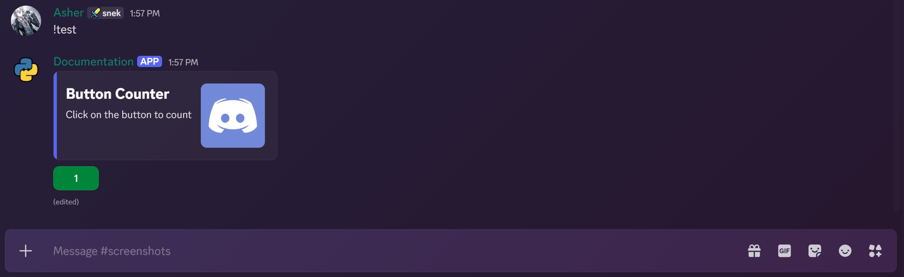

???+ tip "Tip"
    Similar to how we created an advanced `ui.View` in the [views documentation](./views.md#advanced-view-class), we will do the same here using `ui.LayoutView` to handle all the boilerplate code for us.

    Few differences to note here are:

    - We will be using `ui.LayoutView` instead of `ui.View`.
    - We will be using `ui.TextDisplay` to show text content instead of the `content` parameter.
    - Disabling interactive components like buttons and select menus is similar to before, but we will be using the `walk_children()` method to iterate through all components in the layout since components can be nested inside containers and action rows.

    ```python
    # Our objectives:
    # - Create a view that handles errors
    # - Create a view that disables all components after timeout
    # - Make sure that the view only processes interactions from the user who invoked the command

    from __future__ import annotations

    import traceback
    import typing as t

    import discord
    from discord.ui.select import Select


    class BaseLayoutView(discord.ui.LayoutView):
        interaction: discord.Interaction | None = None
        message: discord.Message | None = None

        def __init__(self, user: discord.User | discord.Member, timeout: float = 60.0):
            super().__init__(timeout=timeout)
            # We set the user who invoked the command as the user who can interact with the view
            self.user = user

        # make sure that the view only processes interactions from the user who invoked the command
        async def interaction_check(self, interaction: discord.Interaction) -> bool:
            if interaction.user.id != self.user.id:
                await interaction.response.send_message("You cannot interact with this view.", ephemeral=True)
                return False
            # update the interaction attribute when a valid interaction is received
            self.interaction = interaction
            return True

        def _disable_all(self) -> None:
            # disable all components
            # so components that can be disabled are buttons and select menus, walk because items can be nested inside containers and action rows
            for item in self.walk_children():
                if isinstance(item, discord.ui.Button) or isinstance(item, Select):
                    item.disabled = True

        # after disabling all components we need to edit the message with the new view
        # now when editing the message there are two scenarios:
        # 1. the view was never interacted with i.e in case of plain timeout here message attribute will come in handy
        # 2. the view was interacted with and the interaction was processed and we have the latest interaction stored in the interaction attribute
        async def _edit(self, *args: t.Any, **kwargs: t.Any) -> None:
            if self.interaction is None and self.message is not None:
                # if the view was never interacted with and the message attribute is not None, edit the message
                await self.message.edit(*args, **kwargs)
            elif self.interaction is not None:
                try:
                    # if not already responded to, respond to the interaction
                    await self.interaction.response.edit_message(*args, **kwargs)
                except discord.InteractionResponded:
                    # if already responded to, fetch the original response and edit it
                    self.message = await self.interaction.original_response()
                    await self.message.edit(*args, **kwargs)

        # to handle errors we first notify the user that an error has occurred and then disable all components
        async def on_error(
            self, interaction: discord.Interaction, error: Exception, item: discord.ui.Item[BaseLayoutView]
        ) -> None:
            tb = "".join(traceback.format_exception(type(error), error, error.__traceback__))
            message = f"An error occurred while processing the interaction for {str(item)}:\n```py\n{tb}\n```"
            # disable all components
            self._disable_all()
            # edit the message with the error message
            self.add_item(discord.ui.TextDisplay(message))
            await self._edit(view=self)
            # stop the view
            self.stop()

        async def on_timeout(self) -> None:
            # disable all components
            self._disable_all()
            # edit the message with the new view
            await self._edit(view=self)
    ```


## Action Rows

[`ui.ActionRow`](https://discordpy.readthedocs.io/en/latest/interactions/api.html#discord.ui.ActionRow) is a top level component that acts as a container for interactive components like buttons and select menus. Each action row can hold a maximum of one select menu or up to five buttons.

=== "Direct Usage"
    You can use `ui.ActionRow` directly in your `ui.LayoutView` like so:

    ```python
    class MyLayoutView(discord.ui.LayoutView):
        row: discord.ui.ActionRow["MyLayoutView"] = discord.ui.ActionRow()

        @row.button(label="Click Me", style=discord.ButtonStyle.primary)
        async def my_button(self, interaction: discord.Interaction, button: discord.ui.Button["MyLayoutView"]):
            await interaction.response.send_message("Button clicked!", ephemeral=True)

    @bot.tree.command()
    async def test(inter: discord.Interaction):
        await inter.response.send_message(view=MyLayoutView())
    ```
    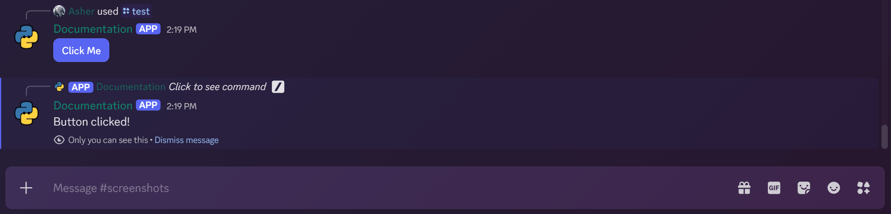
=== "Subclassing ActionRow"
    You can also create a subclass of `ui.ActionRow` to encapsulate related components together:

    ```python
    class MyActionRow(discord.ui.ActionRow["BaseLayoutView"]):
        view: BaseLayoutView

        def __init__(self):
            super().__init__()
            self.add_item(discord.ui.Button["BaseLayoutView"](label="Contact Support", style=discord.ButtonStyle.link, url="https://support.example.com"))

        @discord.ui.button(label="Confirm", style=discord.ButtonStyle.green)
        async def confirm(self, interaction: discord.Interaction, button: discord.ui.Button["BaseLayoutView"]):
            self.view._disable_all()
            await self.view._edit(view=self.view)
            await interaction.followup.send("Confirmed!", ephemeral=True)

        @discord.ui.button(label="Cancel", style=discord.ButtonStyle.red)
        async def cancel(self, interaction: discord.Interaction, button: discord.ui.Button["BaseLayoutView"]):
            await interaction.response.send_message("Cancelled!", ephemeral=True)
            self.view._disable_all()
            await self.view._edit(view=self.view)
            await interaction.followup.send("Cancelled!", ephemeral=True)

    class MyLayoutView(BaseLayoutView):
        row: MyActionRow = MyActionRow()

    @bot.tree.command()
    async def test(inter: discord.Interaction):
        await inter.response.send_message(view=MyLayoutView(inter.user))
    ```
    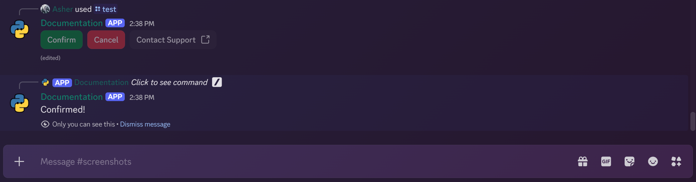
=== "Advanced Example"
    Here's an advanced example demonstrating the use of `ui.ActionRow` with multiple other components in a layout view:

    ```python
    from __future__ import annotations

    import io
    import typing as t

    import discord
    from discord.ext import commands
    from PIL import Image, ImageOps

    from . import BaseLayoutView


    class ImageFilterActionRow(discord.ui.ActionRow["BaseLayoutView"]):
        view: "ImageFilterView"

        @discord.ui.button(label="Grayscale", style=discord.ButtonStyle.primary)
        async def grayscale(self, interaction: discord.Interaction, button: discord.ui.Button["BaseLayoutView"]):
            await self.view.apply_filter(interaction, lambda img: img.convert("L"))

        @discord.ui.button(label="Sepia", style=discord.ButtonStyle.primary)
        async def sepia(self, interaction: discord.Interaction, button: discord.ui.Button["BaseLayoutView"]):
            def sepia_filter(img: Image.Image) -> Image.Image:
                # The matrix for Sepia transformation
                sepia_matrix = (
                    0.393, 0.769, 0.189, 0,
                    0.349, 0.686, 0.168, 0,
                    0.272, 0.534, 0.131, 0
                )
                return img.convert("RGB").convert("RGB", sepia_matrix)

            await self.view.apply_filter(interaction, sepia_filter)

        @discord.ui.button(label="Sketch", style=discord.ButtonStyle.primary)
        async def sketch(self, interaction: discord.Interaction, button: discord.ui.Button["BaseLayoutView"]):
            def sketch_filter(img: Image.Image) -> Image.Image:
                return img.convert("L").point(lambda x: 255 - x)

            await self.view.apply_filter(interaction, sketch_filter)

        @discord.ui.button(label="Neon", style=discord.ButtonStyle.primary)
        async def neon(self, interaction: discord.Interaction, button: discord.ui.Button["BaseLayoutView"]):
            def negative_filter(img: Image.Image) -> Image.Image:
                return ImageOps.invert(img.convert("RGB"))

            await self.view.apply_filter(interaction, negative_filter)

        @discord.ui.button(label="Solarize", style=discord.ButtonStyle.primary)
        async def solarize(self, interaction: discord.Interaction, button: discord.ui.Button["BaseLayoutView"]):
            def solarize_filter(img: Image.Image) -> Image.Image:
                return ImageOps.solarize(img.convert("RGB"), threshold=128)

            await self.view.apply_filter(interaction, solarize_filter)


    class UserActionRow(discord.ui.ActionRow["BaseLayoutView"]):
        view: "ImageFilterView"
        selected_user: discord.User | discord.Member | None = None

        @discord.ui.select(cls=discord.ui.UserSelect, min_values=1, max_values=1)
        async def user_select(self, interaction: discord.Interaction, select: discord.ui.UserSelect["BaseLayoutView"]):
            await interaction.response.defer()
            self.selected_user = select.values[0]
            self.view.media_gallery.clear_items()
            avatar_asset = self.selected_user.display_avatar.with_size(256).with_format("png")
            avatar_bytes = await avatar_asset.read()
            file = discord.File(fp=io.BytesIO(avatar_bytes), filename="avatar.png")
            self.view.media_gallery.add_item(media=file)
            await self.view._edit(view=self.view, attachments=[file])


    class ImageFilterView(BaseLayoutView):  
        def __init__(self, bot: commands.Bot, default_image: discord.File, user: discord.User | discord.Member, timeout: float = 60):
            super().__init__(user, timeout)
            self.bot = bot
            self.media_gallery = discord.ui.MediaGallery["BaseLayoutView"](
                discord.MediaGalleryItem(media=default_image)
            )
            self.file_attachment = discord.ui.File["BaseLayoutView"](media=default_image)
            self.user_action_row = UserActionRow()
            self.user_action_row.selected_user = self.bot.user  # type: ignore
            container = discord.ui.Container["BaseLayoutView"](
                discord.ui.Section(
                    "## Image Filter",
                    "Select an image filter to apply to your avatar.",
                    accessory=discord.ui.Thumbnail["BaseLayoutView"](media=self.bot.user.display_avatar.url),  # type: ignore
                ),
                self.media_gallery,
                ImageFilterActionRow(),
                self.user_action_row,
                self.file_attachment,
                accent_color=discord.Color.blurple(),
            )
            self.add_item(container)

        async def apply_filter(self, interaction: discord.Interaction, filter_func: t.Callable[[Image.Image], Image.Image]) -> None:
            await interaction.response.defer()
            target_user = self.user_action_row.selected_user or self.user
            avatar_asset = target_user.display_avatar.with_size(256).with_format("png")
            avatar_bytes = await avatar_asset.read()

            def process_image() -> io.BytesIO:
                with Image.open(io.BytesIO(avatar_bytes)) as img:
                    filtered_img = filter_func(img)
                    byte_io = io.BytesIO()
                    filtered_img.save(byte_io, format="PNG")
                    byte_io.seek(0)
                    return byte_io

            filtered_image_io = await self.bot.loop.run_in_executor(None, process_image)
            file = discord.File(fp=filtered_image_io, filename="avatar.png")
            self.media_gallery.clear_items()
            self.media_gallery.add_item(media=file)
            self.file_attachment = discord.ui.File["BaseLayoutView"](file)
            await self._edit(view=self, attachments=[file])

    @bot.tree.command()
    async def test(inter: discord.Interaction):
        avatar_asset = bot.user.display_avatar.with_size(256).with_format("png")
        avatar_bytes = await avatar_asset.read()
        avatar_file = discord.File(fp=io.BytesIO(avatar_bytes), filename="avatar.png")
        await inter.response.send_message(view=ImageFilterView(bot, avatar_file, inter.user, timeout=120.0), file=avatar_file)
    ```
    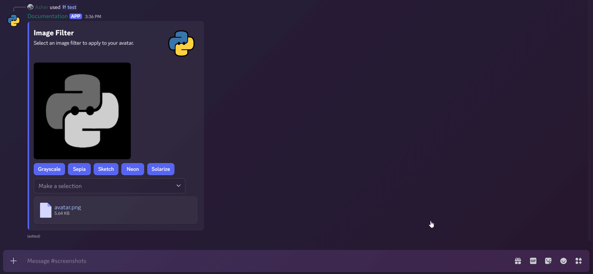

## Sections

[`ui.Section`](https://discordpy.readthedocs.io/en/latest/interactions/api.html#discord.ui.Section) is a top-level component that allows you to associate content with an accessory component, such as a thumbnail or button. This is useful for creating rich content blocks within your messages. At the time of writing, `ui.Section` can only have `TextDisplay` as its content and `Thumbnail` or `Button` as its accessory.

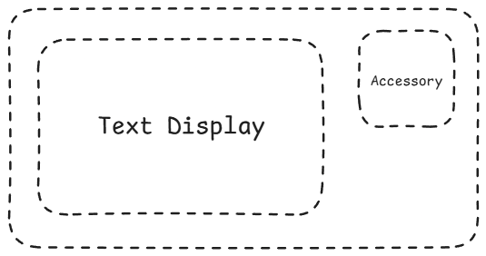{: .center }

=== "Thumbnail Accessory"
    Here's an example of using `ui.Section` with a `Thumbnail` accessory:

    ```python
    class BasicThumbnailSection(discord.ui.LayoutView):
        section = discord.ui.Section["BasicThumbnailSection"](
            "## Title",
            "Markdown _supported_ text displayed in sections.",
            accessory=discord.ui.Thumbnail["BasicThumbnailSection"]("https://i.imgur.com/9sDnoUW.jpeg"),
        )

    @bot.tree.command()
    async def test(inter: discord.Interaction):
        await inter.response.send_message(view=BasicThumbnailSection())
    ```
    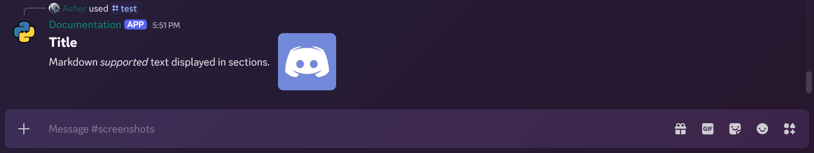
=== "Button Accessory"
    Here's an example of using `ui.Section` with a `Button` accessory:

    ```python
    class BasicButtonSection(discord.ui.LayoutView):
        section = discord.ui.Section["BasicButtonSection"](
            "## Support",
            "Click the button to contact support.",
            accessory=discord.ui.Button["BasicButtonSection"](
                label="Contact Support",
                style=discord.ButtonStyle.link,
                url="https://support.example.com"
            ),
        )

    @bot.tree.command()
    async def test(inter: discord.Interaction):
        await inter.response.send_message(view=BasicButtonSection())
    ```
    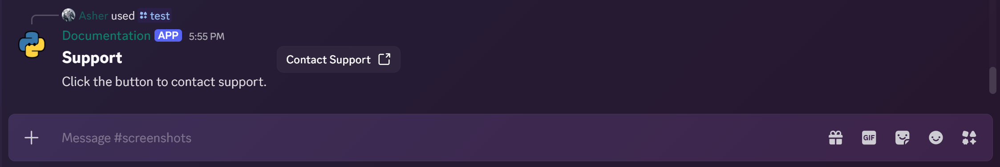
=== "Combined Example"
    You can also combine multiple sections in a single layout view:

    ```python
    class CombinedSectionView(discord.ui.LayoutView):
        thumbnail_section = discord.ui.Section["CombinedSectionView"](
            "## Avatar",
            "This section displays a thumbnail accessory.",
            accessory=discord.ui.Thumbnail["CombinedSectionView"]("https://i.imgur.com/9sDnoUW.jpeg"),
        )
        button_section = discord.ui.Section["CombinedSectionView"](
            "## Support",
            "Click the button to contact support.",
            accessory=discord.ui.Button["CombinedSectionView"](
                label="Contact Support",
                style=discord.ButtonStyle.link,
                url="https://support.example.com"
            ),
        )

    @bot.tree.command()
    async def test(inter: discord.Interaction):
        await inter.response.send_message(view=CombinedSectionView())
    ```
    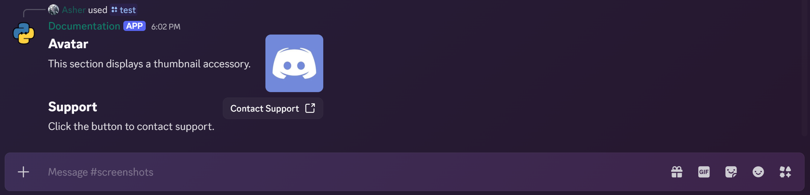

## Text Display

[`ui.TextDisplay`](https://discordpy.readthedocs.io/en/latest/interactions/api.html#discord.ui.TextDisplay) is a top-level component used to display rich text content in messages. It supports Markdown formatting, allowing you to create visually appealing text blocks. You can refer to the [Markdown guide](./markdown-and-ansi.md) for more information on supported formatting options and examples.

Do note that any pingable mentions present in this component will ping and trigger notifications unless explicitly disabled.

=== "Basic Example"
    Here's a basic example of using `ui.TextDisplay` in a layout view:

    ```python
    class MarkdownShowcase(discord.ui.TextDisplay[discord.ui.LayoutView]):
        def __init__(self) -> None:
            super().__init__(
                content=(
                    "# Header 1\n"
                    "## Header 2\n"
                    "### Header 3\n\n"
                    "**Bold Text**\n"
                    "*Italic Text*\n"
                    "***Bold Italic Text***\n\n"
                    "> :sparkles: This is a blockquote.\n\n"
                    "- Item 1\n"
                    "- Item 2\n"
                    "- Item 3\n\n"
                    "`Inline code` example.\n\n"
                    "```python\n"
                    "def hello_world():\n"
                    "    print('Hello, world!')\n"
                    "```\n\n"
                    "[Discord.py](https://discordpy.dev) link example."
                )
            )

    class BasicTextDisplayView(discord.ui.LayoutView):
        text_display = MarkdownShowcase()


    @bot.tree.command()
    async def test(inter: discord.Interaction):
        await inter.response.send_message(view=BasicTextDisplayView())
    ```
    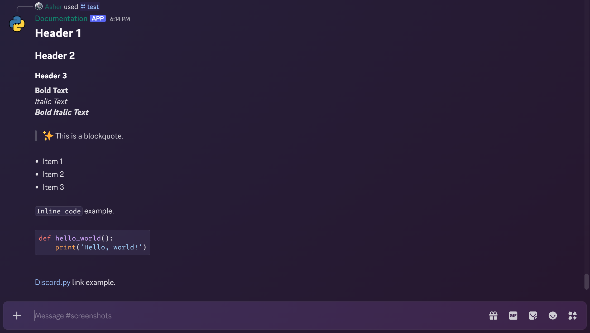
=== "Modal Text Display Example"
    You can also use `ui.TextDisplay` within modals to show rich text content:

    ```python
    class MarkdownShowcase(discord.ui.TextDisplay[discord.ui.LayoutView]):
        def __init__(self) -> None:
            super().__init__(
                content=(
                    "# Header 1\n"
                    "## Header 2\n"
                    "### Header 3\n\n"
                    "**Bold Text**\n"
                    "*Italic Text*\n"
                    "***Bold Italic Text***\n\n"
                    "> :sparkles: This is a blockquote.\n\n"
                    "- Item 1\n"
                    "- Item 2\n"
                    "- Item 3\n\n"
                    "`Inline code` example.\n\n"
                    "```python\n"
                    "def hello_world():\n"
                    "    print('Hello, world!')\n"
                    "```\n\n"
                    "[Discord.py](https://discordpy.dev) link example."
                )
            )

    class ModalTextDisplayView(discord.ui.Modal, title="Modal with Text Display"):
        text_display = MarkdownShowcase()

    @bot.tree.command()
    async def test(inter: discord.Interaction):
        await inter.response.send_message(view=ModalTextDisplayView())
    ```
    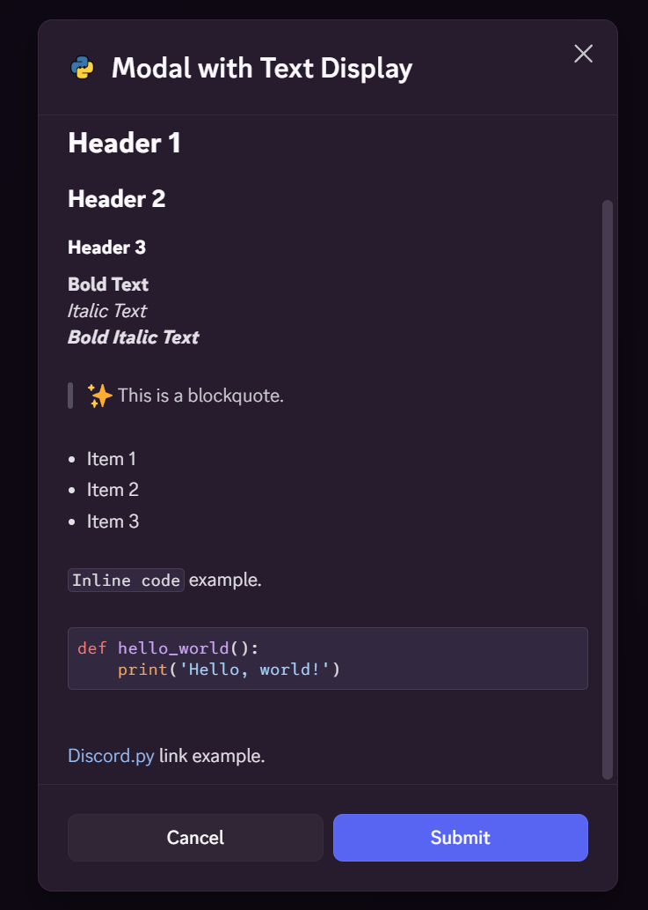{: .center }
=== "Multiple Text Displays Example"
    You can include multiple `ui.TextDisplay` components in a single layout view:

    ```python
    class SimpleTextDisplayView(discord.ui.LayoutView):
        header = discord.ui.TextDisplay["SimpleTextDisplayView"](
            content="# Welcome to the Bot\n"
                    "This is a simple text display example."
        )
        separator = discord.ui.Separator["SimpleTextDisplayView"]()
        instructions = discord.ui.TextDisplay["SimpleTextDisplayView"](
            content="## Instructions\n"
                    "1. Use `/help` to get a list of commands.\n"
                    "2. Use `/info` to get information about the bot."
        )

    @bot.tree.command()
    async def test(inter: discord.Interaction):
        await inter.response.send_message(view=SimpleTextDisplayView())
    ```
    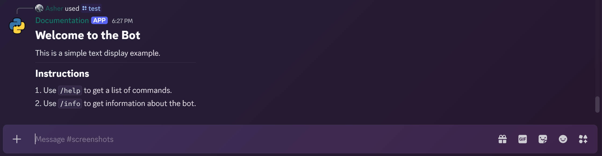

!!! note "Note"
    The character limit across all `ui.TextDisplay` components in a single message is `4000` characters. Make sure to keep your content within this limit to avoid errors.

## Thumbnail

[`ui.Thumbnail`](https://discordpy.readthedocs.io/en/latest/interactions/api.html#discord.ui.Thumbnail) is a non top-level component that displays visual media in a compact format. At time of writing, it can only be used as an accessory in `ui.Section`. Currently thumbnails support images and animated images (GIFs and WebPs).

=== "Static Image"
    === "External URL"
        You can use an external URL to display a static image as a thumbnail:

        ```python
        class ExternalThumbnailSection(discord.ui.LayoutView):
            section = discord.ui.Section["ExternalThumbnailSection"](
                "## External Thumbnail",
                "This section uses an external URL for the thumbnail.",
                accessory=discord.ui.Thumbnail["ExternalThumbnailSection"]("https://i.imgur.com/9sDnoUW.jpeg"),
            )

        @bot.tree.command()
        async def test(inter: discord.Interaction):
            await inter.response.send_message(view=ExternalThumbnailSection())
        ```
        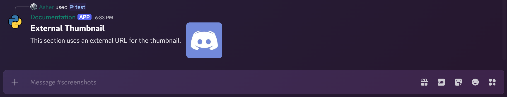
    === "Attachment"
        You can also use a local attachment to display as a thumbnail:

        ```python
        @bot.tree.command()
        async def test(inter: discord.Interaction):
            asset_file = discord.File("assets/1.png", filename="1.png")

            class AttachmentThumbnailSection(discord.ui.LayoutView):
                section = discord.ui.Section["AttachmentThumbnailSection"](
                    "## Attachment Thumbnail",
                    "This section uses a local attachment for the thumbnail.",
                    accessory=discord.ui.Thumbnail["AttachmentThumbnailSection"](media=asset_file),
                )

            await inter.response.send_message(view=AttachmentThumbnailSection(), files=[asset_file])
        ```
        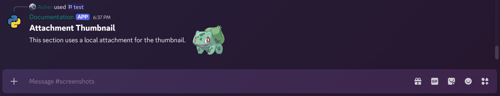
=== "Animated Image"
    You can use an animated image (GIF/WebP) as a thumbnail:

    ```python
    class AnimatedThumbnailSection(discord.ui.LayoutView):
        section = discord.ui.Section["AnimatedThumbnailSection"](
            "## Animated Thumbnail",
            "This section uses an animated image for the thumbnail.",
            accessory=discord.ui.Thumbnail["AnimatedThumbnailSection"]("https://i.imgur.com/xwQzRkv.gif"),
        )

    @bot.tree.command()
    async def test(inter: discord.Interaction):
        await inter.response.send_message(view=AnimatedThumbnailSection())
    ```
    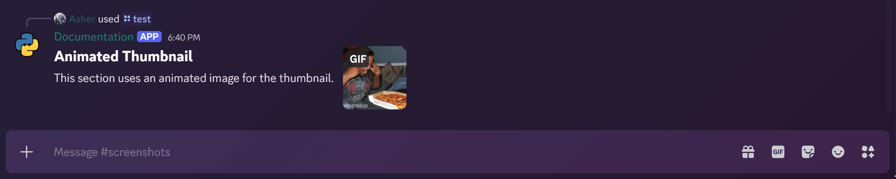

!!! tip "Tip"
    You can also mark thumbnails as spoilers by setting the `spoiler` parameter to `True` when creating a `ui.Thumbnail` component and add `Alt Text` for accessibility by using the `description` parameter.

## Media Gallery

[`ui.MediaGallery`](https://discordpy.readthedocs.io/en/latest/interactions/api.html#discord.ui.MediaGallery) is a top-level component that allows you to display multiple media items (images, videos, GIFs) in a gallery format. Users can navigate through the media items using built-in controls. You can have up to `10` media items in a single media gallery.

=== "Basic Example"
    Here's a basic example of using `ui.MediaGallery` in a layout view:

    ```python
    class BasicMediaGalleryView(discord.ui.LayoutView):
        media_gallery = discord.ui.MediaGallery["BasicMediaGalleryView"](
            discord.MediaGalleryItem(media="http://commondatastorage.googleapis.com/gtv-videos-bucket/sample/BigBuckBunny.mp4"),
            discord.MediaGalleryItem(media="https://media2.giphy.com/media/v1.Y2lkPTc5MGI3NjExZ2ViMWJ6b2I2cGFhNXgzZDJoMG9mMzhwZnE1ZHNkcWVsa3Nzc2lvcyZlcD12MV9pbnRlcm5hbF9naWZfYnlfaWQmY3Q9Zw/ForxtLiaT9Oe0JhFKN/giphy.gif"),
            discord.MediaGalleryItem(media="https://divinikey.com/cdn/shop/files/evoworks-evo75-keyboard-2784814.webp"),
        )

    @bot.tree.command()
    async def test(inter: discord.Interaction):
        await inter.response.send_message(view=BasicMediaGalleryView())
    ```
    
=== "With Attachments"
    You can also use local attachments in a media gallery:

    ```python
    class MediaGallery(discord.ui.MediaGallery[discord.ui.LayoutView]):
        def __init__(self, index: int) -> None:
            self.attachments = [discord.File(f"assets/{i}.png") for i in range((index * 3) + 1, (index * 3) + 4)]
            super().__init__(*[discord.MediaGalleryItem(attachment) for attachment in self.attachments])


    class StepperRow(discord.ui.ActionRow["PokemonGallery"]):
        view: "PokemonGallery"

        @discord.ui.button(label="Previous", style=discord.ButtonStyle.primary)
        async def previous(self, interaction: discord.Interaction, button: discord.ui.Button["PokemonGallery"]):
            self.view._cursor = (self.view._cursor - 1) % self.view._limit
            self.view._update_gallery()
            await self.view._edit(view=self.view, attachments=self.view.media_gallery.attachments)

        @discord.ui.button(label="Next", style=discord.ButtonStyle.primary)
        async def next(self, interaction: discord.Interaction, button: discord.ui.Button["PokemonGallery"]):
            self.view._cursor = (self.view._cursor + 1) % self.view._limit
            self.view._update_gallery()
            await self.view._edit(view=self.view, attachments=self.view.media_gallery.attachments)


    class PokemonGallery(BaseLayoutView):
        def __init__(self, user: discord.User | discord.Member, timeout: float = 60):
            super().__init__(user, timeout)
            self._cursor = 0
            self._limit = 3
            self.media_gallery = MediaGallery(index=self._cursor)
            self.add_item(self.media_gallery)
            self.add_item(StepperRow())

        def _update_gallery(self) -> None:
            self.media_gallery.clear_items()
            updated_gallery = MediaGallery(index=self._cursor)
            for item in updated_gallery.attachments:
                self.media_gallery.add_item(media=item)
            self.media_gallery.attachments = updated_gallery.attachments

    @bot.tree.command()
    async def test(inter: discord.Interaction):
        gallery = PokemonGallery(inter.user)
        await inter.response.send_message(view=gallery, files=gallery.media_gallery.attachments)
    ```
    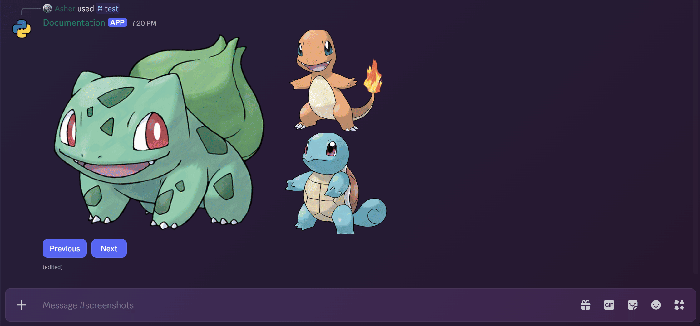

!!! note "Note"
    You can mark each media item as a spoiler by setting the `spoiler` parameter to `True` when creating a `MediaGalleryItem` and add `Alt Text` for accessibility by using the `description` parameter.

## File

[`ui.File`](https://discordpy.readthedocs.io/en/latest/interactions/api.html#discord.ui.File) is a top-level component that allows you to display an uploaded file as an attachment to your message. You can have multiple `ui.File` components in a single layout view, each representing a different file attachment.

=== "Single File Example"
    Here's a basic example of using a single `ui.File` component in a layout view:

    ```python
    @bot.tree.command()
    async def test(inter: discord.Interaction):
    file = discord.File(fp=io.BytesIO(b"Hello, this is a test file!"), filename="test.txt")

    class SingleFileView(discord.ui.LayoutView):
        file_attachment = discord.ui.File["SingleFileView"](media=file)

    view = SingleFileView()
    await inter.response.send_message(view=view, files=[file])
    ```
    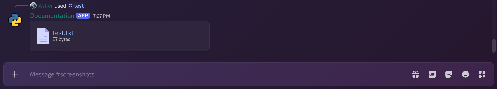
=== "Multiple Files Example"
    You can also include multiple `ui.File` components in a single layout view:

    ```python
    @bot.tree.command()
    async def test(inter: discord.Interaction):
        file1 = discord.File(fp=io.BytesIO(b"Hello, this is the first test file!"), filename="test1.txt")
        file2 = discord.File(fp=io.BytesIO(b"Hello, this is the second test file!"), filename="test2.txt")
        file3 = discord.File(fp="assets/1.png", filename="1.png")

        class MultipleFilesView(discord.ui.LayoutView):
            file_attachment1 = discord.ui.File["MultipleFilesView"](media=file1)
            file_attachment2 = discord.ui.File["MultipleFilesView"](media=file2)
            file_attachment3 = discord.ui.File["MultipleFilesView"](media=file3)

        view = MultipleFilesView()
        await inter.response.send_message(view=view, files=[file1, file2, file3])
    ```
    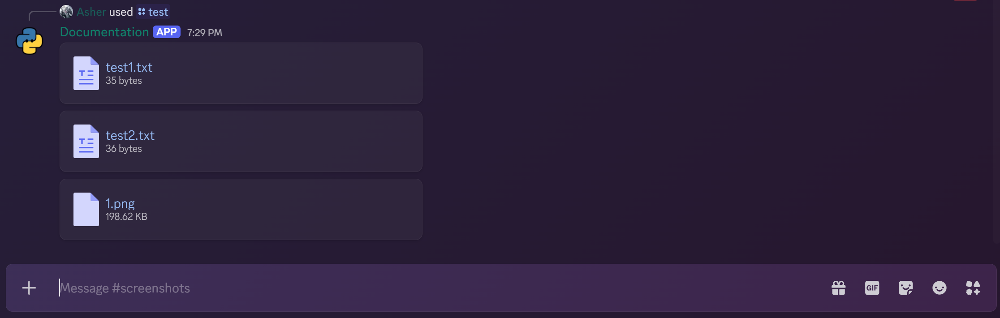

!!! note "Note"
    You can mark each file attachment as a spoiler by setting the `spoiler` parameter to `True` when creating a `ui.File` component.

## Separator

[`ui.Separator`](https://discordpy.readthedocs.io/en/latest/interactions/api.html#discord.ui.Separator) is a top-level component that adds a visual divider between other components in a layout view. This helps to organize content and improve readability by separating different sections of your message. You can use the following parameters to configure the appearance of the separator:

- `divider`: Whether to display a horizontal line as the divider or just a space. Defaults to `True`.
- `spacing`: Only two options are available: `small` and `large`. This determines the amount of space above and below the separator. Defaults to `small`.

=== "Small Separator (Visible)"
    Here's an example of using a small visible separator in a layout view:

    ```python
    @bot.tree.command()
    async def test(inter: discord.Interaction):
        class SeperatorView(discord.ui.LayoutView):
            header = discord.ui.TextDisplay("## Header Text")
            separator = discord.ui.Separator(visible=True, spacing=discord.SeparatorSpacing.small)
            body = discord.ui.TextDisplay("This is the body text.")

        await inter.response.send_message(view=SeperatorView())
    ```
    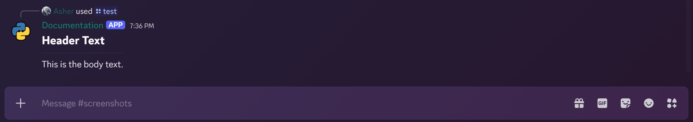
=== "Large Separator (Visible)"
    Here's an example of using a large visible separator in a layout view:

    ```python
    @bot.tree.command()
    async def test(inter: discord.Interaction):
        class SeperatorView(discord.ui.LayoutView):
            header = discord.ui.TextDisplay("## Header Text")
            separator = discord.ui.Separator(visible=True, spacing=discord.SeparatorSpacing.large)
            body = discord.ui.TextDisplay("This is the body text.")

        await inter.response.send_message(view=SeperatorView())
    ```
    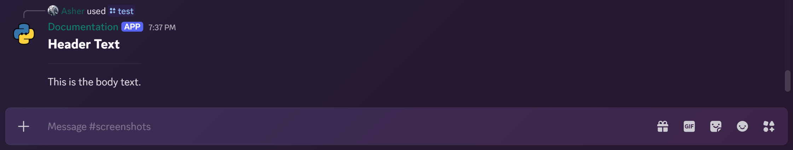
=== "Invisible Separator (Small)"
    Here's an example of using a small invisible separator in a layout view:

    ```python
    @bot.tree.command()
    async def test(inter: discord.Interaction):
        class SeperatorView(discord.ui.LayoutView):
            header = discord.ui.TextDisplay("## Header Text")
            separator = discord.ui.Separator(visible=False, spacing=discord.SeparatorSpacing.small)
            body = discord.ui.TextDisplay("This is the body text.")

        await inter.response.send_message(view=SeperatorView())
    ```
    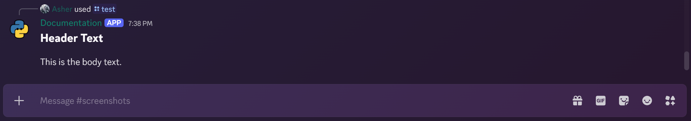
=== "Invisible Separator (Large)"
    Here's an example of using a large invisible separator in a layout view:

    ```python
    @bot.tree.command()
    async def test(inter: discord.Interaction):
        class SeperatorView(discord.ui.LayoutView):
            header = discord.ui.TextDisplay("## Header Text")
            separator = discord.ui.Separator(visible=False, spacing=discord.SeparatorSpacing.large)
            body = discord.ui.TextDisplay("This is the body text.")

        await inter.response.send_message(view=SeperatorView())
    ```
    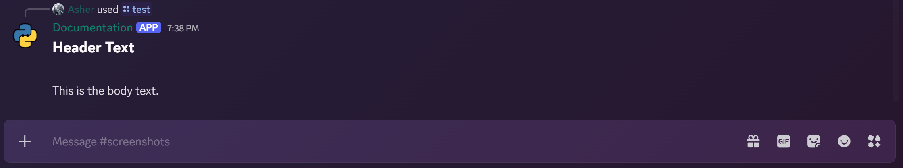

## Container

[`ui.Container`](https://discordpy.readthedocs.io/en/latest/interactions/api.html#discord.ui.Container) is a top-level component that allows you to group multiple components together, providing a cohesive layout with a unified appearance. Containers can hold various components such as sections, media galleries, action rows, and more.

You can customize the container's appearance using an optional `accent_color` parameter, which sets the color of the container's border, and yes that means you can avoid having the side borders which embeds have and instead blend in the container with the user's discord theme 🎉🎉 (no more hex color code hacks).

Here is an exhaustive list of all the components that can be added to a `ui.Container`:

- [`ui.ActionRow`](https://discordpy.readthedocs.io/en/latest/interactions/api.html#discord.ui.ActionRow)
- [`ui.File`](https://discordpy.readthedocs.io/en/latest/interactions/api.html#discord.ui.File)
- [`ui.MediaGallery`](https://discordpy.readthedocs.io/en/latest/interactions/api.html#discord.ui.MediaGallery)
- [`ui.Section`](https://discordpy.readthedocs.io/en/latest/interactions/api.html#discord.ui.Section)
- [`ui.TextDisplay`](https://discordpy.readthedocs.io/en/latest/interactions/api.html#discord.ui.TextDisplay)
- [`ui.Separator`](https://discordpy.readthedocs.io/en/latest/interactions/api.html#discord.ui.Separator)

Here's an example of using `ui.Container` to group multiple components together in a layout view:

```python
from __future__ import annotations

import datetime

import discord

from . import BaseLayoutView
from .media_gallery import MediaGallery, StepperRow


class EmbedContainerView(BaseLayoutView):
    def __init__(
        self, user: discord.User | discord.Member, title: str, description: str, thumbnail: str, *, timeout: float = 60
    ) -> None:
        super().__init__(user, timeout)
        self._cursor = 0
        self._limit = 3

        section = discord.ui.Section["EmbedContainerView"](
            f"## {title}",
            description,
            accessory=discord.ui.Thumbnail["EmbedContainerView"](thumbnail),
        )
        self.media_gallery = MediaGallery(index=self._cursor)
        container = discord.ui.Container["EmbedContainerView"](
            section,
            self.media_gallery,
            StepperRow(),
            discord.ui.Separator(),
            discord.ui.TextDisplay(
                f"-# {datetime.datetime.now(tz=datetime.timezone.utc).strftime('%Y-%m-%d %H:%M:%S %Z')} - Generated by EmbedContainerView"
            ),
            accent_color=discord.Color.blurple(),
        )
        self.add_item(container)

    def _update_gallery(self) -> None:
        self.media_gallery.clear_items()
        updated_gallery = MediaGallery(index=self._cursor)
        for item in updated_gallery.attachments:
            self.media_gallery.add_item(media=item)
        self.media_gallery.attachments = updated_gallery.attachments

@bot.tree.command()
async def test(inter: discord.Interaction):
    container_view = EmbedContainerView(
        inter.user,
        title="Container View",
        description=(
                "This is an example of a container view with an embedded media gallery and markdown section.\n"\
                "### Features\n"\
                "- **Container Component**: Organizes multiple components into a cohesive layout.\n"\
                "- **Section Component**: Displays markdown content with support for thumbnails.\n"\
                "- **Media Gallery Component**: Showcases multiple media items with navigation controls.\n"\
                "- **Accent Color**: Customizes the appearance of the container with a blurple accent color.\n"\
                ),
        thumbnail=inter.user.display_avatar.url,
    )
    attachments = container_view.media_gallery.attachments
    await inter.response.send_message(view=container_view, files=attachments)
```
=== "Accent Color"
    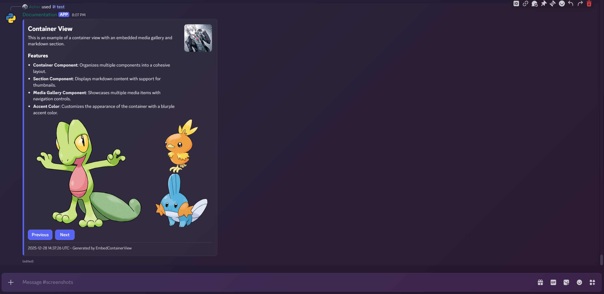
=== "No Accent Color"
    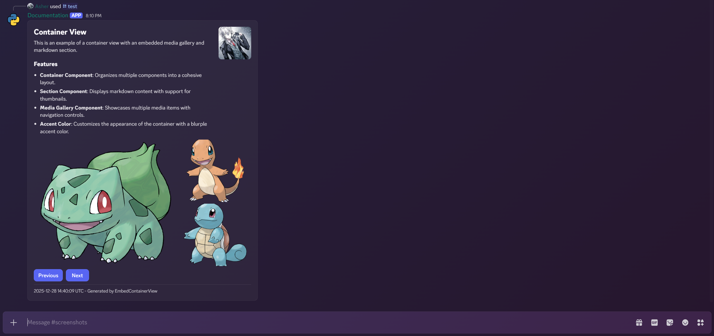

## Label

[`ui.Label`](https://discordpy.readthedocs.io/en/latest/interactions/api.html#discord.ui.Label) is a top-level component that allows you to add descriptive text labels to other components, such as select menus, text inputs, and file uploads. Labels help provide context and instructions to users, enhancing the overall user experience.

Labels are to be used within modals to wrap around input components like `ui.TextInput` and `ui.FileUpload`.

## File Upload

[`ui.FileUpload`](https://discordpy.readthedocs.io/en/latest/interactions/api.html#discord.ui.FileUpload) is a top-level component that allows users to upload files directly through the interaction interface. This component can be added to layout views and modals, enabling users to submit files as part of their interaction with the bot. You can upload a maximum of `10` files using this component.

Here's an example demonstrating the use of `ui.FileUpload` within a modal to upload an image and apply various filters using buttons in an action row:

```python
class ImageFilterActionRow(discord.ui.ActionRow["BaseLayoutView"]):
    view: "ImageFilterView"

    @discord.ui.button(label="Grayscale", style=discord.ButtonStyle.primary)
    async def grayscale(self, interaction: discord.Interaction, button: discord.ui.Button["BaseLayoutView"]):
        await self.view.apply_filter(interaction, lambda img: img.convert("L"))

    @discord.ui.button(label="Sepia", style=discord.ButtonStyle.primary)
    async def sepia(self, interaction: discord.Interaction, button: discord.ui.Button["BaseLayoutView"]):
        def sepia_filter(img: Image.Image) -> Image.Image:
            # The matrix for Sepia transformation
            sepia_matrix = (0.393, 0.769, 0.189, 0, 0.349, 0.686, 0.168, 0, 0.272, 0.534, 0.131, 0)
            return img.convert("RGB").convert("RGB", sepia_matrix)

        await self.view.apply_filter(interaction, sepia_filter)

    @discord.ui.button(label="Sketch", style=discord.ButtonStyle.primary)
    async def sketch(self, interaction: discord.Interaction, button: discord.ui.Button["BaseLayoutView"]):
        def sketch_filter(img: Image.Image) -> Image.Image:
            return img.convert("L").point(lambda x: 255 - x)

        await self.view.apply_filter(interaction, sketch_filter)

    @discord.ui.button(label="Neon", style=discord.ButtonStyle.primary)
    async def neon(self, interaction: discord.Interaction, button: discord.ui.Button["BaseLayoutView"]):
        def negative_filter(img: Image.Image) -> Image.Image:
            return ImageOps.invert(img.convert("RGB"))

        await self.view.apply_filter(interaction, negative_filter)

    @discord.ui.button(label="Solarize", style=discord.ButtonStyle.primary)
    async def solarize(self, interaction: discord.Interaction, button: discord.ui.Button["BaseLayoutView"]):
        def solarize_filter(img: Image.Image) -> Image.Image:
            return ImageOps.solarize(img.convert("RGB"), threshold=128)

        await self.view.apply_filter(interaction, solarize_filter)


class ImageFilterView(BaseLayoutView):
    def __init__(
        self, bot: commands.Bot, default_image: discord.File, user: discord.User | discord.Member, timeout: float = 60
    ):
        super().__init__(user, timeout)
        self.bot = bot
        self.image_bytes = default_image.fp.read()
        default_image.fp.seek(0)
        self.media_gallery = discord.ui.MediaGallery["BaseLayoutView"](discord.MediaGalleryItem(media=default_image))
        self.file_attachment = discord.ui.File["BaseLayoutView"](media=default_image)
        container = discord.ui.Container["BaseLayoutView"](
            discord.ui.Section(
                "## Image Filter",
                "Select an image filter to apply.",
                accessory=discord.ui.Thumbnail["BaseLayoutView"](media=self.bot.user.display_avatar.url),  # type: ignore
            ),
            self.media_gallery,
            ImageFilterActionRow(),
            self.file_attachment,
            accent_color=discord.Color.blurple(),
        )
        self.add_item(container)

    async def apply_filter(
        self, interaction: discord.Interaction, filter_func: t.Callable[[Image.Image], Image.Image]
    ) -> None:
        await interaction.response.defer()
        img_bytes = copy.deepcopy(self.image_bytes)

        def process_image() -> io.BytesIO:
            with Image.open(io.BytesIO(img_bytes)) as img:
                filtered_img = filter_func(img)
                byte_io = io.BytesIO()
                filtered_img.save(byte_io, format="PNG")
                byte_io.seek(0)
                return byte_io

        filtered_image_io = await self.bot.loop.run_in_executor(None, process_image)
        file = discord.File(fp=filtered_image_io, filename="image.png")
        self.media_gallery.clear_items()
        self.media_gallery.add_item(media=file)
        self.file_attachment = discord.ui.File["BaseLayoutView"](file)
        await self._edit(view=self, attachments=[file])


class FileUploadModal(BaseModal, title="Upload a File"):
    def __init__(self, *, timeout: float | None = None) -> None:
        super().__init__(timeout=timeout)
        self.file_upload = discord.ui.FileUpload["FileUploadModal"](min_values=1, max_values=1, required=True)
        self.add_item(discord.ui.Label(
            text="Upload",
            component=self.file_upload,
            description="You can upload a maximum of 1 file.",
        ))

@bot.tree.command()
async def test(inter: discord.Interaction):
    modal = FileUploadModal(timeout=60.0)
    await inter.response.send_modal(modal)
    await modal.wait()
    if not modal.is_finished() or not modal.file_upload.values:
        await inter.followup.send("Modal timed out or no file uploaded.", ephemeral=True)
        return
    image = await modal.file_upload.values[0].to_file(filename="image.png")
    await inter.followup.send(view=ImageFilterView(bot, image, inter.user), file=image)
```

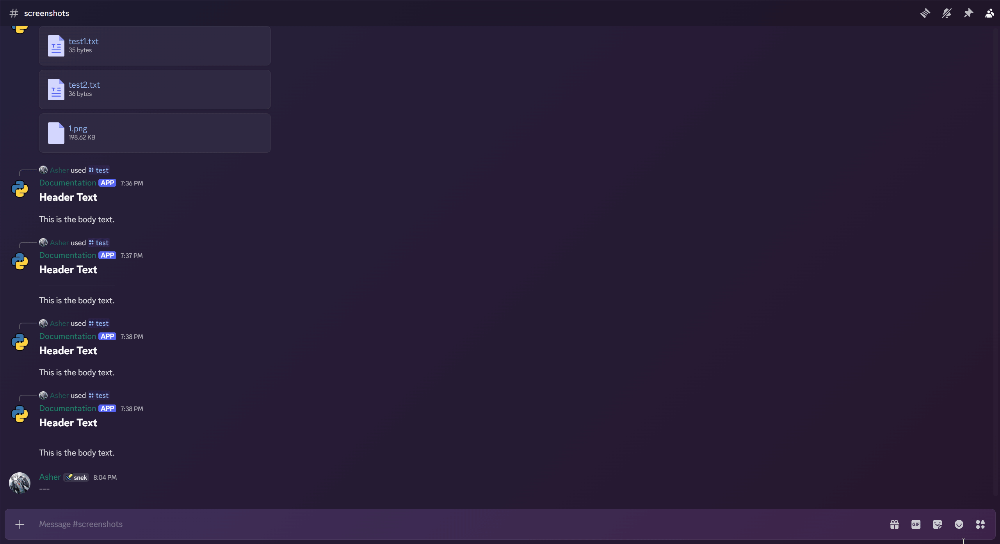

## Component ID's

In components v2, discord introduced the concept of Component ID's which are unique identifiers assigned to each interactive component (like buttons, select menus, etc.) within a layout view. These ID's differ from the `custom_id` used in components which is still present both in legacy and v2 components.

The `id` concept introduced here is similar to how GUID's work with user interface elements in other frameworks. Each component can be manually assigned an `id` in code, and you can use the `find_item()` method to get deeply nested components by their `id`.

Here's an example demonstrating how to assign and retrieve component ID's in a layout view:

```python
import zlib

def _string_to_field_id(name: str) -> int:
    return zlib.crc32(name.encode()) & 0x7FFFFFFF

COUNT_FIELD_ID = _string_to_field_id("counter_display")


class CountButton(discord.ui.Button["CounterView"]):
    def __init__(self) -> None:
        super().__init__(label="+1", style=discord.ButtonStyle.primary)

    async def callback(self, interaction: discord.Interaction) -> None:
        view = self.view
        view.count += 1
        counter_display = view.find_item(COUNT_FIELD_ID)
        if isinstance(counter_display, discord.ui.TextDisplay):
            counter_display.content = f"Count: {view.count}"
        await view._edit(view=view)


class CounterView(BaseLayoutView):
    count: int

    def __init__(self, user: discord.User | discord.Member, timeout: float = 60):
        super().__init__(user, timeout)
        self.count = 0
        self.add_item(
            discord.ui.Container["CounterView"](
                discord.ui.Section(
                    "## Counter",
                    discord.ui.TextDisplay["CounterView"](
                        content=f"Count: {self.count}",
                        id=COUNT_FIELD_ID,
                    ),
                    accessory=discord.ui.Thumbnail["CounterView"](user.display_avatar.url),
                ),
                discord.ui.ActionRow["CounterView"](
                    CountButton(),
                ),
                accent_color=discord.Color.green(),
            )
        )

@bot.tree.command()
async def test(inter: discord.Interaction):
    """A command to test basic layout view"""
    view = CounterView(inter.user)
    await inter.response.send_message(view=view)
    view.message = await inter.original_response()
```
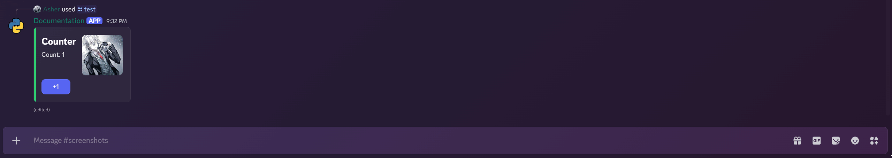

## Conclusion

We hope this guide has provided you with a comprehensive understanding of the various components available in Discord.py's Components V2 system. By leveraging these components, you can create rich and interactive user interfaces that enhance the user experience of your Discord bot.
