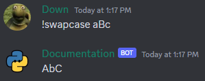
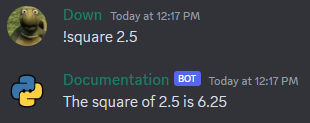
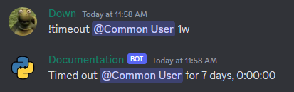

## Basic

Basic converter is a function or type that can be invoked with one argument to transform an input argument into a different form or representation.

### Using function

Example usage:

```python
def swap_characters(argument: str):
    return argument.swapcase()

@bot.command()
async def swapcase(ctx: commands.Context, *, text: swap_characters):
    await ctx.send(text)
```




### Using built-in types

```python
@bot.command()
async def double(ctx, number: int):
    result = number * 2
    await ctx.send(f"The double of {number} is {result}")

@bot.command()
async def square(ctx, number: float):
    result = number ** 2
    await ctx.send(f"The square of {number} is {result}")
```



!!! note "Note"
    By default, when passing arguments to a command, they are treated as strings. Therefore, it is necessary to convert them to the appropriate data type, such as integers, in order to perform operations on them.

!!! warning "Warning"
    The `bool` type converter is handled in a slightly different way, and you can find more information about it [here](https://discordpy.readthedocs.io/en/stable/ext/commands/commands.html#bool)

## Discord.py built-in

Built-in converters in Discord.py are provided by the library and are readily available for use. They help in converting user input into specific data types such as `discord.Member`, `discord.User`, `discord.TextChannel`, `discord.Role` and many more full list can be found [here](https://discordpy.readthedocs.io/en/stable/ext/commands/commands.html#discord-converters).

Example usage:

```python
@bot.command()
async def greet(ctx, member: discord.Member):
    await ctx.send(f"Hello, {member.mention}!")
```


## Advanced

Advanced converters in Discord.py allow you to define your own conversion logic for specific types of inputs. You can create a custom converter by subclassing the `commands.Converter` class provided by Discord.py and implementing the `convert` method.

Example usage:

```python
class DurationConverter(commands.Converter):
    async def convert(self, ctx: commands.Context, argument: str) -> datetime.timedelta:
        multipliers = {
            's': 1,  # seconds
            'm': 60,  # minutes
            'h': 3600,  # hours
            'd': 86400,  # days
            'w': 604800  # weeks
        }

        try:
            amount = int(argument[:-1])
            unit = argument[-1]
            seconds = amount * multipliers[unit]
            delta = datetime.timedelta(seconds=seconds)
            return delta
        except (ValueError, KeyError):
            raise commands.BadArgument("Invalid duration provided.")

@bot.command()
async def timeout(ctx: commands.Context, member: discord.Member, duration: DurationConverter):
    await member.timeout(duration)
    await ctx.send(f"Timed out {member.mention} for {duration}")
```




## Inline Advanced

Even if we choose not to inherit from the `Converter` class, we can still offer a `convert` class method that incorporates the advanced functionalities typically associated with an advanced converter.

```python
class Percentage:
    def __init__(self, value: float):
        self.value = value

    @classmethod
    async def convert(cls, ctx: commands.Context, argument: str):
        try:
            percentage = float(argument.strip("%")) / 100
            return cls(percentage)
        except ValueError:
            raise commands.BadArgument("Invalid percentage provided.")

@bot.command()
async def discount(ctx: commands.Context, original_price: float, percentage: Percentage):
    discounted_price = original_price * (1 - percentage.value)
    savings = original_price - discounted_price

    await ctx.send(f"Original Price: ${original_price:.2f}\n"
                   f"Discount: {percentage.value * 100}%\n"
                   f"Discounted Price: ${discounted_price:.2f}\n"
                   f"Savings: ${savings:.2f}")
```


## Special
!!! warning "Warning"
    If you are using Python 3.9 or below when using `Union`, `Optional`, `Literal` or `Annotated` you have to import `typing` module
### Union

The Union converter allows a command to accept multiple specific types instead of just one type. It provides a way to introduce more relaxed and dynamic grammar to commands.

=== "Python 3.9"

    ```python
    @bot.command()
    async def union(ctx, channel: typing.Union[discord.TextChannel, discord.DMChannel], *, message: str):
        await channel.send(message)
    ```

=== "Python 3.10 and above"

    ```python
    @bot.command()
    async def union(ctx, channel: discord.TextChannel | discord.DMChannel, *, message: str):
        await channel.send(message)
    ```

### Optional

The Optional converter allows for "back-referencing" behavior. If the converter fails to parse the input into the specified type, the parser will skip the parameter. Then, either None or the specified default value will be passed to the parameter. The parser will continue to the next parameters and converters, if any.

=== "Python 3.9"

    ```python
    @bot.command()
    async def greet(ctx: commands.Context, member: typing.Optional[discord.Member] = None):
        member = member or ctx.author
        await ctx.send(f"Hello, {member.mention}!")
    ```

=== "Python 3.10 and above"

    ```python
    @bot.command()
    async def greet(ctx: commands.Context, member: discord.Member | None = None):
        member = member or ctx.author
        await ctx.send(f"Hello, {member.mention}!")
    ```


### Literal


The Literal converter specifies that the passed parameter must be exactly one of the listed values.

```python
@bot.command()
async def rps(ctx: commands.Context, move: typing.Literal["rock", "paper", "scissors"]):
    await ctx.send(f"You played {move}")

@rps.error
async def rps_error(ctx: commands.Context, error: commands.CommandInvokeError):
    if isinstance(error, commands.BadLiteralArgument):
        await ctx.send("Invalid choice. Valid choices are: rock, paper, scissors.")
        return
    print(error)
```

!!! warning "Warning"
    If none of the options from the Literal are passed then `BadLiteralArgument` is raised.

### Annotated

In Python 3.9, a new feature called `typing.Annotated` was introduced. It enables the type checker to view one type, while allowing the library to see a different type. This feature proves valuable when dealing with intricate converters, as it helps satisfy the type checker's requirements. The converter, which the library should utilize, must be specified as the second parameter of `typing.Annotated`.

We can update the definition of the previously defined command [swapcase](#using-function) in a way that informs the type checker that the variable text will be of type `str`.

```python
def swap_characters(argument: str):
    return argument.swapcase()

@bot.command()
async def swapcase(ctx: commands.Context, *, text: typing.Annotated[str, swap_characters]):
    await ctx.send(text)
```


!!! note "Note"
    If you're using a Python version lower than 3.9, you can import `Annotated` from the `typing_extensions` module, as it was introduced in Python 3.9.

### Greedy

The Greedy converter is for a list of arguments. It attempts to convert as much as possible until it can't convert anymore.

```python
@bot.command()
async def add(ctx: commands.Context, numbers: commands.Greedy[int]):
    total = sum(numbers)
    await ctx.send(f"The sum of the numbers is: {total}")
```


!!! warning "Warning"
    The provided command definition `async def command(ctx: commands.Context, argument1: commands.Greedy[int], argument2: int)` won't work as expected because the `Greedy` type annotation consumes all available `int` values, leaving no values for the argument2. As a result, argument2 will be missing and `MissingRequiredArgument` will be raised. **To ensure the availability of a value for argument2 annotate it with a different type, such as `str` or other.**

### Attachment

Unlike the other built-in Discord.py converters, the `Attachment` converter does not handle text input. Instead, its purpose is to search for and retrieve uploaded files.

```python
@bot.command()
async def upload(ctx: commands.Context, attachment: discord.Attachment):
    await ctx.send(f'You have uploaded <{attachment.url}>')
```

## Flag Converters

With the help of a `FlagConverter`, users can conveniently indicate user-friendly "flags" using [PEP 526](https://peps.python.org/pep-0526/) type annotations.

Default syntax for flag converters:
```
!command argument1: value1 argument2: value2 ...
```

If you wish to learn more about this feature please refer to the documentation [here](https://discordpy.readthedocs.io/en/stable/ext/commands/commands.html#flagconverter)

## Parameter metadata

The parameter feature enables the addition of metadata to command parameters, including details like converters, default values, descriptions, and displayed names. For a list of all available parameters, please refer to the documentation [here](https://discordpy.readthedocs.io/en/stable/ext/commands/api.html#discord.ext.commands.parameter).

We can update the definition of the previously defined command [timeout](#advanced), allowing us to type hint it as `datetime.timedelta` and utilize the converter argument of the parameter.

```python
@bot.command()
async def timeout(ctx: commands.Context, member: discord.Member, duration: datetime.timedelta = commands.parameter(converter=DurationConverter)):
    await member.timeout(duration)
    await ctx.send(f"Timed out {member.mention} for {duration}")
```


We can also update the definition of the previously defined command [greet](#optional), incorporating the use of the `parameter` feature to define a default value. Instead of explicitly checking if the member was passed or using the command author, we can set a default value using `parameter`.

```python
@bot.command()
async def greet(ctx: commands.Context, member: discord.Member = commands.parameter(default=lambda ctx: ctx.author)):
    await ctx.send(f"Hello, {member.mention}!")
```

We can further simplify the code by taking advantage of some common use-case defaults provided by the library. The `Author`, `CurrentChannel`, and `CurrentGuild` options can be used as default values, eliminating the need for explicit checks or manual setting.

```python
@bot.command()
async def greet(ctx: commands.Context, member: discord.Member = commands.Author):
    await ctx.send(f"Hello, {member.mention}!")
```


