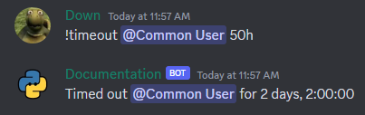

## Using Converters

To use a converter, you annotate a function parameter with the desired converter class. For built-in converters, you can directly use the provided classes like `discord.Member` or `discord.TextChannel`. For custom converters, you need typehint the function parameter as your subclassed converter class.

## Basic

You can use standard Python types like `int` or `float` as converters. These types can be used to convert user input into integer or float values, respectively.

!!! note "Note"
    By default, when passing arguments to a command, they are treated as strings. Therefore, it is necessary to convert them to the appropriate data type, such as integers, in order to perform operations on them.

Example usage:

```python
@bot.command()
async def double(ctx, number: int):
    result = number * 2
    await ctx.send(f"The double of {number} is {result}")

@bot.command()
async def square(ctx, number: float):
    result = number ** 2
    await ctx.send(f"The square of {number} is {result}")
```


## Discord built-in

Built-in converters in Discord.py are provided by the library and are readily available for use. They help in converting user input into specific data types such as `discord.Member`, `discord.User`, `discord.TextChannel`, `discord.Role` and many more full list can be found [here](https://discordpy.readthedocs.io/en/stable/ext/commands/commands.html#discord-converters).

Example usage:

```python
@bot.command()
async def greet(ctx, member: discord.Member):
    await ctx.send(f"Hello, {member.mention}!")
```


## Custom

Custom converters in Discord.py allow you to define your own conversion logic for specific types of inputs. You can create a custom converter by subclassing the `commands.Converter` class provided by Discord.py and implementing the `convert` method.

Example usage:

```python
class DurationConverter(commands.Converter):
    async def convert(self, ctx: commands.Context, argument: str) -> datetime.timedelta:
        multipliers = {
            's': 1,  # seconds
            'm': 60,  # minutes
            'h': 3600,  # hours
            'd': 86400,  # days
            'w': 604800  # weeks
        }

        try:
            amount = int(argument[:-1])
            unit = argument[-1]
            seconds = amount * multipliers[unit]
            delta = datetime.timedelta(seconds=seconds)
            return delta
        except (ValueError, KeyError):
            raise commands.BadArgument("Invalid duration provided.")

@bot.command()
async def timeout(ctx: commands.Context, member: discord.Member, duration: DurationConverter):
    await member.timeout(duration)
    await ctx.send(f"Timed out {member.mention} for {duration}")
```



