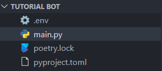

# Creating a discord Bot

## Prerequisites

- [x] Python 3.8 or higher installed on your computer.
- [x] A Discord bot created on the [Discord Developer Portal](https://discord.com/developers/applications).
- [x] The bot token copied to your clipboard or saved somewhere safe.
- [x] The bot added to a server.

Make sure to have the above prerequisites ready before moving on to the next section. If you don't have any of the above, please go back to the [previous section](./index.md) and complete it.

## Creating a Bot

Now that we have the prerequisites ready, we can start creating the bot. To do this, we need to create a new folder for our bot. You can name this folder anything you want. After creating the folder, open it in your favorite code editor. I will be using Visual Studio Code for this tutorial.

After opening the folder in your code editor, we need to create a new file called `main.py`. This is the main file of our bot. This is where we will be writing all our code. After creating the file, we need to create a new file called `.env`. This is where we will be storing our bot token.

{ align=left width="65%" }

{ width="30%" }

```dotenv title=".env"
TOKEN=your_token_here
```

!!! warning "Warning"
    Please make sure to keep your bot token safe. If someone gets access to your bot token, they can do anything with your bot. If you think someone has access to your bot token, you can regenerate it on the [Discord Developer Portal](https://discord.com/developers/applications).

Replace `your_token_here` with your bot token. After adding the token, we need to install the discord.py library. To do this, open a new terminal in your code editor and run the following command:

=== "Without Voice Support (Python 3.13+)"
    ```bash
    pip install discord.py audioop-lts
    ```

=== "With Voice Support (Pre Python 3.13+)"
    ```bash
    pip install discord.py[voice] audioop-lts
    ```

    Linux users might need to install the following packages to enable voice support:

    === "Debian/Ubuntu"
        ```bash
        sudo apt install libffi-dev libsodium-dev python3-dev
        ```

    === "Fedora/RHEL/CentOS"
        ```bash
        sudo dnf install libffi-devel libsodium-devel python3-devel
        ```

    === "Arch"
        ```bash
        sudo pacman -Syu libffi libsodium
        ```

    !!! warning "Warning"
        If you are on any other distribution, you will need to install the required packages using your package manager.

        - `libffi-dev` or `libffi-devel`
        - `libsodium-dev` or `libsodium-devel`


=== "Without Voice Support (Pre Python 3.13)"
    ```bash
    pip install discord.py
    ```

=== "With Voice Support (Pre Python 3.13)"
    ```bash
    pip install discord.py[voice]
    ```

    Linux users might need to install the following packages to enable voice support:

    === "Debian/Ubuntu"
        ```bash
        sudo apt install libffi-dev libsodium-dev python3-dev
        ```

    === "Fedora/RHEL/CentOS"
        ```bash
        sudo dnf install libffi-devel libsodium-devel python3-devel
        ```

    === "Arch"
        ```bash
        sudo pacman -Syu libffi libsodium
        ```

    !!! warning "Warning"
        If you are on any other distribution, you will need to install the required packages using your package manager.

        - `libffi-dev` or `libffi-devel`
        - `libsodium-dev` or `libsodium-devel`


!!! note "Note"
    You can use ++ctrl+"`"++ to open a new terminal in Visual Studio Code.  

    For more advanced users, it's recommended to use a virtual environment or a package manager like [Poetry](https://python-poetry.org/).
    A virtual environment is a tool that helps manage dependencies for different projects. This means that you can have different versions of the same package installed for different projects. This is useful when you are working on multiple projects that use different versions of the same package. It does this by creating isolated environments for each project.

    === "Virtual Environment"

        === "Windows"
            ```bash
            # Initialize the virtual environment
            py -m venv venv
            # Activate the virtual environment
            venv/Scripts/activate
            # Install discord.py
            pip install discord.py
            # If running on Python 3.13 and above
            pip install audioop-lts
            ```
        === "Mac & Linux"
            ```bash
            # Initialize the virtual environment
            python3 -m venv venv
            # Activate the virtual environment
            source venv/bin/activate
            # Install discord.py
            pip install discord.py
            # If running on Python 3.13 and above
            pip install audioop-lts
            ```
        { align=left }
        { align=right }

        !!! note "Note"
            You will need to activate the virtual environment every time you open a new terminal. As an indicator, you will see `(venv)` in your terminal.

        !!! warning "Warning"
            If you get an error in windows saying `Activate.ps1 cannot be loaded because running scripts is disabled on this system`, you will need to run the following command in an elevated PowerShell session:

            ```powershell
            Set-ExecutionPolicy -ExecutionPolicy RemoteSigned -Scope CurrentUser
            ```
    === "Poetry"
        ```bash
        poetry init
        poetry add discord.py
        # If on Python 3.13 and above
        poetry add audioop-lts
        ```
        { align=left }
        { align=right }
        !!! note "Note"
            You will need to run `poetry shell` every time you open a new terminal. As an indicator, you will see `(<project-name>)` in your terminal.

## Writing the Code

Before we jump into writing code we need to install one more package. This package is called `python-dotenv`. This package allows us to read the `.env` file we created earlier. To install this package, run the following command in your terminal:

```bash
pip install python-dotenv
```

!!! info "Note"
    A `.env` file is a file that contains environment variables. These variables are used to store sensitive information like API keys and tokens. These variables are not shared with anyone and are only used by the developer.

Now that we have everything ready, we can start writing the code. Open the `main.py` file and add the following code:

=== "Using Client"
    ```python
    import os

    import discord
    from dotenv import load_dotenv

    load_dotenv()

    TOKEN = os.getenv("TOKEN")

    client = discord.Client(intents=discord.Intents.all())

    @client.event
    async def on_ready() -> None:
        print(f"Logged in as {client.user}")

    client.run(TOKEN)
    ```
=== "Using Bot"
    ```python
    import os

    import discord
    from discord.ext import commands
    from dotenv import load_dotenv

    load_dotenv()

    TOKEN = os.getenv("TOKEN")

    bot = commands.Bot(command_prefix="!", intents=discord.Intents.all())

    @bot.event
    async def on_ready() -> None:
        print(f"Logged in as {bot.user}")

    bot.run(TOKEN)
    ```

!!! info "Note"
    To run the bot, you can use the following command:

    ```bash
    python main.py # Make sure you are in the same directory as the main.py file in your terminal.
    ```
    If you are using a virtual environment or Poetry, you will need to activate it first. And to stop the bot, you can use ++ctrl+c++.


### Differences between Client and Bot

Now looking at the code, you might be wondering what the difference between `Client` and `Bot` is and when to use which. The `commands.Bot` class is a subclass of the `discord.Client` class. This means that the `commands.Bot` class has all the functionality of the `discord.Client` class and more.  

The `commands.Bot` class is used to create a bot that can respond to commands. The `discord.Client` class is used to create a bot that can respond to events. For example, if you want to create a bot that responds to prefix commands with a bunch of complex commands and functionalities, it is recommended to use the `commands.Bot` class.
If you want to just create a minimal bot that responds to events or with just a few slash commands, you can use the `discord.Client` class.

In most cases, you will be using the `commands.Bot` class.

| Client                                                                 | Bot                                                                                        |
|------------------------------------------------------------------------|--------------------------------------------------------------------------------------------|
| Capable of only responding to events and slash commands if configured. | Capable of responding to events, commands, and slash commands with out of the box support. |
| Can be used to create a minimal bot.                                   | Can be used to create a bot with more functionality.                                       |
| Not possible to add cogs.                                              | Possible to add cogs.                                                                      |
| Not possible to make prefix commands.                                  | Possible to make prefix commands.                                                          |
| Only possible to have 1 callback per event.                            | Possible to have multiple callbacks per event using `listen` decorators.                    |

!!! note "Note"
    A `discord.Client` instance allows for only 1 callback per event. This means that if you have 2 `on_message` callbacks, only 1 of them will be called.

    ```python
    @client.event
    async def on_message(message: discord.Message) -> None:
        print("First callback")

    @client.event
    async def on_message(message: discord.Message) -> None:
        print("Second callback")
    ```
    In the above example, only the first callback will be called.

    But if you are using an instance of `commands.Bot`, you can use the `listen` decorator to add multiple callbacks to the same event.

    ```python
    @bot.event
    async def on_message(message: discord.Message) -> None:
        print("First callback")

    @bot.listen("on_message")
    async def on_message(message: discord.Message) -> None:
        print("Second callback")
    ```
    In the above example, both callbacks will be called.

!!! warning "Warning"
    Don't use both the `discord.Client` and `commands.Bot` class at the same time it will cause confusion and unexpected behavior and errors.

### Using Intents

Intents are a way to tell Discord what events your bot is interested in. For example, if you want to receive messages from users, you would need to enable the `discord.Intents.messages` intent. If you want to receive reactions from users, you would need to enable the `discord.Intents.reactions` intent.  

If you want to receive all events, you would need to enable all intents. This can be done by using the `discord.Intents.all()` intent. If you want to receive only the default events, you would need to enable the `discord.Intents.default()` intent. This can be done by using the `discord.Intents.default()` intent.  

The default intents contain all intents except for the `discord.Intents.members`, `discord.Intents.message_content` and `discord.Intents.presences` intents. This is because these intents are privileged intents. This means that you need to enable them on the [Discord Developer Portal](https://discord.com/developers/applications) before you can use them.

!!! note "Note"
    Make sure to only enable the intents you need. If you enable all intents, your bot might be slower and consume more resources unnecessarily.


### Using Commands and Events

Now that we have our bot ready, we can start adding commands and events. Here is the list of possible [events](https://discordpy.readthedocs.io/en/stable/api.html#event-reference).

=== "Prefix Commands"
    ```python
    import os

    import discord
    from discord.ext import commands
    from dotenv import load_dotenv

    load_dotenv()

    TOKEN = os.getenv("TOKEN")

    intents = discord.Intents.default()
    intents.message_content = True
    bot = commands.Bot(command_prefix=commands.when_mentioned_or("!"), intents=intents)  # commands.when_mentioned_or("!") is used to make the bot respond to !ping and @bot ping

    @bot.event
    async def on_ready() -> None:  # This event is called when the bot is ready
        print(f"Logged in as {bot.user}")

    @bot.event
    async def on_message(message: discord.Message) -> None:  # This event is called when a message is sent
        if message.author.bot:  # If the message is sent by a bot, return
            return

        if message.content == "Hello":  # If the message content is Hello, respond with Hi
            await message.channel.send("Hi")

        await bot.process_commands(message)  # This is required to process commands

    @bot.command()
    async def ping(ctx: commands.Context) -> None:  
        await ctx.send(f"> Pong! {round(bot.latency * 1000)}ms")

    bot.run(TOKEN)
    ```
    {: style="width: 100%"}
    !!! warning "Warning"
        If you don't call `bot.process_commands(message)` in the `on_message` event, the bot will not process commands the way it is supposed to. This means that the bot will not respond to commands.

    !!! note "Greedy Arguments"
        If you want to pass multiple arguments to a command, you can use the `*` operator. The `*` operator marks the parameter after it as a greedy argument. This means that the parameter will consume all the arguments passed to the command.

        ```python
        @bot.command()
        async def echo(ctx: commands.Context, *, message: str) -> None:
            await ctx.send(message)
        ```
        In the above example, the `message` parameter will consume all the arguments passed to the command. This also means that any parameter after the `message` parameter will cause an error due to missing arguments.

        A thing to note however is that this specific behavior is only with respect to `discord.py` and not Python itself. In Python, any parameters defined after a `*` operator are considered keyword-only arguments.
=== "Slash Commands"
    ```python
    import os

    import discord
    from discord.ext import commands
    from dotenv import load_dotenv

    load_dotenv()

    TOKEN = os.getenv("TOKEN")

    intents = discord.Intents.default()
    intents.message_content = True
    bot = commands.Bot(command_prefix=commands.when_mentioned_or("!"), intents=intents)  # commands.when_mentioned_or("!") is used to make the bot respond to !ping and @bot ping

    async def setup_hook() -> None:  # This function is automatically called before the bot starts
        await bot.tree.sync()   # This function is used to sync the slash commands with Discord it is mandatory if you want to use slash commands

    bot.setup_hook = setup_hook  # Not the best way to sync slash commands, but it will have to do for now. A better way is to create a command that calls the sync function.

    @bot.event
    async def on_ready() -> None:  # This event is called when the bot is ready
        print(f"Logged in as {bot.user}")

    @bot.tree.command()
    async def ping(inter: discord.Interaction) -> None:
        await inter.response.send_message(f"> Pong! {round(bot.latency * 1000)}ms")

    bot.run(TOKEN)
    ```
    {: style="width: 100%;"}
    !!! info "Note"
        The first required argument of a slash command is always `inter: discord.Interaction` and all further arguments must be type hinted.
=== "Hybrid Commands"
    ```python
    import os

    import discord
    from discord.ext import commands
    from dotenv import load_dotenv

    load_dotenv()

    TOKEN = os.getenv("TOKEN")

    intents = discord.Intents.default()
    intents.message_content = True
    bot = commands.Bot(command_prefix=commands.when_mentioned_or("!"), intents=intents)  # commands.when_mentioned_or("!") is used to make the bot respond to !ping and @bot ping

    async def setup_hook() -> None:  # This function is automatically called before the bot starts
        await bot.tree.sync()   # This function is used to sync the slash commands with Discord it is mandatory if you want to use slash commands

    bot.setup_hook = setup_hook  # Not the best way to sync slash commands, but it will have to do for now. A better way is to create a command that calls the sync function.

    @bot.event
    async def on_ready() -> None:  # This event is called when the bot is ready
        print(f"Logged in as {bot.user}")

    @bot.hybrid_command()
    async def ping(ctx: commands.Context) -> None:  # This is a hybrid command, it can be used as a slash command and as a normal command
        await ctx.send(f"> Pong! {round(bot.latency * 1000)}ms")

    bot.run(TOKEN)
    ```
    {: style="width: 100%;"}
    !!! info "Note"
        In hybrid commands, the first required argument must be `ctx: commands.Context` and all further arguments must be type hinted so as to support slash commands.

!!! danger "Danger"
    You should be careful when using the `on_ready` event. This event is called whenever the bot is ready. This means that if the bot disconnects and reconnects, the `on_ready` event will be called again. This can cause unexpected behavior in your bot by running the same code multiple times.
    If you want to run a piece of code only once before the bot starts, you should use the `setup_hook` function.

    ```python
    async def setup_hook() -> None:
        # Your code here

    bot.setup_hook = setup_hook
    ```

!!! note "Note"
    If you want to use `discord.Client` for slash commands, the process is the same as the one for `discord.ext.commands.Bot`. The only difference is that you need to create a tree attribute for your client instance manually.
    Documentation for `discord.app_commands.CommandTree` can be found [here][discord.app_commands.CommandTree].

    ```python
    client = discord.Client(intents=discord.Intents.all())
    client.tree = discord.app_commands.CommandTree(client)
    ```

## Making an Advanced Bot

Now that we have a basic bot, we will apply what we learned to make an advanced bot and add more functionality to it creating a robust core for our bot.

```python
import datetime
import logging
import os
import traceback
import typing

import aiohttp
import discord
from discord.ext import commands
from dotenv import load_dotenv


class CustomBot(commands.Bot):
    client: aiohttp.ClientSession
    _uptime: datetime.datetime = datetime.datetime.utcnow()

    def __init__(self, prefix: str, ext_dir: str, *args: typing.Any, **kwargs: typing.Any) -> None:
        intents = discord.Intents.default()
        intents.members = True
        intents.message_content = True
        super().__init__(*args, **kwargs, command_prefix=commands.when_mentioned_or(prefix), intents=intents)
        self.logger = logging.getLogger(self.__class__.__name__)
        self.ext_dir = ext_dir
        self.synced = False

    async def _load_extensions(self) -> None:
        if not os.path.isdir(self.ext_dir):
            self.logger.error(f"Extension directory {self.ext_dir} does not exist.")
            return
        for filename in os.listdir(self.ext_dir):
            if filename.endswith(".py") and not filename.startswith("_"):
                try:
                    await self.load_extension(f"{self.ext_dir}.{filename[:-3]}")
                    self.logger.info(f"Loaded extension {filename[:-3]}")
                except commands.ExtensionError:
                    self.logger.error(f"Failed to load extension {filename[:-3]}\n{traceback.format_exc()}")

    async def on_error(self, event_method: str, *args: typing.Any, **kwargs: typing.Any) -> None:
        self.logger.error(f"An error occurred in {event_method}.\n{traceback.format_exc()}")

    async def on_ready(self) -> None:
        self.logger.info(f"Logged in as {self.user} ({self.user.id})")

    async def setup_hook(self) -> None:
        self.client = aiohttp.ClientSession()
        await self._load_extensions()
        if not self.synced:
            await self.tree.sync()
            self.synced = not self.synced
            self.logger.info("Synced command tree")

    async def close(self) -> None:
        await super().close()
        await self.client.close()

    def run(self, *args: typing.Any, **kwargs: typing.Any) -> None:
        load_dotenv()
        try:
            super().run(str(os.getenv("TOKEN")), *args, **kwargs)
        except (discord.LoginFailure, KeyboardInterrupt):
            self.logger.info("Exiting...")
            exit()

    @property
    def user(self) -> discord.ClientUser:
        assert super().user, "Bot is not ready yet"
        return typing.cast(discord.ClientUser, super().user)

    @property
    def uptime(self) -> datetime.timedelta:
        return datetime.datetime.utcnow() - self._uptime


def main() -> None:
    logging.basicConfig(level=logging.INFO, format="[%(asctime)s] %(levelname)s: %(message)s")
    bot = CustomBot(prefix="!", ext_dir="cogs")
    bot.run()


if __name__ == "__main__":
    main()
```

This bot has a lot of new features, so let's go over them one by one. This bot template can be used for both slash commands and regular commands or hybrid commands.

- [x] `CustomBot` has a `logger` attribute that is used to log messages to the console.
- [x] `CustomBot` has an `ext_dir` attribute that is used to store the path to the directory where the bot's extensions/cogs are stored and loaded from.
- [x] `CustomBot` has a `synced` attribute that is used to check if the bot's slash commands are synced with Discord.
- [x] `CustomBot` has a `client` attribute that is used to make HTTP requests.
- [x] `CustomBot` has a basic error handler that logs the error to the console.
- [x] `CustomBot` has an `uptime` property that is used to get the bot's uptime.

!!! warning "Warning"
    For conducting specific actions on startup, you should use the `setup_hook` function. This function is called before the bot starts and is the best place to put your startup code. Please do not put your startup code in `on_ready` as this event is fired whenever bot connection to discord gateway is established. This means that `on_ready` can be called multiple times during the bot's lifetime.

## Conclusion

In this tutorial, we learned how to create a simple bot application using discord.py. We also learned how to create a more advanced bot application that can be used as a template for future projects. Going forward, we will further expand on this template and add more functionality to it.
