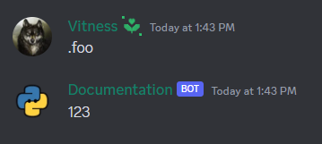

# Custom Context Class

There are many uses for [context](https://discordpy.readthedocs.io/en/latest/ext/commands/api.html?#discord.ext.commands.Context) and its properties, however occasionally we wish to add some additional methods or attributes.

Here is how you do it in discord.py:

### Creating custom context class

* Subclass context and add your features

```py
import typing

from discord.ext import commands

class MyContext(commands.Context):
    def __init__(self, *args: typing.Any, **kwargs: typing.Any):
        super().__init__(*args, **kwargs)
        self.test = 123

    async def send_test(self):
        await self.send(f"{self.test}")
```

!!! info "Note"
    You can override any library methods of context if you want.

### Overriding get_context

* Make discord.py use your context class by overriding the [get_context](https://discordpy.readthedocs.io/en/stable/ext/commands/api.html?#discord.ext.commands.Bot.get_context) method in the bot subclass.

```py
import discord
from discord.ext import commands

class MyBot(commands.Bot):
    async def get_context(self, message: discord.Message, *, cls=CustomContext):
        return await super().get_context(message, cls=cls)
```

* Don't forget to use your custom bot class, not default one

```py
bot = MyBot(".", intents=intents)
```

### Creating example command

```py
@bot.command()
async def foo(ctx: MyContext) -> None:
    await ctx.send_test()
```

### Result

{ align=left }

And that's it! You can now use your custom context class.

!!! info "Note"
    Custom class context is limited to commands which you `commands.Context` as a required argument. Meaning that you can't use it with slash commands.

### More examples

Here are a few more examples from discord.py

[:fontawesome-solid-paper-plane: Examples](https://github.com/Rapptz/discord.py/blob/master/examples/custom_context.py){ .md-button .md-button--primary }
