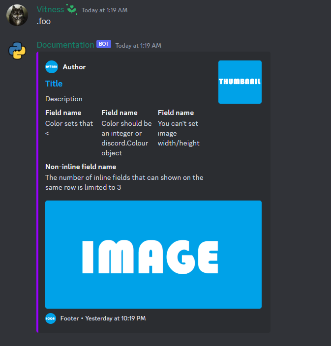
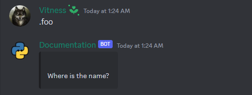

# Embeds

## What is Embed?

Discord Embed object is a message component that is used as a way of adding rich content with different structures and formatting styles

## Overview

Here is an example of an embed with all its features.

```py
@bot.command()
async def foo(ctx: commands.Context):
    some_url = "https://fallendeity.github.io/discord.py-masterclass/"
    embed = discord.Embed(
        title="Title",
        description="Description",
        url=some_url,
        color=discord.Color.random(),
        timestamp=datetime.datetime.utcnow()
    )
    embed.add_field(name="Field name", value="Color sets that <")
    embed.add_field(name="Field name", value="Color should be an integer or discord.Colour object")
    embed.add_field(name="Field name", value="You can't set image width/height")
    embed.add_field(name="Non-inline field name", value="The number of inline fields that can shown on the same row is limited to 3", inline=False)
    embed.set_author(name="Author", url=some_url,
                     icon_url="https://cdn.discordapp.com/attachments/1112418314581442650/1124820259384332319/fd0daad3d291ea1d.png")
    embed.set_image(url="https://cdn.discordapp.com/attachments/1028706344158634084/1124822236801544324/ea14e81636cb2f1c.png")
    embed.set_thumbnail(url="https://media.discordapp.net/attachments/1112418314581442650/1124819948317986926/db28bfb9bfcdd1f6.png")
    embed.set_footer(text="Footer", icon_url="https://cdn.discordapp.com/attachments/1112418314581442650/1124820375587528797/dc4b182a87ecee3d.png")
    await ctx.send(embed=embed)
```

!!! warning "Warning"
    Almost all embed methods require keyword-only arguments

!!! info "Note"
    Since most embed methods return the embed itself, you can nest them as follows:
    ```py
    discord.Embed(...).set_image(...).add_field(...)
    ```



## Working with specific fields

### Getting a list of fields

*property* [Embed.fields](https://discordpy.readthedocs.io/en/stable/api.html?#discord.Embed.fields)

```pycon
>>> import discord
>>> embed = discord.Embed()
>>> embed.fields
[]
>>> embed.add_field(name="name", value="value")
>>> embed.fields
[EmbedProxy(inline=True, name='name', value='value')]
>>> embed.fields[0].value
'value'
```

!!!warning "Warning"
    Working with attribute `_fields` directly is a bad practice. Use special embed methods instead

    > _single_leading_underscore: weak “internal use” indicator. E.g. from M import * does not import objects whose names start with an underscore.
    ([pep8](https://peps.python.org/pep-0008/#descriptive-naming-styles))


### Appending a field

*method* [Embed.add_field](https://discordpy.readthedocs.io/en/stable/api.html?#discord.Embed.add_field)

```pycon
>>> import discord
>>> embed = discord.Embed()
>>> embed.add_field(name="name1", value="value1")
>>> embed.add_field(name="name2", value="value2")
>>> embed.add_field(name="name3", value="value3")
>>> embed.fields
[EmbedProxy(inline=True, name='name1', value='value1'), EmbedProxy(inline=True, name='name2', value='value2'), EmbedProxy(inline=True, name='name3', value='value3')]
```

### Inserting field at index

*method* [Embed.insert_field_at](https://discordpy.readthedocs.io/en/stable/api.html?#discord.Embed.insert_field_at)

```pycon
>>> import discord
>>> embed = discord.Embed()
>>> embed.add_field(name="name1", value="value1")
>>> embed.add_field(name="name2", value="value2")
>>> embed.add_field(name="name3", value="value3")
>>> embed.insert_field_at(1, name="new", value="new")
>>> embed.fields
[EmbedProxy(inline=True, name='name1', value='value1'), EmbedProxy(inline=True, name='new', value='new'), EmbedProxy(inline=True, name='name2', value='value2'), EmbedProxy(inline=True, name='name3', value='value3')]
```

### Changing field at index

*method* [Embed.set_field_at](https://discordpy.readthedocs.io/en/stable/api.html?#discord.Embed.set_field_at)

```pycon
>>> import discord
>>> embed = discord.Embed()
>>> embed.add_field(name="name1", value="value1")
>>> embed.add_field(name="name2", value="value2")
>>> embed.add_field(name="name3", value="value3")
>>> embed.set_field_at(1, name="new", value="new")
>>> embed.fields
[EmbedProxy(inline=True, name='name1', value='value1'), EmbedProxy(inline=True, name='new', value='new'), EmbedProxy(inline=True, name='name3', value='value3')]
```

### Removing one field

*method* [Embed.remove_field](https://discordpy.readthedocs.io/en/stable/api.html?#discord.Embed.remove_field)

```pycon
>>> import discord
>>> embed = discord.Embed()
>>> embed.add_field(name="name1", value="value1")
>>> embed.add_field(name="name2", value="value2")
>>> embed.add_field(name="name3", value="value3")
>>> embed.remove_field(1)
>>> embed.fields
[EmbedProxy(inline=True, name='name1', value='value1'), EmbedProxy(inline=True, name='name3', value='value3')]
```

### Removing all fields

*method* [Embed.clear_fields](https://discordpy.readthedocs.io/en/stable/api.html?#discord.Embed.clear_fields)

```pycon
>>> import discord
>>> embed = discord.Embed()
>>> embed.add_field(name="name1", value="value1")
>>> embed.add_field(name="name2", value="value2")
>>> embed.add_field(name="name3", value="value3")
>>> embed.fields
[EmbedProxy(inline=True, name='name1', value='value1'), EmbedProxy(inline=True, name='name2', value='value2'), EmbedProxy(inline=True, name='name3', value='value3')]
>>> embed.clear_fields()
>>> embed.fields
[]
```

## Embed with multiple images

```py
@bot.command()
async def foo(ctx: commands.Context):
    embed = discord.Embed(url="https://fallendeity.github.io/discord.py-masterclass/")
    embed.set_image(url="https://cdn.discordapp.com/attachments/1028706344158634084/1125040932635549818/0e0eb12ccd76d766.png")
    await ctx.send(embeds=[embed, embed])
```

!!! info "Note"
    Embeds must have urls, and these urls have to be the same.


## (De)serialization

Converting embed objects to the Python dictionary and vice versa is very simple.

For that we can use [from_dict](https://discordpy.readthedocs.io/en/stable/api.html?#discord.Embed.from_dict) and [to_dict](https://discordpy.readthedocs.io/en/stable/api.html?#discord.Embed.to_dict) methods

```pycon
>>> import discord
>>> embed = discord.Embed(title="Hello", description="world!")
>>> embed.add_field(name="Field name", value="Field value")
>>> embed_dict = embed.to_dict()
>>> _
{'fields': [{'inline': True, 'name': 'Field name', 'value': 'Field value'}], 'type': 'rich', 'description': 'world!', 'title': 'Hello'}
>>> embed_dict["description"] = "test"
>>> embed = discord.Embed.from_dict(embed_dict)
>>> type(embed)
<class 'discord.embeds.Embed'>
>>> embed.description
'test'
```

## How to create an empty field?

You can't create an empty field due to Discord API restrictions, however you can get around them by using invisible characters

```py
@bot.command()
async def foo(ctx: commands.Context):
    embed = discord.Embed()
    # embed.add_field(name="") -> Error
    embed.add_field(name="\u200b", value="Where is the name?")
    await ctx.send(embed=embed)
```



## How to use local image for an embed image?

!!! info "Note"
    It's a copy from [discord.py faq](https://discordpy.readthedocs.io/en/stable/faq.html#local-image)

Discord special-cases uploading an image attachment and using it within an embed so that it will not display separately, but instead in the embed’s thumbnail, image, footer or author icon.

To do so, upload the image normally with [abc.Messageable.send()](https://discordpy.readthedocs.io/en/stable/api.html#discord.abc.Messageable.send), and set the embed’s image URL to `attachment://image.png`, where `image.png` is the filename of the image you will send.

Quick example:
```py
file = discord.File("path/to/my/image.png", filename="image.png")
embed = discord.Embed()
embed.set_image(url="attachment://image.png")
await channel.send(file=file, embed=embed)
```

## Embed limits

!!! abstract ""
    Embed **title** is limited to **256 characters**

    Embed **description** is limited to **4096 characters**

    An embed can contain a maximum of **25 fields**

    A **field name/title** is limited to **256 character** and the **value** of the field is limited to **1024 characters**

    Embed **footer** is limited to **2048 characters**

    Embed **author name** is limited to **256 characters**

    The **total of characters** allowed in an embed is **6000**

## Embed generating website

!!! warning "Warning"
    We don't advise using the website to create embeds: it's best to do it on your own. But it's actually very comfortable.

On this [site](https://cog-creators.github.io/discord-embed-sandbox/) you can generate discord.py code for creating an embed
