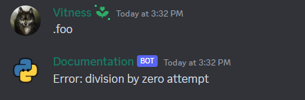
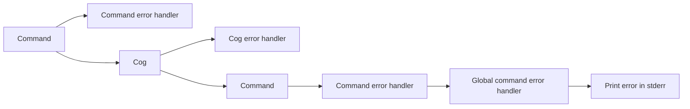
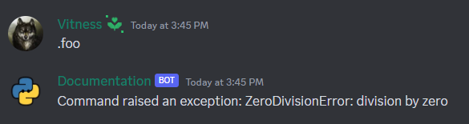
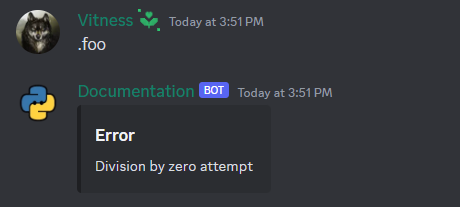
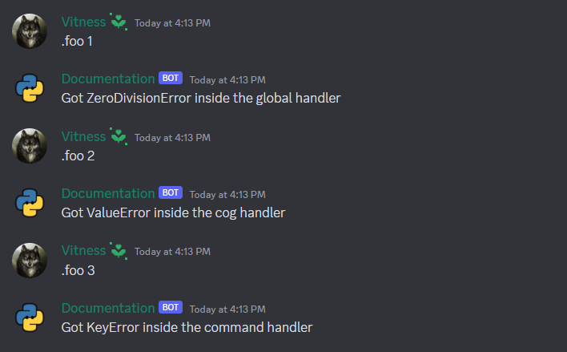
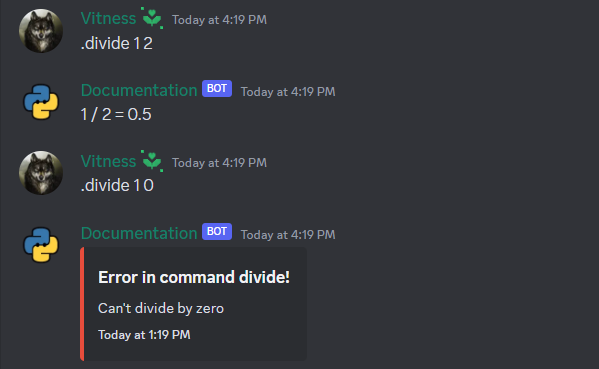
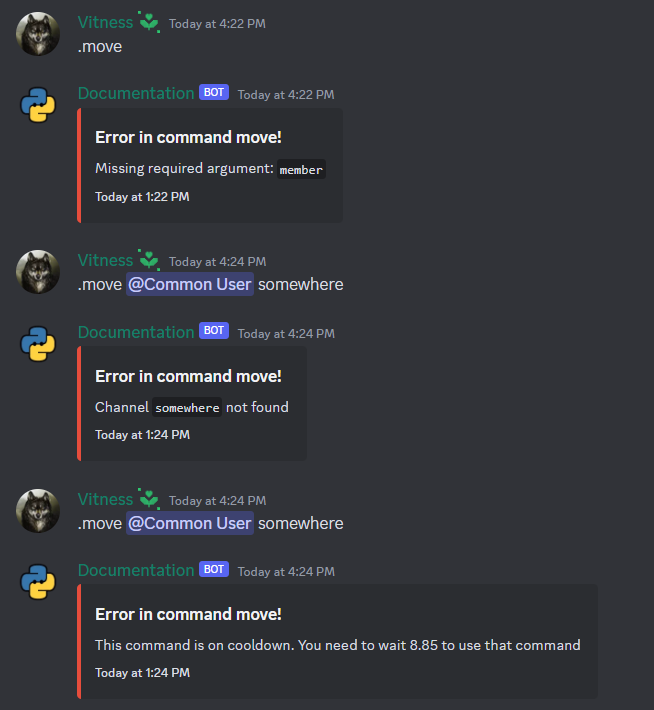
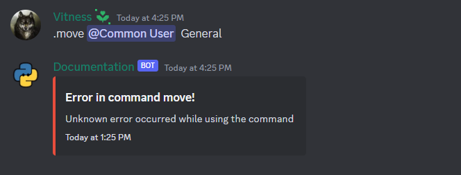
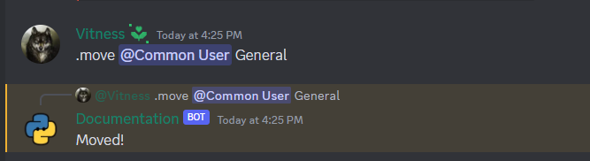

# Error Handling

There are many reasons why you can get an error, ranging from Discord API errors raised by the discord.py library to simple coding mistakes.

## Example command with error

Let's take the command `foo`, which gets some error. We will simply divide by zero within in the example, although there may be any error.

```py
@bot.command()
async def foo(ctx: commands.Context):
    1 / 0
```

When we run the command, we will encounter the following error:

```python
Traceback (most recent call last):
  File "...\lib\site-packages\discord\ext\commands\core.py", line 235, in wrapped
    ret = await coro(*args, **kwargs)
  File "main.py", line ..., in foo
    1 / 0
ZeroDivisionError: division by zero

The above exception was the direct cause of the following exception:

Traceback (most recent call last):
  File "...\lib\site-packages\discord\ext\commands\bot.py", line 1350, in invoke
    await ctx.command.invoke(ctx)
  File "...\lib\site-packages\discord\ext\commands\core.py", line 1029, in invoke
    await injected(*ctx.args, **ctx.kwargs)  # type: ignore
  File "...\lib\site-packages\discord\ext\commands\core.py", line 244, in wrapped
    raise CommandInvokeError(exc) from exc
discord.ext.commands.errors.CommandInvokeError: Command raised an exception: ZeroDivisionError: division by zero
```

Usually, we don't want that, right? We wish to respond to the error in some way, like informing the user.

So let's handle the error!

## Basic error handling (try-except)

In Python, try-except is typically used to capture exceptions. Of course, you can also use them in discord.py, but doing so is less comfortable and has some drawbacks (not everything in discord.py can be captured with it).

```py
@bot.command()
async def foo(ctx: commands.Context):
    try:
        1 / 0
    except ZeroDivisionError:
        await ctx.send("Error: division by zero attempt")
```

{ align=left }

!!! info "Note"
    With such code, you cannot handle exceptions from things like checks or cooldowns and errors which occur in the command itself, but not in the try-except block.

## What library does with the errors

When a command in Discord.py encounters an error, the library handles it in the following order rather than terminating the code with an error:

* Run the command's error handler if it has one.
* Run the error handler if command is contained within a cog and the cog has one.
* Run the global command error handler if exists.
* Print the error in the stderr without quitting the program if there are no error handlers.



!!! warning "Warning"
    Making an error handler will suppress any errors, making it difficult to debug your code. Normally, if your handler doesn't pass any conditions, you print out the error. We won't do that here.

## Exception Hierarchy

The [discord.py documentation](https://discordpy.readthedocs.io/en/stable/ext/commands/api.html?#exception-hierarchy) contains a list of all errors and their hierarchy.

## Command Handler

To create a handler for a single command, use [Command.error](https://discordpy.readthedocs.io/en/stable/ext/commands/api.html?#discord.ext.commands.Command.error) decorator.  This handler will only operate with this command, not any others.

```py
@bot.command()
async def foo(ctx: commands.Context):
    1 / 0

@foo.error
async def foo_error(ctx: commands.Context, error: commands.CommandError):
    await ctx.send(error)
```

{ style="width: 100%" }

Much better! But to a user who is not a programmer, it does not appear to be very understandable So we can simply format it whatever we like. [Built-in isinstance function](https://docs.python.org/3/library/functions.html#isinstance) is suggested as a method for determining the type of error.

```py
@foo.error
async def foo_error(ctx: commands.Context, error: commands.CommandError):
    embed = discord.Embed(title="Error")
    if isinstance(error, commands.CommandInvokeError):
        error = error.original
    if isinstance(error, ZeroDivisionError):
        embed.description = "Division by zero attempt"
    else:
        embed.description = "Unknown error"
    await ctx.send(embed=embed)
```

{ align=left }

!!! info "Note"
    If there is an actual error in your code, then it will be a [CommandInvokeError](https://discordpy.readthedocs.io/en/stable/ext/commands/api.html?#discord.ext.commands.CommandInvokeError). We can use its `original` or `__cause__` attribute to retrieve the original error.
    ```py
    error = error.__cause__
    ```

## Cog Handler

You can set up a cog handler if there are several commands with the same exceptions in the same cog.

For that you need create a cog and override [Cog.cog_command_error](https://discordpy.readthedocs.io/en/stable/ext/commands/api.html?#discord.ext.commands.Cog.cog_command_error) method.

```py
import traceback

import discord
from discord.ext import commands

class Example(commands.Cog):
    @commands.command()
    async def foo(self, ctx: commands.Context):
        1 / 0

    async def cog_command_error(self, ctx: commands.Context, error: commands.CommandError):
        embed = discord.Embed(title="Error")
        if isinstance(error, commands.CommandInvokeError):
            error = error.original
        if isinstance(error, ZeroDivisionError):
            embed.description = "Division by zero attempt"
        else:
            error_data = "".join(traceback.format_exception(type(error), error, error.__traceback__))
            embed.description = f"Unknown error\n```py\n{error_data[:1000]}\n```"
        await ctx.send(embed=embed)


async def setup(bot: commands.Bot):
    await bot.add_cog(Example())
```

{ align=left }

!!! warning "Warning"
    Make sure to load your cogs otherwise commands will not be registered to bot and there will be no response. To load cogs, use the [Bot.load_extension](https://discordpy.readthedocs.io/en/stable/ext/commands/api.html?#discord.ext.commands.Bot.load_extension) method.

    ```py
    bot.load_extension("cogs.example")
    ```

## Global Handler

It can get very boring to handle errors for each command or cog separately. Especially when we do it similarly everywhere.

Let's make a global error handler, that will be used by all commands.

For that you need to override bot's [on_command_error method](https://discordpy.readthedocs.io/en/stable/ext/commands/api.html?#discord.ext.commands.Bot.on_command_error).

In order to accomplish this, you can either subclass the bot and modify its method, or use [Bot.event](https://discordpy.readthedocs.io/en/stable/ext/commands/api.html?#discord.ext.commands.Bot.event) or [Bot.listen](https://discordpy.readthedocs.io/en/stable/ext/commands/api.html?#discord.ext.commands.Bot.listen) decorator.

```py
import traceback

import discord
from discord.ext import commands

@bot.command()
async def foo(ctx: commands.Context):
    1 / 0

@bot.event
async def on_command_error(ctx: commands.Context, error: commands.CommandError):
    embed = discord.Embed(title="Error")
    if isinstance(error, commands.CommandInvokeError):
        error = error.original
    if isinstance(error, ZeroDivisionError):
        embed.description = "Division by zero attempt"
    else:
        error_data = "".join(traceback.format_exception(type(error), error, error.__traceback__))
        embed.description = f"Unknown error\n```py\n{error_data[:1000]}\n```"
    await ctx.send(embed=embed)
```


!!! warning "Warning"
    Always make sure to have an `else` clause in your error handler. Otherwise, you will not be able to see the actual error if it is not one of the expected ones.

    ```py
    @bot.event
    async def on_command_error(ctx: commands.Context, error: commands.CommandError):
        embed = discord.Embed(title="Error")
        if isinstance(error, commands.CommandInvokeError):
            error = error.original
        if isinstance(error, ZeroDivisionError):
            embed.description = "Division by zero attempt"
        # else:
        #     embed.description = "Unknown error"
        await ctx.send(embed=embed)
    ```
    In such a situation, you will not be able to see the actual error as the error handler will be eating away the error.

## Expanded Example

### Sequential handling

Both will be executed if command has an error handler and command's cog has an error handler. We can use it to only check for errors where we have to.

Let's use such command `foo` and consider that the first error might occur in any command, the second could occur only in that command cog, and the third could only occur in this command.

```py
class Example(commands.Cog):
    async def cog_command_error(self, ctx: commands.Context, error: commands.CommandError):
        if isinstance(error, commands.CommandInvokeError) and isinstance(error.original, ValueError):
            await ctx.send("Got ValueError inside the cog handler")

    @commands.command()
    async def foo(self, ctx: commands.Context, arg: int):
        if arg == 1:
            1 / 0
        if arg == 2:
            int("x")
        if arg == 3:
            {"hello": "world"}["test"]

    @foo.error
    async def foo_error(self, ctx: commands.Context, error: commands.CommandError):
        if isinstance(error, commands.CommandInvokeError) and isinstance(error.original, KeyError):
            await ctx.send("Got KeyError inside the command handler")


@bot.event
async def setup_hook():
    await bot.add_cog(Example())


@bot.event
async def on_command_error(ctx: commands.Context, error: commands.CommandError):
    if isinstance(error, commands.CommandInvokeError) and isinstance(error.original, ZeroDivisionError):
        await ctx.send("Got ZeroDivisionError inside the global handler")
```



### Full bot with more errors

An expanded example with some additional errors:

```py
import datetime
import traceback

import discord
from discord.ext import commands

intents = discord.Intents.default()
intents.message_content = True
bot = commands.Bot(".", intents=intents)


class AuthorHasLowerRole(commands.CommandError):
    """Exception raised when user tries to move the user which has a better role"""


@bot.event
async def on_command_error(ctx: commands.Context, error: commands.CommandError):
    if isinstance(error, commands.CommandNotFound):
        return
    if not isinstance(error, commands.CommandOnCooldown):
        ctx.command.reset_cooldown(ctx)
    embed = discord.Embed(
        title=f"Error in command {ctx.command}!",
        description="Unknown error occurred while using the command",
        color=discord.Color.red(),
        timestamp=datetime.datetime.utcnow()
    )
    if isinstance(error, commands.CommandInvokeError):
        if isinstance(error.original, ZeroDivisionError):
            embed.description = "Can't divide by zero"
    elif isinstance(error, commands.CommandOnCooldown):
        embed.description = f"This command is on cooldown. You need to wait {error.retry_after:.2f} to use that command"
    elif isinstance(error, AuthorHasLowerRole):
        embed.description = "You can't manage this member because he has a better role than yours"
    elif isinstance(error, commands.BotMissingPermissions):
        embed.description = f"I am missing required permissions to do that"
        embed.add_field(name="List of permissions", value=', '.join(error.missing_permissions))
    elif isinstance(error, commands.MissingPermissions):
        embed.description = f"You are missing required permissions to do that"
        embed.add_field(name="List of permissions", value=', '.join(error.missing_permissions))
    elif isinstance(error, commands.BadArgument):
        if isinstance(error, commands.MemberNotFound):
            embed.description = f"Member `{error.argument}` not found"
        elif isinstance(error, commands.ChannelNotFound):
            embed.description = f"Channel `{error.argument}` not found"
    elif isinstance(error, commands.MissingRequiredArgument):
        embed.description = f"Missing required argument: `{error.param.name}`"
    else:
        error_data = "".join(traceback.format_exception(type(error), error, error.__traceback__))
        embed.description = f"Unknown error\n```py\n{error_data[:1000]}\n```"
    await ctx.send(embed=embed)


@bot.command()
async def divide(ctx: commands.Context, a: int, b: int):
    await ctx.send(f"{a} / {b} = {a / b}")


@bot.command()
@commands.cooldown(1, 10, commands.BucketType.user)
@commands.has_guild_permissions(move_members=True)
async def move(ctx: commands.Context, member: discord.Member, channel: discord.VoiceChannel, *, reason="No reason provided"):
    if ctx.author.top_role <= member.top_role:
        raise AuthorHasLowerRole()
    await member.move_to(channel, reason=reason)
    await ctx.reply("Moved!")

bot.run("TOKEN")
```

!!! info "Note"
    When a command encounters any exception, it still updates the cooldown, so this code resets it:
    ```py
    if not isinstance(error, commands.CommandOnCooldown):
        ctx.command.reset_cooldown(ctx)
    ```
    Using it or not is entirely up to you.






* If we use that command and the member is not connected to any voice, we receive an unknown error because we didn't handle it (none of our conditions were met).



* However, this command will function properly if the user is connected to a voice channel.


