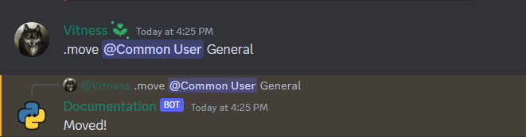

# Error Handling

There can be a lot of reasons why you get an error - from Discord API errors raised by the discord.py library to just some common errors in your code

## Example command with error

Let's take a command `foo` that get's some error. In the example we will just divide by zero inside, but there can be any error

```py
@bot.command()
async def foo(ctx: commands.Context):
    1 / 0
```

So, when we run it we will get such error

```
Traceback (most recent call last):
  File "...\lib\site-packages\discord\ext\commands\core.py", line 235, in wrapped
    ret = await coro(*args, **kwargs)
  File "main.py", line ..., in foo
    1 / 0
ZeroDivisionError: division by zero

The above exception was the direct cause of the following exception:

Traceback (most recent call last):
  File "...\lib\site-packages\discord\ext\commands\bot.py", line 1350, in invoke
    await ctx.command.invoke(ctx)
  File "...\lib\site-packages\discord\ext\commands\core.py", line 1029, in invoke
    await injected(*ctx.args, **ctx.kwargs)  # type: ignore
  File "...\lib\site-packages\discord\ext\commands\core.py", line 244, in wrapped
    raise CommandInvokeError(exc) from exc
discord.ext.commands.errors.CommandInvokeError: Command raised an exception: ZeroDivisionError: division by zero
```

That's usually not what we want, right? We want to do something with the error, for example say the user about it.

So let's handle the error!

## Basic error handling (try-except)

Usually you catch exceptions with [try-except](https://realpython.com/python-exceptions/) in python. Of course you can do it in discord.py too, but it is not
very comfortable and has some problems (not everything in discord.py can be catched with it)

```py
@bot.command()
async def foo(ctx: commands.Context):
    try:
        1 / 0
    except ZeroDivisionError:
        await ctx.send("Error: division by zero attempt")
```

!!! warning "Warning"
    You can't handler errors from things like checks or cooldowns with such code


## What library does with the errors

When command gets an error in discord.py it doesn't terminate the code with error but is handled by the library in such order:

* if command has an error handler, run it.
* if command is inside a cog and command's cog has an error handler, run it.
* if global command error handler exists, run it
* if there are no handlers, print out error in the stderr without exiting the program

!!! warning "Warning"
    When you make an error handler it will suppress any error, making your code hard to debug. We won't do it here, but usually you will print out the error if it hasn't passed any condition in your handler.

## Exception Hierarchy

A list of all errors and their hierarchy can be found in the [discord.py docs](https://discordpy.readthedocs.io/en/stable/ext/commands/api.html?#exception-hierarchy)

## Command Handler

You can use [command.error](https://discordpy.readthedocs.io/en/stable/ext/commands/api.html?#discord.ext.commands.Command.error) decorator to make a handler for one single command.  This handler will work for this only command and won't affect the others.

```py
@bot.command()
async def foo(ctx: commands.Context):
    1 / 0

@foo.error
async def foo_error(ctx: commands.Context, error: commands.CommandError):
    await ctx.send(error)
```


Much better! But looks not very clean for user which is not a programmer. So we can just format it as we want. The recommended way for checking the type of error is  [builtin isinstance function](https://docs.python.org/3/library/functions.html#isinstance)

```py
@foo.error
async def foo_error(ctx: commands.Context, error: commands.CommandError):
    embed = discord.Embed(title="Error")
    if isinstance(error, commands.CommandInvokeError):
        error = error.original
    if isinstance(error, ZeroDivisionError):
        embed.description = "Division by zero attempt"
    else:
        embed.description = "Unknown error"
    await ctx.send(embed=embed)
```


!!! info "Note"
    If there is an error in your code, then it will be a [CommandInvokeError](https://discordpy.readthedocs.io/en/stable/ext/commands/api.html?#discord.ext.commands.CommandInvokeError). To get the original error we can use it's `original` attribute. 

## Cog Handler

If you have a group of commands with the same exceptions in the same cog, then you can setup a cog handler.

Let's create a cog and override [cog.cog_command_error](https://discordpy.readthedocs.io/en/stable/ext/commands/api.html?#discord.ext.commands.Cog.cog_command_error).

```py 
class Example(commands.Cog):
    @commands.command()
    async def foo(self, ctx: commands.Context):
        1 / 0

    async def cog_command_error(self, ctx: commands.Context, error: commands.CommandError):
        embed = discord.Embed(title="Error")
        if isinstance(error, commands.CommandInvokeError):
            error = error.original
        if isinstance(error, ZeroDivisionError):
            embed.description = "Division by zero attempt"
        else:
            embed.description = "Unknown error"
        await ctx.send(embed=embed)
```

And of course we need to add this cog in our bot

```py
@bot.event
async def setup_hook():
    await bot.add_cog(Example())
```


## Global Handler

Handling error for each command/cog separately can become very boring. Especially when we do it the same everywhere.

Let's make a global error handler, that will be used by all commands.

For that we need to override bot's [on_command_error method](https://discordpy.readthedocs.io/en/stable/ext/commands/api.html?#discord.ext.commands.Bot.on_command_error)

So, we can do this by subclassing the bot and changing its method, or by using [bot.event](https://discordpy.readthedocs.io/en/stable/ext/commands/api.html?#discord.ext.commands.Bot.event) decorator.

```py
@bot.command()
async def foo(ctx: commands.Context):
    1 / 0
    
@bot.event
async def on_command_error(ctx: commands.Context, error: commands.CommandError):
    embed = discord.Embed(title="Error")
    if isinstance(error, commands.CommandInvokeError):
        error = error.original
    if isinstance(error, ZeroDivisionError):
        embed.description = "Division by zero attempt"
    else:
        embed.description = "Unknown error"
    await ctx.send(embed=embed)
```


## Expanded Example

### Sequential handling

If command has an error handler, and command's cog has an error handler, then they both will be run. We can use that to check for errors only in the places we need. 

Let's use such function (`foo`) and imagine, that first error can be in any command, second error can be only in that command cog, and the third can exist in this command only.

```py
class Example(commands.Cog):
    async def cog_command_error(self, ctx: commands.Context, error: commands.CommandError):
        if isinstance(error, commands.CommandInvokeError) and isinstance(error.original, ValueError):
            await ctx.send("Got ValueError inside the cog handler")

    @commands.command()
    async def foo(self, ctx: commands.Context, arg: int):
        if arg == 1:
            1 / 0
        if arg == 2:
            int("x")
        if arg == 3:
            {"hello": "world"}["test"]

    @foo.error
    async def foo_error(self, ctx: commands.Context, error: commands.CommandError):
        if isinstance(error, commands.CommandInvokeError) and isinstance(error.original, KeyError):
            await ctx.send("Got KeyError inside the command handler")


@bot.event
async def setup_hook():
    await bot.add_cog(Example())


@bot.event
async def on_command_error(ctx: commands.Context, error: commands.CommandError):
    if isinstance(error, commands.CommandInvokeError) and isinstance(error.original, ZeroDivisionError):
        await ctx.send("Got ZeroDivisionError inside the global handler")
```


### Full bot with more errors 

An expanded example with some different errors including:

```py
import datetime

import discord
from discord.ext import commands

intents = discord.Intents.default()
intents.message_content = True
bot = commands.Bot(".", intents=intents)


class AuthorHasLowerRole(commands.CommandError):
    """Exception raised when user tries to move the user which has a better role"""


@bot.event
async def on_command_error(ctx: commands.Context, error: commands.CommandError):
    if isinstance(error, commands.CommandNotFound):
        return

    embed = discord.Embed(
        title=f"Error in command {ctx.command}!",
        description="Unknown error occurred while using the command",
        color=discord.Color.red(),
        timestamp=datetime.datetime.utcnow()
    )

    if isinstance(error, commands.CommandInvokeError):
        if isinstance(error.original, ZeroDivisionError):
            embed.description = "Can't divide by zero"
    elif isinstance(error, commands.CommandOnCooldown):
        embed.description = f"This command is on cooldown. You need to wait {error.retry_after:.2f} to use that command"
    elif isinstance(error, AuthorHasLowerRole):
        embed.description = "You can't manage this member because he has a better role than yours"
    elif isinstance(error, commands.BotMissingPermissions):
        embed.description = f"I am missing required permissions to do that"
        embed.add_field(name="List of permissions", value=', '.join(error.missing_permissions))
    elif isinstance(error, commands.MissingPermissions):
        embed.description = f"You are missing required permissions to do that"
        embed.add_field(name="List of permissions", value=', '.join(error.missing_permissions))
    elif isinstance(error, commands.BadArgument):
        if isinstance(error, commands.MemberNotFound):
            embed.description = f"Member `{error.argument}` not found"
        elif isinstance(error, commands.ChannelNotFound):
            embed.description = f"Channel `{error.argument}` not found"
    elif isinstance(error, commands.MissingRequiredArgument):
        embed.description = f"Missing required argument: `{error.param.name}`"
    await ctx.send(embed=embed)


@bot.command()
async def divide(ctx: commands.Context, a: int, b: int):
    await ctx.send(f"{a} / {b} = {a / b}")


@bot.command()
@commands.cooldown(1, 10, commands.BucketType.user)
@commands.has_guild_permissions(move_members=True)
async def move(ctx: commands.Context, member: discord.Member, channel: discord.VoiceChannel, *, reason="No reason provided"):
    if ctx.author.top_role <= member.top_role:
        raise AuthorHasLowerRole()
    await member.move_to(channel, reason=reason)
    await ctx.reply("Moved!")

bot.run("TOKEN")
```


* If we use that command and member will not be connected to any voice, we will get an unknown error because we didn't handle it (none of our conditions worked) 


* But if user is connected to some voice, this command will work fine



