from examples.views.main import CustomBot

# Help Command

The help command is used to display information about the bot and its commands, cogs/extensions, and groups. There are two types of commands:

1. **Prefix/Message Commands**: These are commands that are used by sending a message to the bot. They are of the form `<prefix><command> [arguments]`. For example, `!help` is a prefix command. Your application uses the underlying `on_message` event to handle these commands and discord holds no information about them.
2. **Slash Commands**: These are commands that are registered with discord. They are of the form `/command [arguments]`. Discord holds information about these commands and can provide information about them to users. This means discord can display to users the commands that your application has registered, required arguments, and its description.

`discord.py` by default provides a minimal help command for prefix commands. The help command can be customized to display information about the bot's commands, cogs/extensions, and groups.

In this guide, we will cover how to customize the help command to display information about the bot's commands, cogs/extensions, and groups for prefix commands first and then extend it to display information about slash commands.

## Custom Help Command

`discord.py` has a set of [base classes](https://discordpy.readthedocs.io/en/stable/ext/commands/api.html?highlight=helpcommand#help-commands) that can be used to create a custom help command.

- [`commands.DefaultHelpCommand`](https://discordpy.readthedocs.io/en/stable/ext/commands/api.html?highlight=helpcommand#defaulthelpcommand): The default help command that comes with `discord.py`. It is a subclass of `commands.HelpCommand` and acts as a basic help command for prefix and hybrid commands.

=== "Default Help Command"
    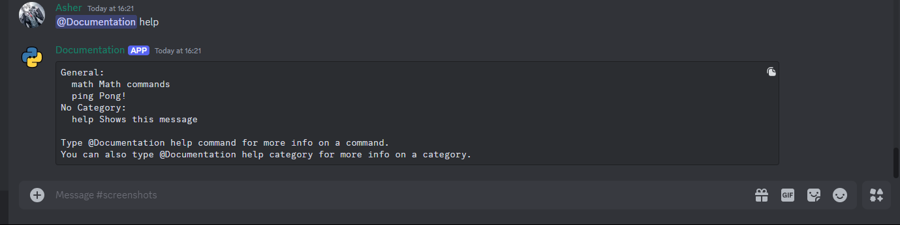

=== "Command Help"
    

=== "Group Help"
    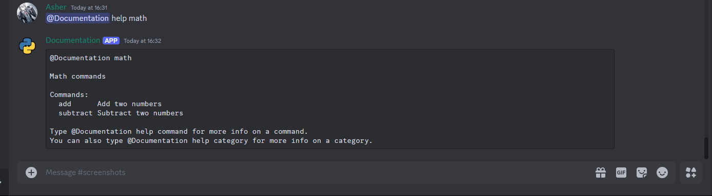

=== "Cog Help"
    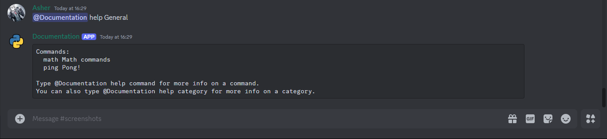

- [`commands.MinimalHelpCommand`](https://discordpy.readthedocs.io/en/stable/ext/commands/api.html?highlight=helpcommand#minimalhelpcommand): Similar to `DefaultHelpCommand` but with a minimalistic design, using plain text instead of code blocks and simplified formatting.

=== "Minimal Help Command"
    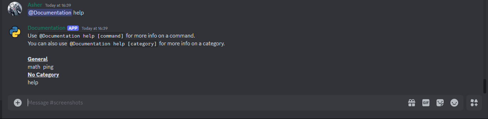

=== "Command Help"
    

=== "Group Help"
    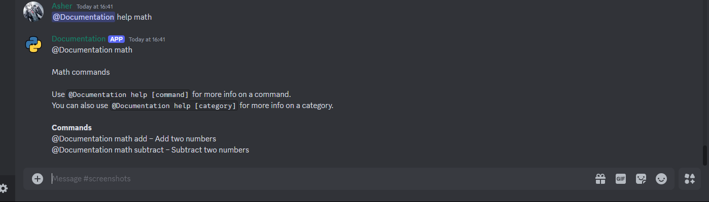

=== "Cog Help"
    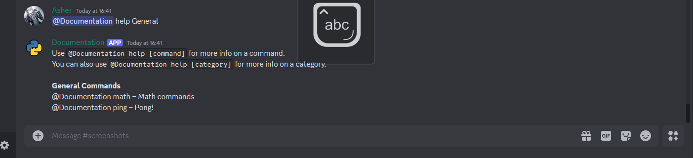

- [`commands.HelpCommand`](https://discordpy.readthedocs.io/en/stable/ext/commands/api.html?highlight=helpcommand#helpcommand): The base class for creating custom help commands. It provides methods that can be overridden to customize the help command's behavior. By default, it does nothing and is meant to be subclassed.

### Methods of HelpCommand

The `commands.HelpCommand` class provides the following methods that can be overridden to customize the help command's behavior and utility methods to construct the help message.

| Method                                               | Description                                                                                                                                                        |
|------------------------------------------------------|--------------------------------------------------------------------------------------------------------------------------------------------------------------------|
| `get_bot_mapping()`                                  | Returns a mapping of command and command group objects to their respective cogs/extensions. If a command is not part of any cog/extension, it is mapped to `None`. |
| `get_command_signature(command)`                     | Returns the signature of the command. Example: `!command [arg1] [arg2]`.                                                                                           |
| `command_not_found(string)`                          | Returns a string to display when a command is not found.                                                                                                           |
| `subcommand_not_found(command, string)`              | Returns a string to display when a subcommand under a command group is not found.                                                                                  |
| `filter_commands(commands, *, sort=False, key=None)` | Filters the commands based on the provided parameters. It runs all associated checks with the command and takes into account weather the command is hidden.        |
| `get_destination()`                                  | Returns the destination where the help command information should be sent.                                                                                         |
| `send_error_message(error)`                          | Sends an error message to the destination. For example, the output of `command_not_found()` would be passed here.                                                  |
| `on_help_command_error(ctx, error)`                  | Handles the error that occurs during the execution of the help command.                                                                                            |
| `send_bot_help(mapping)`                             | Sends the help message for the bot. Invoked when no other argument was passed when calling the help command. Example: `!help`.                                     |
| `send_cog_help(cog)`                                 | Sends the help message for a cog/extension. Invoked when a cog/extension name was passed when calling the help command. Example: `!help cog_name`.                 |
| `send_group_help(group)`                             | Sends the help message for a command group. Invoked when a command group name was passed when calling the help command. Example: `!help group_name`.               |
| `send_command_help(command)`                         | Sends the help message for a command. Invoked when a command name was passed when calling the help command. Example: `!help command_name`.                         |

### Customizing the Help Command

To create a custom help command, you need to subclass `commands.HelpCommand` and override the methods you want to customize. These customizations can include formatting the help message, altering the help message's appearance, paginating the help message, and handling interactions with the user.

We can divide the customization into two parts:

1. **Formatting the Help Message**: This involves formatting the help message to display relevant information and also to make it visually appealing.
2. **Sending the Help Message**: This involves sending the formatted help message to the user, and handling interactions with the user.

!!! note "Note"
    In this guide, we will be utilizing the pagination classes from the [Pagination](./pagination.md) guide to paginate the help message.

#### Formatter Class

The `Formatter` class is responsible for formatting the help message. It contains methods to format the command signature, help, aliases, cooldown, enabled status, and description. It also contains methods to format the command, cog/extension, and group help messages.

```python title="help_command.py"
from typing import Optional, List

import discord
import humanfriendly
from discord.ext import commands


class Formatter:
    def __init__(self, help_command: commands.HelpCommand) -> None:
        self.ctx = help_command.context
        self.help_command = help_command

    def __format_command_signature(self, command: commands.Command) -> tuple[str, str]:
        params = self.__format_param(command)
        return f"{command.qualified_name}\n", f"```yaml\n{params}```"

    def __format_param(self, param: commands.Command) -> str:
        signature = self.help_command.get_command_signature(param)
        return signature

    @staticmethod
    def __format_command_help(command: commands.Command) -> str:
        # command.help is the docstring of the command, might be None.
        return command.help or "No help provided."

    @staticmethod
    def __format_command_aliases(command: commands.Command) -> str:
        # Join the aliases with a comma and space.
        return f"```yaml\nAliases: {', '.join(command.aliases)}```" if command.aliases else "No aliases."

    @staticmethod
    def __format_command_cooldown(command: commands.Command) -> str:
        # Humanfriendly is used to format the cooldown time in a human-readable format.
        # Source: https://github.com/xolox/python-humanfriendly
        return (
            f"Cooldown: {humanfriendly.format_timespan(command.cooldown.per, max_units=2)} per user."
            if command.cooldown
            else "No cooldown set."
        )

    @staticmethod
    def __format_command_enabled(command: commands.Command) -> str:
        return f"Enabled: {command.enabled}" if command.enabled else "Command is disabled."

    def format_command(self, command: commands.Command) -> discord.Embed:
        signature = self.__format_command_signature(command)
        embed = discord.Embed(
            title=signature[0],
            description=signature[1] + self.__format_command_help(command),
            color=discord.Color.blue(),
        )
        embed.add_field(name="Aliases", value=self.__format_command_aliases(command), inline=True)
        embed.add_field(name="Cooldown", value=self.__format_command_cooldown(command), inline=True)
        embed.add_field(name="Enabled", value=self.__format_command_enabled(command), inline=True)
        embed.set_footer(
            text=f"Requested by {self.ctx.author}",
            icon_url=self.ctx.author.display_avatar,
        )
        embed.set_thumbnail(url=self.ctx.bot.user.display_avatar)
        return embed

    async def format_cog_or_group(
        self, cog_or_group: Optional[commands.Cog | commands.Group], commands_: List[commands.Command | commands.Group]
    ) -> List[discord.Embed]:
        # Commands or command groups may be created standalone or outside a cog, in which case cog_or_group is None.
        category_name = cog_or_group.qualified_name if cog_or_group else "No Category"
        # Get the description of the cog or group.
        if isinstance(cog_or_group, commands.Group):
            category_desc = cog_or_group.help or "No description provided."
        else:
            # cog_or_group is a Cog object, might be None.
            category_desc = cog_or_group.description if cog_or_group and cog_or_group.description else "No description provided."
        cog_embed = (
            discord.Embed(
                title=f"{category_name} Commands",
                description=f"*{category_desc}*" or "*No description provided.*",
                color=discord.Color.blue(),
            )
            .set_thumbnail(url=self.ctx.bot.user.display_avatar)
            .set_footer(
                text=f"Requested by {self.ctx.author}",
                icon_url=self.ctx.author.display_avatar,
            )
        )
        embeds: List[discord.Embed] = []

        # Create multiple embeds if the number of commands exceeds 5, with 5 commands per embed.
        for i in range(0, len(commands_), 5):
            embed = cog_embed.copy()
            # Create chunks of 5 commands and add them to the embed.
            for command in commands_[i : i + 5]:
                signature = self.__format_command_signature(command)
                embed.add_field(
                    name=signature[0],
                    value=signature[1] + self.__format_command_help(command),
                    inline=False,
                )
            embed.set_thumbnail(url=self.ctx.bot.user.display_avatar)
            embeds.append(embed)
        return embeds if embeds else [cog_embed]
```

| Method                       | Description                                                                                                                                                           |
|------------------------------|-----------------------------------------------------------------------------------------------------------------------------------------------------------------------|
| `__format_command_signature` | Formats the command signature. It returns the command name and its signature. For example, `<prefix>command [arg1] [arg2]`.                                           |
| `__format_param`             | Formats the command parameters, arguments, and usage. It returns the command signature. For example, `<arg1>`, `[arg2=default value]`.                                |
| `__format_command_help`      | Returns the command help/description or a default message if no help is provided.                                                                                     |
| `__format_command_aliases`   | Returns the command aliases or a default message if no aliases are provided. For example, `Aliases: alias1, alias2`.                                                  |
| `__format_command_cooldown`  | Returns the command cooldown or a default message if no cooldown is set. For example, `Cooldown: 5 seconds per user`.                                                 |
| `__format_command_enabled`   | Returns the command enabled status or a default message if the command is disabled. For example, `Enabled: True`.                                                     |
| `format_command`             | Formats the command help message, utilizing the above methods.                                                                                                        |
| `format_cog_or_group`        | Formats the cog/extension or group help message, utilizing the above methods. Creates multiple embeds if the number of commands exceeds 5, with 5 commands per embed. |

#### Sending the Help Message

The `CustomHelpCommand` class is responsible for sending the help message. It contains methods we need to override as per our requirements.

Here is a flowchart which visualizes the flow of the help command, and how the methods are called:

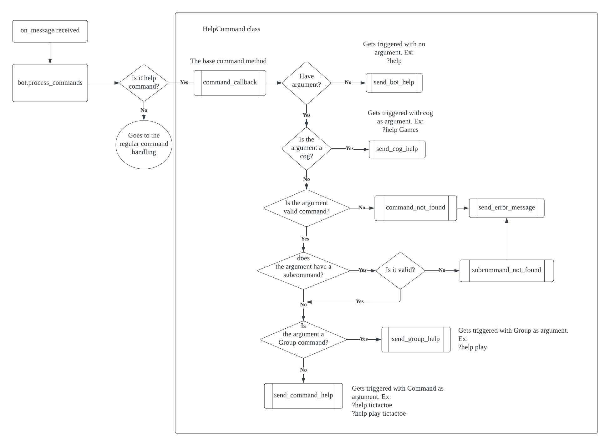<figcaption>Flowchart of the Help Command. Image credit: [InterStella0](https://gist.github.com/InterStella0/b78488fb28cadf279dfd3164b9f0cf96)</figcaption>

```python title="help_command.py"
from typing import Mapping, Optional, List, Any, Iterable

import discord
from discord.ext import commands
from discord.ext.commands import Cog, Command, Group

from paginators.advanced_paginator import EmbedCategoryPaginator, CategoryEntry
from paginators.button_paginator import EmbedButtonPaginator


class CustomHelpCommand(commands.HelpCommand):
    @staticmethod
    def flatten_commands(commands_: Iterable[commands.Command | commands.Group]) -> List[commands.Command]:
        flattened = []
        for command in commands_:
            if isinstance(command, commands.Group):
                flattened.extend(CustomHelpCommand.flatten_commands(command.commands))
            else:
                flattened.append(command)
        return flattened

    async def send_bot_help(self, mapping: Mapping[Optional[Cog], List[Command[Any, ..., Any]]], /) -> None:
        home_embed = (
            discord.Embed(
                title="Home",
                description="Documentation Bot Home Page - Custom Help Command",
                color=discord.Color.blue(),
            )
            .set_thumbnail(url=self.context.bot.user.display_avatar)
            .set_footer(
                text=f"Requested by {self.context.author}",
                icon_url=self.context.author.display_avatar,
            )
        )

        home_pages: List[discord.Embed] = []

        for i in range(0, len(mapping), 5):
            embed = home_embed.copy()
            for cog, cmds in mapping.items():
                filtered_cmds = await self.filter_commands(self.flatten_commands(cmds), sort=True)
                embed.add_field(
                    name=cog.qualified_name if cog else "No Category",
                    value=f"*{cog.description if cog and cog.description else 'No description provided.'}* `[Commands: {len(filtered_cmds)}]`",
                    inline=False,
                )
            home_pages.append(embed)

        categories: List[CategoryEntry[discord.Embed]] = [
            CategoryEntry(
                category_title="Home",
                category_description="Documentation Bot Home Page",
                pages=home_pages,
            )
        ]
        for cog, cmds in mapping.items():
            filtered_cmds = await self.filter_commands(self.flatten_commands(cmds), sort=True)

            # mapping includes a None key for commands that are not part of any cog, we need to check for it.
            cog_name = cog.qualified_name if cog else "No Category"
            cog_desc = cog.description if cog and cog.description else "No description provided."

            categories.append(
                CategoryEntry(
                    category_title=cog_name,
                    category_description=cog_desc,
                    pages=await Formatter(self).format_cog_or_group(cog, filtered_cmds),
                )
            )

        paginator = EmbedCategoryPaginator(self.context.author, pages=categories)
        await paginator.start_paginator(self.context)

    async def send_cog_help(self, cog: Cog, /) -> None:
        commands_ = await self.filter_commands(self.flatten_commands(cog.get_commands()), sort=True)
        embeds = await Formatter(self).format_cog_or_group(cog, commands_)
        paginator = EmbedButtonPaginator(self.context.author, pages=embeds)
        await paginator.start_paginator(self.context)

    async def send_group_help(self, group: Group[Any, ..., Any], /) -> None:
        commands_ = await self.filter_commands(self.flatten_commands(group.commands), sort=True)
        embeds = await Formatter(self).format_cog_or_group(group, commands_)
        paginator = EmbedButtonPaginator(self.context.author, pages=embeds)
        await paginator.start_paginator(self.context)

    async def send_command_help(self, command: Command[Any, ..., Any], /) -> None:
        command_ = await self.filter_commands([command], sort=True)
        embed = Formatter(self).format_command(command_[0])
        await self.context.send(embed=embed)

    async def send_error_message(self, error: str, /) -> None:
        embed = discord.Embed(
            title="Error",
            description=error,
            color=discord.Color.red(),
        ).set_footer(
            text=f"Requested by {self.context.author}",
            icon_url=self.context.author.display_avatar,
        )
        await self.context.send(embed=embed)
```

Now let's take a look at how the `CustomHelpCommand` class works:

- `flatten_commands`: For prefix commands, you can build command groups with subcommands. A command group can also have another command group registered under it, hence forming a hierarchy. This method flattens the command groups and returns a list of commands.
- `send_bot_help`: This function receives a mapping or in more simple terms, a dictionary where the key is a `commands.Cog` object and the value is a list of `commands.Command` and `commands.Group` objects. There is also a singular `None` key that holds all the commands that are not part of any cog.
    - The function creates a home page that displays each cog and the number of commands it has, and the `No Category` section for commands that are not part of any cog.
    - It then creates a list of `CategoryEntry` objects, where each object represents a category (cog or `No Category`) and a corresponding list of pages which include a short description for the category and the commands it contains.
    - Finally, it creates an `EmbedCategoryPaginator` object and starts the paginator.
- `send_cog_help`: This function receives a `commands.Cog` object and sends the help message for the cog. It filters the commands of the cog, formats the cog help message, and starts the paginator. Each page contains a maximum of 5 commands.
- `send_group_help`: This function receives a `commands.Group` object and sends the help message for the group. It filters the commands of the group, formats the group help message, and starts the paginator. Each page contains a maximum of 5 commands.
- `send_command_help`: This function receives a `commands.Command` object and sends the help message for the command. It filters the command, formats the command help message, and sends the embed.
- `send_error_message`: This function receives an error message and creates an embed with the error message. It then sends the embed to the user.

=== "Bot Help"
    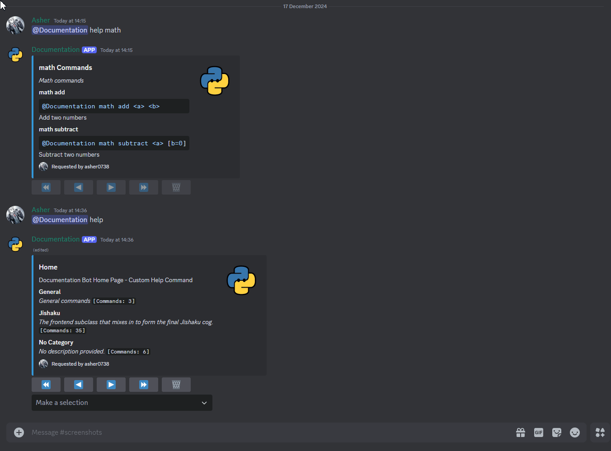

=== "Cog Help"
    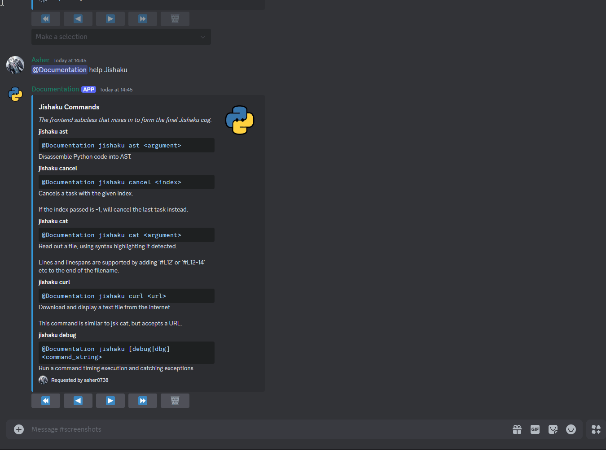

=== "Group Help"
    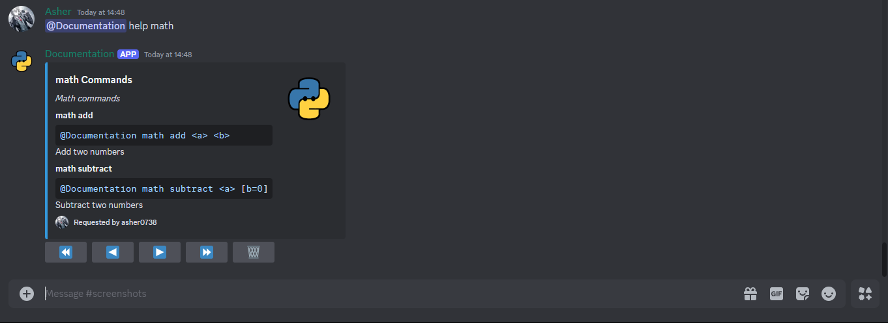

=== "Command Help"
    

=== "Error Message"
    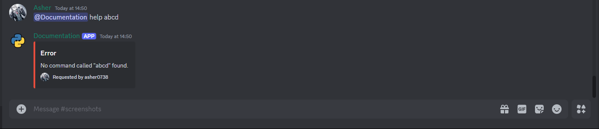

## Registering the Custom Help Command

To use the custom help command, you need to register it with the bot. You can do this by passing an instance of the `CustomHelpCommand` class to the `help_command` parameter of the `commands.Bot` constructor.

```python
from discord.ext import commands

from help_command import CustomHelpCommand

bot = commands.Bot(command_prefix="!", help_command=CustomHelpCommand())
```

Now, when you run the bot and use the help command, you will see the custom help message. This will also register your help command under ungrouped or under the `None` key in the mapping.

Alternatively, to avoid this you can register the help command under a cog. This will group the help command under the cog name in the mapping.

```python
from discord.ext import commands

from help_command import CustomHelpCommand


class HelpCog(commands.Cog):
    def __init__(self, bot: commands.Bot):
        self.bot = bot
        self._help_command = CustomHelpCommand()
        self._help_command.cog = self
        self._original_help_command = bot.help_command
        bot.help_command = self._help_command

    def cog_unload(self):
        self.bot.help_command = self._original_help_command
```

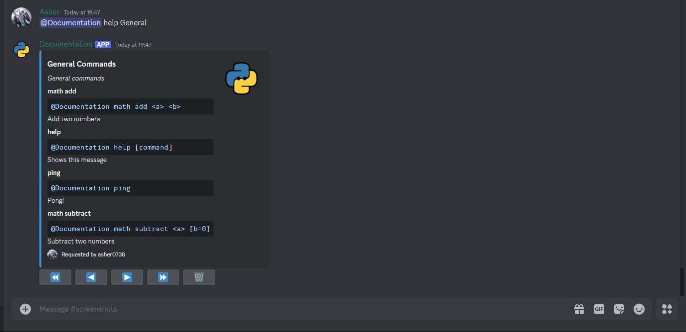

## Slash Help Command

The custom help command we created so far only works for prefix commands. This is because by default the `mapping` or the list of commands in the `DefaultHelpCommand` class does not include slash commands. Of course, there are a few more nuances to consider when altering the help command to work with slash commands. We will cover these aspects as we go along.

There are 2 ways we can approach this:

- We modify our custom help command to include slash commands. Then we remove the default help command and register our custom help command, as a slash or hybrid command.

This is how it would look like:

```python
bot = commands.Bot(prefix="!", intents=discord.Intents.default(), help_command=None)

@bot.hybrid_command(name="help", description="Show help for a command")
async def help_(ctx: commands.Context, command: str = None) -> None:
    help_command = CustomHelpCommand(with_app_command=True)
    help_command.context = ctx
    await help_command.command_callback(ctx, query=command)
```

- In the second approach, we create patch/update the internal `_HelpCommandImpl` to utilize the default behavior of `discord.py`'s help command for slash commands. This is a more complex approach and requires a deeper understanding of the internals of `discord.py`.

```python
bot = commands.Bot(prefix="!", intents=discord.Intents.default(), help_command=CustomHelpCommand(with_app_command=True))
```

### Modifying the Custom Help Command

For now we will focus on the first approach. We will patch the `CustomHelpCommand` to include slash commands and make necessary changes to the methods to handle slash commands.

```python title="help_command.py"
# Create a complete command signature for slash commands, including subcommands and groups.
def _construct_full_name(command: commands.Command | app_commands.Command) -> str:
    parent: Optional[app_commands.Group] = command.parent
    entries = []
    while parent is not None:
        entries.append(parent.name)
        parent = parent.parent
    entries.reverse()
    entries.append(command.name)
    return " ".join(entries)

class CustomHelpCommand(commands.HelpCommand):
    def __init__(
        self,
        *,
        with_app_command: bool = False,
        **kwargs: Any,
    ) -> None:
        super().__init__(**kwargs)
        # Whether to include slash commands in the help command.
        self.with_app_command = with_app_command
```

We add a new parameter `with_app_command` to the `CustomHelpCommand` class to include slash commands in the help command. We also define a helper function `_construct_full_name` to construct the full name of the command, including subcommands and groups.

```python
# We are using this method to construct the full name of the command, in our Formatter class.
def get_command_signature(
    self, command: commands.Command[Any, ..., Any] | app_commands.Command[Any, ..., Any]
) -> str:
    # By default, the signature of the prefix command is returned.
    if isinstance(command, commands.Command):
        return super().get_command_signature(command)
    # We construct the same signature but for slash commands.
    command_path = _construct_full_name(command)

    def _format_param(data: str, *, required: bool = False) -> str:
        return f"<{data}>" if required else f"[{data}]"

    params = []
    for param in command.parameters:
        # check for attachment type
        if param.type == discord.AppCommandOptionType.attachment:
            params.append(_format_param(f"{param.name} (upload a file)", required=param.required))
            continue  
        # check if choices are provided
        choices = (
            "|".join(
                f"'{choice.value}'" if isinstance(choice.value, str) else choice.name for choice in param.choices
            )
            if param.choices
            else ""
        )
        # check if default value is provided
        default = (
            f"={param.default}"
            if not param.required and param.default is not discord.utils.MISSING and param.default not in (None, "")
            else ""
        )
        # format name, choices, and default
        formatted = f"{param.name}{default} ({choices})" if choices else f"{param.name}{default}"
        params.append(_format_param(formatted, required=param.required))

    return f"/{command_path} {' '.join(params)}"
```

Overrides the `get_command_signature` method to construct the full name of the command for slash commands. It constructs the command path by traversing the parent groups and subcommands. The final command signature includes the command path, parameters, choices, and default values.

!!! note "Methods with minimal changes"
    The following methods have minimal changes and are used as is:

    ```diff
    @staticmethod
    def flatten_commands(
    -    commands_: Iterable[commands.Command | commands.Group]
    +    commands_: Iterable[commands.Command | commands.Group | app_commands.Command | app_commands.Group]
    ) -> List[commands.Command | app_commands.Command]:
        flattened = []
        for command in commands_:
    -        if isinstance(command, commands.Group):
    +        if isinstance(command, commands.Group | app_commands.Group):
                flattened.extend(CustomHelpCommand.flatten_commands(command.commands))
            else:
                flattened.append(command)
        return flattened
    ```

    ```diff
    -   async def send_bot_help(self, mapping: Mapping[Optional[Cog], List[Command[Any, ..., Any]]], /) -> None:
    +   async def send_bot_help(self, mapping: Mapping[Optional[Cog], List[Command[Any, ..., Any] | app_commands.Command[Any, ..., Any]]], /) -> None:
    ```

    ```diff
    -   async def send_cog_help(self, cog: Cog, /) -> None:
    +   async def send_cog_help(self, cog: commands.GroupCog | commands.Cog, /) -> None:
    -   commands_ = await self.filter_commands(self.flatten_commands(cog.get_commands()), sort=True)
    +   commands = cog.get_commands() + (cog.get_app_commands() if self.with_app_command else [])
    +   if isinstance(cog, commands.GroupCog):
    +       commands.extend(cog.app_command.commands)
    +   commands_ = await self.filter_commands(self.flatten_commands(commands), sort=True)
        embeds = await Formatter(self).format_cog_or_group(cog, commands_)
        paginator = EmbedButtonPaginator(self.context.author, pages=embeds)
        await paginator.start_paginator(self.context)
    ```

    ```diff
    -   async def send_group_help(self, group: Group[Any, ..., Any], /) -> None:
    +   async def send_group_help(self, group: Group[Any, ..., Any] | app_commands.Group, /) -> None:
    ```

    ```diff
    -   async def send_command_help(self, command: Command[Any, ..., Any], /) -> None:
    +   async def send_command_help(self, command: Command[Any, ..., Any] | app_commands.Command[Any, ..., Any], /) -> None:
    ```

    For complete set of changes, refer to the [source code](https://github.com/FallenDeity/discord.py-masterclass/tree/master/examples/slash-commands/utils/help.py).


```python
# This method is used to construct the `mapping` for the help command.
def get_all_commands(
    self,
) -> Mapping[Optional[Cog], List[Command[Any, ..., Any] | app_commands.Command[Any, ..., Any]]]:
    # Default mapping for prefix commands.
    mapping = self.get_bot_mapping()
    # Update mapping for slash commands, if enabled
    if self.with_app_command:
        for cog, cmds in self.get_app_command_mapping().items():
            for cmd in cmds:
                if cmd.name not in (c.name for c in mapping.get(cog, [])):
                    mapping.setdefault(cog, []).append(cmd)
    return mapping

def get_app_command_mapping(
    self,
) -> Mapping[Optional[Cog], List[app_commands.Command[Any, ..., Any] | app_commands.Group]]:
    # App commands can exist under a cog, or unbound not under any category

    mapping = {}
    # Iterate through each cog
    for cog in self.context.bot.cogs.values():
        # If it's a GroupCog, you can define prefix commands inside it, but it will not be included as a subcommand.
        # And prefix or text part of a hybrid command defined here is not included in the default mapping.
        # Hence, we also perform `cog.get_commands()` to get the prefix commands for this edge case.
        if isinstance(cog, commands.GroupCog):
            mapping.setdefault(cog, [*cog.get_commands()]).extend(cog.app_command.commands)
            continue
        # Include app commands present in the cog.
        mapping.setdefault(cog, []).extend(cog.get_app_commands())

    # Get unbound commands, i.e., commands not part of any cog.
    def get_unbound_cmds(with_guild=None):
        return [
            c
            for c in self.context.bot.tree.get_commands(guild=with_guild)
            if isinstance(c, app_commands.Command) and c.binding is None
        ]

    # Include unbound commands, specific to a guild if available.
    if self.context.guild:
        mapping.setdefault(None, []).extend(get_unbound_cmds(self.context.guild))

    # Include unbound commands, not specific to any guild (global commands).
    mapping.setdefault(None, []).extend(get_unbound_cmds())

    return mapping
```

One of the major changes is the addition of the `get_app_command_mapping` method. This method constructs the mapping for slash commands. It iterates through each cog and includes the app commands present in the cog. It also includes unbound commands, i.e., commands not part of any cog.
The `get_all_commands` method is updated to include the mapping for both prefix and slash commands.

```python  
# This where the internal logic of the help command is handled and different help messages are sent based on the query.
async def command_callback(self, ctx: commands.Context[commands.Bot], /, *, query: Optional[str] = None) -> None:
    """
    This is the entry point of the help command.

    Parameters
    ----------
    ctx: commands.Context
        The context of the command invocation.
    query: Optional[str]
        The command, group, or cog to get help for.
    """
    command = query
    # Empty function by default, you can override to perform some pre-processing or setup.
    await self.prepare_help_command(ctx, command)

    bot = ctx.bot

    # If no command is provided, send the bot help message. (e.g., !help)
    if command is None:
        mapping = self.get_all_commands()
        return await self.send_bot_help(mapping)

    # Check if the command is a cog or extension.
    cog = bot.get_cog(command)
    if cog:
        return await self.send_cog_help(cog)

    maybe_coro = discord.utils.maybe_coroutine

    # Split the command into parts. (e.g., !help command subcommand)
    keys = command.split()
    # Get the initial command or group, if it exists.
    cmd = bot.all_commands.get(keys[0])

    if self.with_app_command:
        guild_id = ctx.guild.id if ctx.guild else None

        if cmd is None:
            cmd = bot.tree.get_command(keys[0], guild=discord.Object(id=guild_id))

        if cmd is None:
            cmd = bot.tree.get_command(keys[0])

    # If the command does not exist, send an error message.
    if cmd is None:
        string = await maybe_coro(self.command_not_found, self.remove_mentions(command))
        return await self.send_error_message(string)

    # If the command is a group and query has subcommands, get the subcommand.
    for key in keys[1:]:
        try:
            cmds = getattr(cmd, "all_commands", None) or cmd._children
            found = cmds.get(key) if cmds else None
        except AttributeError:
            string = await maybe_coro(self.subcommand_not_found, cmd, self.remove_mentions(key))  # type: ignore
            return await self.send_error_message(string)
        else:
            if found is None:
                string = await maybe_coro(self.subcommand_not_found, cmd, self.remove_mentions(key))  # type: ignore
                return await self.send_error_message(string)
            cmd = found

    # Send group help if it's a group.
    if isinstance(cmd, commands.Group | app_commands.Group):
        return await self.send_group_help(cmd)

    # Send command help if it's a command.
    return await self.send_command_help(cmd)
```

The `command_callback` method is the entry point for the help command logic. It handles the internal logic of the help command and sends different help messages based on the query.

- If no query is provided, it sends the bot help message.
- If the query is a cog or extension, it sends the cog help message.
- If the query is a command group, it sends the group help message.
- If the query is a command, it sends the command help message.
- If the command does not exist, it sends an error message.

```python
# The default `filter_commands` method only works for prefix commands.
# We need to override it to function with slash commands.
async def filter_commands(
    self,
    commands: Iterable[Command[Any, ..., Any] | app_commands.Command[Any, ..., Any]],
    /,
    *,
    sort: bool = False,
    key: Optional[Callable[[Command[Any, ..., Any] | app_commands.Command[Any, ..., Any]], Any] | None] = None,
) -> List[Command[Any, ..., Any] | app_commands.Command[Any, ..., Any]]:
    if sort and key is None:
        key = lambda c: c.name  # noqa: E731

    # Filter commands based on 'hidden' attribute.
    iterator = commands if self.show_hidden else filter(lambda c: not getattr(c, "hidden", None), commands)

    if self.verify_checks is False:
        # if we do not need to verify the checks then we can just
        # run it straight through normally without using await.
        return sorted(iterator, key=key) if sort else list(iterator)  # type: ignore # the key shouldn't be None

    if self.verify_checks is None and not self.context.guild:
        # if verify_checks is None, and we're in a DM, don't verify
        return sorted(iterator, key=key) if sort else list(iterator)  # type: ignore

    # if we're here then we need to check every command if it can run
    async def predicate(cmd: Command[Any, ..., Any] | app_commands.Command) -> bool:
        ctx = self.context

        # Check if the command can run in the current context, for prefix commands.
        if isinstance(cmd, Command):
            try:
                return await cmd.can_run(ctx)
            except discord.ext.commands.CommandError:
                return False

        # Check if the command can run in the current context, for slash commands.
        no_interaction = ctx.interaction is None
        # If the command has no checks and there is no interaction
        if not cmd.checks and no_interaction:
            binding = cmd.binding
            if cmd.parent is not None and cmd.parent is not binding:
                return False  # it has group command interaction check

            if binding is not None:
                check = getattr(binding, "interaction_check", None)
                if check:
                    return False  # it has cog interaction check

            return True

        # If there is no interaction, return False.
        if no_interaction:
            return False

        try:
            # Internal method for slash commands to check if the command can run.
            return await cmd._check_can_run(ctx.interaction)
        except app_commands.AppCommandError:
            return False

    # Filter the commands based on the predicate.
    ret = []
    for cmd in iterator:
        valid = await predicate(cmd)
        if valid:
            ret.append(cmd)

    if sort:
        ret.sort(key=key)
    return ret
```

`filter_commands` method is used to filter viable/usable commands based on the context of the invocation. It filters the commands based on checks and attributes defined.
The method is overridden to also function with slash commands.

Let's now take a look at the how to utilize the custom help command with slash commands.

```python
bot = commands.Bot(prefix="!", intents=discord.Intents.default(), help_command=None)

@bot.hybrid_command(name="help", description="Show help for a command")
async def help_(ctx: commands.Context, command: str = None) -> None:
    help_command = CustomHelpCommand(with_app_command=True)
    help_command.context = ctx
    await help_command.command_callback(ctx, query=command)
```

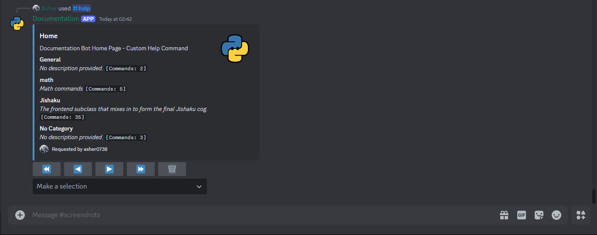

??? note "Modified `Formatter` class"
    A few minor modifications are made to the `Formatter` class to handle parameter and signature formatting for slash commands.

    ```python title="help_command.py"
    class Formatter:
        def __init__(self, help_command: commands.HelpCommand) -> None:
            self.ctx = help_command.context
            self.help_command = help_command

        def __format_command_signature(self, command: commands.Command | app_commands.Command) -> tuple[str, str]:
            params = self.help_command.get_command_signature(command)
            return f"{command.qualified_name}\n", f"```yaml\n{params}```"

        # Updated method to generate detail about the command parameters.
        @staticmethod
        def __format_param(param: app_commands.Parameter | commands.Parameter) -> str:
            result = (
                f"{param.name}={param.default}"
                if not param.required and param.default is not discord.utils.MISSING and param.default not in (None, "")
                else f"{param.name}"
            )
            result = f"[{result}]" if not param.required else f"<{result}>"
            if isinstance(param, commands.Parameter):
                return f"```yaml\n{param.name} ({param.annotation.__name__}) - {result}:\n\t{param.description}```"
            choices = (
                ", ".join(f"'{choice.value}'" if isinstance(choice.value, str) else choice.name for choice in param.choices)
                if param.choices
                else ""
            )
            result = f"{param.name} ({param.type.name}) - {result}:"
            result += f"\n\t{param.description}" if param.description else ""
            result += f"\n\tChoices: {choices}" if choices else ""
            return f"```yaml\n{result}```"

        @staticmethod
        def __format_command_help(command: commands.Command | app_commands.Command) -> str:
            return command.description or "No help provided."

        @staticmethod
        def __format_command_aliases(command: commands.Command | app_commands.Command) -> str:
            if isinstance(command, app_commands.Command):
                return "No aliases."
            return f"```yaml\nAliases: {', '.join(command.aliases)}```" if command.aliases else "No aliases."

        @staticmethod
        def __format_command_cooldown(command: commands.Command | app_commands.Command) -> str:
            if isinstance(command, app_commands.Command):
                return "No cooldown set."
            return (
                f"Cooldown: {humanfriendly.format_timespan(command.cooldown.per, max_units=2)} per user."
                if command.cooldown
                else "No cooldown set."
            )

        @staticmethod
        def __format_command_enabled(command: commands.Command | app_commands.Command) -> str:
            if isinstance(command, app_commands.Command):
                return "Command is enabled."
            return f"Enabled: {command.enabled}" if command.enabled else "Command is disabled."

        def format_command(self, command: commands.Command | app_commands.Command) -> discord.Embed:
            signature = self.__format_command_signature(command)
            embed = discord.Embed(
                title=signature[0],
                description=signature[1] + self.__format_command_help(command),
                color=discord.Color.blue(),
            )

            params = command.parameters if isinstance(command, app_commands.Command) else command.params.values()
            # format each parameter of the command, new method __format_param is used.
            for param in params:
                embed.add_field(
                    name=param.name,
                    value=self.__format_param(param),
                    inline=False,
                )
            embed.add_field(name="Aliases", value=self.__format_command_aliases(command), inline=True)
            embed.add_field(name="Cooldown", value=self.__format_command_cooldown(command), inline=True)
            embed.add_field(name="Enabled", value=self.__format_command_enabled(command), inline=True)
            embed.set_footer(
                text=f"Requested by {self.ctx.author}",
                icon_url=self.ctx.author.display_avatar,
            )
            embed.set_thumbnail(url=self.ctx.bot.user.display_avatar)
            return embed

        async def format_cog_or_group(
            self,
            cog_or_group: Optional[commands.GroupCog | app_commands.Group | commands.Cog | commands.Group],
            commands_: List[commands.Command | commands.Group | app_commands.Command | app_commands.Group],
        ) -> List[discord.Embed]:
            category_name = cog_or_group.qualified_name if cog_or_group else "No Category"
            if isinstance(cog_or_group, commands.Group):
                category_desc = cog_or_group.help or "No description provided."
            else:
                category_desc = (
                    cog_or_group.description if cog_or_group and cog_or_group.description else "No description provided."
                )
            cog_embed = (
                discord.Embed(
                    title=f"{category_name} Commands",
                    description=f"*{category_desc}*" or "*No description provided.*",
                    color=discord.Color.blue(),
                )
                .set_thumbnail(url=self.ctx.bot.user.display_avatar)
                .set_footer(
                    text=f"Requested by {self.ctx.author}",
                    icon_url=self.ctx.author.display_avatar,
                )
            )
            embeds: List[discord.Embed] = []
            for i in range(0, len(commands_), 5):
                embed = cog_embed.copy()
                for command in commands_[i : i + 5]:
                    signature = self.__format_command_signature(command)
                    embed.add_field(
                        name=signature[0],
                        value=signature[1] + self.__format_command_help(command),
                        inline=False,
                    )
                embed.set_thumbnail(url=self.ctx.bot.user.display_avatar)
                embeds.append(embed)
            return embeds if embeds else [cog_embed]
    ```

### An advanced approach

Now that we have implemented the custom help command for both prefix and slash commands, we can try to dive a little deeper and integrate this approach with the internal mechanics of `discord.py`.

!!! note Note
    This section is entirely optional and requires a deeper understanding of the internals of `discord.py`, for the general use case the above approach should suffice.

To integrate the custom help command with the internal mechanics of `discord.py`, we will be creating a custom implementation of the [`_HelpCommandImpl`](https://github.com/Rapptz/discord.py/blob/9806aeb83179d0d1e90d903e30db7e69e0d492e5/discord/ext/commands/help.py#L226-L303) class.

```python
class _InjectorCallback:
    # This class is to ensure that the help command instance gets passed properly
    # The final level of invocation will always lead back to the _original instance
    # hence bind needed to be modified before invoke is called.
    def __init__(self, original_callback: Any, bind: "CustomHelpCommand") -> None:
        self.callback = original_callback
        self.bind = bind

    async def invoke(self, *args: Any, **kwargs: Any) -> Any:
        # *args include ctx/context, command/query
        # If HelpCommand is registered under a cog, the cog instance is passed as the first argument.
        # Skip the first argument if it's a cog instance.
        if self.bind.cog is not None:
            cog, *args = args

        # self.callback is the `command_callback` bound method of the CustomHelpCommand instance.
        # self.callback.__func__ returns the original function to be invoked.
        # await CustomHelpCommand.command_callback(bound_instance, ctx, query)
        return await self.callback.__func__(self.bind, *args, **kwargs)


def _inject_callback(inject):
    # This method is used to inject the custom help command callback into the internal help command.
    try:
        inject.__original_callback__
    except AttributeError:
        inject.__original_callback__ = _InjectorCallback(inject.command_callback, inject)

    caller = inject.__original_callback__  # The _InjectorCallback instance.
    original_callback = caller.callback  # The 'command_callback' method of the CustomHelpCommand instance.

    # Wrapper method to invoke the original callback.
    async def wrapper(*args, **kwargs):
        return await caller.invoke(*args, **kwargs)

    callback = copy.copy(wrapper)
    # Copy the signature of the original callback to the wrapper method.
    signature = list(Signature.from_callable(original_callback).parameters.values())
    callback.__signature__ = Signature.from_callable(callback).replace(parameters=signature)
    # Update the 'command_callback' method of the CustomHelpCommand instance with the wrapper method.
    inject.command_callback = callback


def _parse_params_docstring(func: Callable[..., Any]) -> dict[str, str]:
    doc = inspect.getdoc(func)
    if doc is None:
        return {}

    param_docs = {}
    sphinx_pattern = re.compile(r"^\s*:param\s+(\S+).*?:\s*(.+)", re.MULTILINE)
    google_pattern = re.compile(r"^\s*(\S+)\s*\(.*?\):\s*(.+)", re.MULTILINE)
    numpy_pattern = re.compile(r"^\s*(\S+)\s*:\s*.*?\n\s*(.+?)(?=\n\S|\Z)", re.DOTALL | re.MULTILINE)

    for pattern in (sphinx_pattern, google_pattern, numpy_pattern):
        for match in pattern.finditer(doc):
            param_name, desc = match.groups()
            param_docs[param_name] = desc
    return param_docs

# Most of the implementation is similar to the default _HelpCommandImpl.
class _HelpHybridCommandImpl(commands.HybridCommand):
    def __init__(self, inject: "CustomHelpCommand", *args: Any, **kwargs: Any) -> None:
        # Create a wrapper around the CustomHelpCommand instance.
        _inject_callback(inject)
        super().__init__(inject.command_callback, *args, **kwargs)
        self._original: "CustomHelpCommand" = inject
        self._injected: "CustomHelpCommand" = inject
        self.params: Dict[str, Parameter] = get_signature_parameters(
            inject.__original_callback__.callback, globals(), skip_parameters=1
        )

        # get function params descriptions, from the original callback docstring
        param_descs = _parse_params_docstring(inject.__original_callback__.callback)
        if self.app_command:
            # Describe the parameters for the app command, so they show up in discord client.
            app_params = [p for p in self.app_command.parameters if p.name in param_descs]
            app_commands.describe(**{p.name: param_descs[p.name] for p in app_params})(self.app_command)

        self.params.update(
            (name, param.replace(description=desc))
            for name, desc in param_descs.items()
            if (param := self.params.get(name))
        )

        # Inject the callback metadata for the help command. i.e., AppCommand autocomplete.
        self.__inject_callback_metadata(inject)

    def __inject_callback_metadata(self, inject: "CustomHelpCommand") -> None:
        if not self.with_app_command:
            return
        # A method that can be defined in the CustomHelpCommand to provide autocomplete for the help command.
        autocomplete = inject.help_command_autocomplete
        self.autocomplete(list(dict.fromkeys(self.params))[-1])(autocomplete)

    async def prepare(self, ctx: Context[Any]) -> None:
        self._injected = injected = self._original.copy()
        injected.context = ctx
        # Update the bound instance of the callback method.
        self._original.__original_callback__.bind = injected  # type: ignore
        self.params = get_signature_parameters(injected.__original_callback__.callback, globals(), skip_parameters=1)

        # get function params descriptions, from the original callback docstring
        param_descs = _parse_params_docstring(injected.__original_callback__.callback)
        self.params.update(
            (name, param.replace(description=desc))
            for name, desc in param_descs.items()
            if (param := self.params.get(name))
        )

        on_error = injected.on_help_command_error
        if not hasattr(on_error, "__help_command_not_overridden__"):
            if self.cog is not None:
                self.on_error = self._on_error_cog_implementation
            else:
                self.on_error = on_error

        await super().prepare(ctx)

    async def _on_error_cog_implementation(self, _, ctx: Context[commands.Bot], error: CommandError) -> None:
        await self._injected.on_help_command_error(ctx, error)

    def _inject_into_cog(self, cog: Cog) -> None:
        # Warning: hacky

        # Make the cog think that get_commands returns this command
        # as well if we inject it without modifying __cog_commands__
        # since that's used for the injection and ejection of cogs.
        def wrapped_get_commands(
            *, _original: Callable[[], List[Command[Any, ..., Any]]] = cog.get_commands
        ) -> List[Command[Any, ..., Any]]:
            ret = _original()
            ret.append(self)
            return ret

        # Ditto here
        def wrapped_walk_commands(
            *, _original: Callable[[], Generator[Command[Any, ..., Any], None, None]] = cog.walk_commands
        ):
            yield from _original()
            yield self

        functools.update_wrapper(wrapped_get_commands, cog.get_commands)
        functools.update_wrapper(wrapped_walk_commands, cog.walk_commands)
        cog.get_commands = wrapped_get_commands
        cog.walk_commands = wrapped_walk_commands
        self.cog = cog

    def _eject_cog(self) -> None:
        if self.cog is None:
            return

        # revert back into their original methods
        cog = self.cog
        cog.get_commands = cog.get_commands.__wrapped__
        cog.walk_commands = cog.walk_commands.__wrapped__
        self.cog = None


# Remaining methods are same as what we implemented in the CustomHelpCommand class above.
class CustomHelpCommand(commands.HelpCommand):
    __original_callback__: _InjectorCallback

    def __init__(
        self,
        *,
        name: str = "help",
        description: str = "Shows this message",
        with_app_command: bool = False,
        **kwargs: Any,
    ) -> None:
        super().__init__(**kwargs)
        self.with_app_command = with_app_command
        self.command_attrs["with_app_command"] = with_app_command
        self.command_attrs["name"] = name
        self.command_attrs["description"] = description
        self._command_impl = _HelpHybridCommandImpl(self, **self.command_attrs)

    def _add_to_bot(self, bot: commands.bot.BotBase) -> None:
        # Add the custom help command to the bot.
        command = _HelpHybridCommandImpl(self, **self.command_attrs)
        self._command_impl = command
        bot.add_command(command)

    def _remove_from_bot(self, bot: commands.bot.BotBase) -> None:
        # Remove the custom help command from the bot.
        impl = self._command_impl
        bot.remove_command(impl.name)
        app = impl.app_command
        for snowflake in getattr(app, "_guild_ids", None) or []:
            bot.tree.remove_command(app.name, guild=discord.Object(snowflake))
        impl._eject_cog()

    async def help_command_autocomplete(
        self, inter: discord.Interaction[commands.Bot], current: str
    ) -> list[app_commands.Choice[str]]:
        help_command = self.copy()
        help_command.context = await inter.client.get_context(inter)

        all_cmds: dict[str, list[commands.Command | app_commands.Command]] = {
            cog.qualified_name if cog else "No Category": help_command.flatten_commands(cmds)
            for cog, cmds in help_command.get_all_commands().items()
        }
        choices = list(all_cmds.keys()) + [_construct_full_name(cmd) for cmd in sum(all_cmds.values(), [])]
        matches = difflib.get_close_matches(current, choices, n=25, cutoff=0.4) or sorted(
            choices, key=lambda x: x.lower()
        )
        return [app_commands.Choice(name=match, value=match) for match in matches][:25]
```

Finally, we can register the custom help command with the bot.

```python
bot = commands.Bot(prefix="!", intents=discord.Intents.default(), help_command=CustomHelpCommand(with_app_command=True))
```

=== "Slash Help Command"
    
=== "Help Describe"
    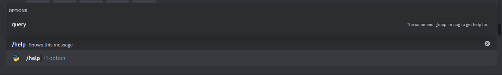

    Parameter description is extracted from the docstring of the command callback.
=== "Help Autocomplete"
    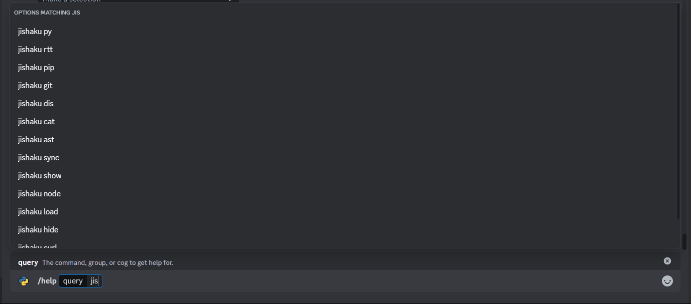

    Overriding the `help_command_autocomplete` method allows you to provide autocomplete for the help command.

The complete source code for the above can be found [here](https://github.com/FallenDeity/discord.py-masterclass/tree/master/examples/slash-commands/utils/help.py).

## Conclusion

Whew! That was a lot of information. We covered in detail each aspect of the help command provided by `discord.py` and how you can customize it to suit your needs. We also discussed how to integrate the custom help command with slash commands. We hope this guide helps you understand the help command better and how you can customize it to provide a better experience for your users.

- [Custom Help Command Source Code](https://github.com/FallenDeity/discord.py-masterclass/tree/master/examples/slash-commands/utils/help.py)
- A Help Command extension [library](https://github.com/InterStella0/starlight-dpy) by [InterStella0](https://github.com/InterStella0).
