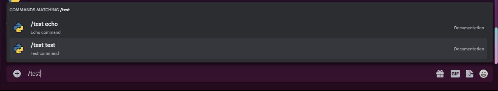

# Hybrid Commands

Hybrid commands are commands that can be used both as a slash command and as a regular prefix command. This is useful for commands that you want to be able to use both ways, but don't want to have to write the same code twice. In order for this to work, the callback must have the same subset that is supported by application commands.

{: style="width: 100%;"}


!!! warning "Warning"
    Hybrid commands are only available in discord.py 2.0 and above.

## Creating a Hybrid Command

To create a hybrid command, you must use the `hybrid_command` decorator. This decorator takes an additional `name` and `description` parameter, which are used to register the slash command. In case `name` is not provided, the name of the function will be used.

There are two ways to document hybrid commands. You can either use the `app_commands.describe` decorator or docstrings. `discord.py` accepts multiple docstring formats, including [Google-style](https://google.github.io/styleguide/pyguide.html#383-functions-and-methods), [NumPy-style](https://numpydoc.readthedocs.io/en/stable/format.html#parameters), and [Sphinx-style](https://www.sphinx-doc.org/en/master/usage/domains/python.html#info-field-lists).

=== "Using Parameters"

    ```python
    @bot.hybrid_command(name="echo", description="Echoes a message")
    @app_commands.describe(message="The message to echo")
    async def echo(ctx: commands.Context, message: str):
        await ctx.send(message)
    ```
=== "Using Docstrings"

    ```python
    @bot.hybrid_command()
    async def echo(ctx: commands.Context, message: str):
        """
        Echoes a message

        Parameters
        ----------
        ctx: commands.Context
            The context of the command invocation
        message: str
            The message to echo
        """
        await ctx.send(message)
    ```

{: style="width: 100%;"}
{: style="width: 100%;"}

!!! warning "Note"
    The `name` parameter must be a valid slash command name. This means that it must be between 1 and 32 characters long, and can only contain alphanumeric characters, dashes, and underscores.

## Hybrid Command Parameters

Hybrid commands similarly to slash commands, have a few parameters that are supported by discord when registering the command.

- `str [AppCommandOptionType.string]` - A string parameter
- `int [AppCommandOptionType.integer]` - An integer parameter
- `float [AppCommandOptionType.number]` - A float parameter
- `bool [AppCommandOptionType.boolean]` - A boolean parameter
- `discord.User [AppCommandOptionType.user]` or `discord.Member` - A user or member parameter. A user annotation can also result in a member parameter.
- \* `discord.abc.GuildChannel` - A channel parameter
- `discord.Role [AppCommandOptionType.role]` - A role parameter
- `discord.Attachment [AppCommandOptionType.attachment]` - An attachment parameter

All other parameters will be treated as a string parameter and can be converted implicitly using [converters](./converters.md)

!!! info "Info"
    - \* All channel subclasses and unions (e.g. Union[TextChannel, StageChannel]) are also supported.

    - Some combinations of types are also allowed, including:
        - Union[User, Member] (results in AppCommandOptionType.user)
        - Union[Member, Role] (results in AppCommandOptionType.mentionable)
        - Union[User, Role] (results in AppCommandOptionType.mentionable)
        - Union[User, Member, Role] (results in AppCommandOptionType.mentionable)

=== "String"

    ```python
    @bot.hybrid_command()
    async def echo(ctx: commands.Context, message: str):
        """
        Echoes a message

        Parameters
        ----------
        ctx: commands.Context
            The context of the command invocation
        message: str
            The message to echo
        """
        await ctx.send(message)
    ```

    {: style="width: 100%;"}

=== "Integer"

    ```python
    @bot.hybrid_command()
    async def echo(ctx: commands.Context, number: int):
        """
        Echoes a number

        Parameters
        ----------
        ctx: commands.Context
            The context of the command invocation
        number: int
            The number to echo
        """
        await ctx.send(number)
    ```

    {: style="width: 100%;"}

=== "Float"

    ```python
    @bot.hybrid_command()
    async def echo(ctx: commands.Context, number: float):
        """
        Echoes a number

        Parameters
        ----------
        ctx: commands.Context
            The context of the command invocation
        number: float
            The number to echo
        """
        await ctx.send(number)
    ```

    {: style="width: 100%;"}

=== "Boolean"

    ```python
    @bot.hybrid_command()
    async def echo(ctx: commands.Context, boolean: bool):
        """
        Echoes a boolean

        Parameters
        ----------
        ctx: commands.Context
            The context of the command invocation
        boolean: bool
            The boolean to echo
        """
        await ctx.send(boolean)
    ```

    {: style="width: 100%;"}

=== "User"

    ```python
    @bot.hybrid_command()
    async def echo(ctx: commands.Context, user: discord.User):
        """
        Echoes a user

        Parameters
        ----------
        ctx: commands.Context
            The context of the command invocation
        user: discord.User
            The user to echo
        """
        embed = discord.Embed(title=user.display_name, description=f"{user.mention} is cool", color=user.color)
        embed.set_thumbnail(url=user.display_avatar)
        await ctx.send(embed=embed)
    ```

    {: style="width: 100%;"}

=== "Channel"

    ```python
    @bot.hybrid_command()
    async def echo(ctx: commands.Context, channel: discord.abc.GuildChannel):
        """
        Echoes a channel

        Parameters
        ----------
        ctx: commands.Context
            The context of the command invocation
        channel: discord.abc.GuildChannel
            The channel to echo
        """
        # channel types include StageChannel, TextChannel, VoiceChannel, CategoryChannel, ForumChannel
        await ctx.send(channel.mention)
    ```

    {: style="width: 100%;"}

=== "Role"

    ```python
    @bot.hybrid_command()
    async def echo(ctx: commands.Context, role: discord.Role):
        """
        Echoes a role

        Parameters
        ----------
        ctx: commands.Context
            The context of the command invocation
        role: discord.Role
            The role to echo
        """
        embed = discord.Embed(title=role.name, description=f"{role.mention} is cool", color=role.color)
        await ctx.send(embed=embed)
    ```

    {: style="width: 100%;"}

=== "Attachment"

    ```python
    @bot.hybrid_command()
    async def echo(ctx: commands.Context, attachment: discord.Attachment):
        """
        Echoes an attachment

        Parameters
        ----------
        ctx: commands.Context
            The context of the command invocation
        attachment: discord.Attachment
            The attachment to echo
        """
        embed = discord.Embed(title=attachment.filename, description=f"Attachment from {attachment.url}\nSize: {attachment.size / 1024} KB", color=discord.Color.random())
        embed.set_image(url=attachment.url)
        await ctx.send(embed=embed)
    ```

    {: style="width: 100%;"}

### Parameter Ranges

You can also specify a range for integer and float parameters. This can be done by annotating using `app_commands.Range`, and for string you can specify the minimum and maximum length.

=== "Integer"

    ```python
    @bot.hybrid_command()
    async def echo(ctx: commands.Context, number: app_commands.Range[int, 0, 10]):
        """
        Echoes a number

        Parameters
        ----------
        ctx: commands.Context
            The context of the command invocation
        number: app_commands.Range[int, 0, 10]
            The number to echo
        """
        await ctx.send(number)
    ```

    {: style="width: 100%;"}

=== "Float"

    ```python
    @bot.hybrid_command()
    async def echo(ctx: commands.Context, number: app_commands.Range[float, 0.0, 10.0]):
        """
        Echoes a number

        Parameters
        ----------
        ctx: commands.Context
            The context of the command invocation
        number: app_commands.Range[float, 0.0, 10.0]
            The number to echo
        """
        await ctx.send(number)
    ```

    {: style="width: 100%;"}

=== "String"

    ```python
    @bot.hybrid_command()
    async def echo(ctx: commands.Context, message: app_commands.Range[str, 1, 10]):
        """
        Echoes a message

        Parameters
        ----------
        ctx: commands.Context
            The context of the command invocation
        message: app_commands.Range[str, 1, 10]
            The message to echo
        """
        await ctx.send(message)
    ```

    {: style="width: 100%;"}

!!! failure "Warning"
    Since `Range` is a slash command specific annotation, it will not work with regular prefix commands.

### Choices

You can also specify choices for parameters. This gives a dropdown menu with the specified choices for the parameter in discord.

=== "Using Enums"

    ```python
    import enum

    class Color(str, enum.Enum):
        Red = "red"
        Green = "green"
        Blue = "blue"

    @bot.hybrid_command()
    async def echo(ctx: commands.Context, color: Color):
        """
        Echoes a color

        Parameters
        ----------
        ctx: commands.Context
            The context of the command invocation
        color: Color
            The color to echo
        """
        await ctx.send(color)
    ```

=== "Using Literal"

    ```python
    from typing import Literal

    @bot.hybrid_command()
    async def echo(ctx: commands.Context, color: Literal["red", "green", "blue"]):
        """
        Echoes a color

        Parameters
        ----------
        ctx: commands.Context
            The context of the command invocation
        color: Literal["red", "green", "blue"]
            The color to echo
        """
        await ctx.send(color)
    ```

=== "Using Decorator"

    ```python
    @bot.hybrid_command()
    @app_commands.choices(color=[
        app_commands.Choice(name="Red", value="red"),
        app_commands.Choice(name="Green", value="green"),
        app_commands.Choice(name="Blue", value="blue")
    ])
    async def echo(ctx: commands.Context, color: str):
        """
        Echoes a color

        Parameters
        ----------
        ctx: commands.Context
            The context of the command invocation
        color: str
            The color to echo
        """
        await ctx.send(color)
    ```

{: style="width: 100%;"}

!!! failure "Warning"
    Since `choices` is a slash command specific annotation, while using the command as a regular prefix command, the choices will not be available and no checks will be performed on the parameter internally i.e you can pass any value to the parameter.

    You can have maximum of 25 choices for a parameter.

### Autocomplete

You can also specify autocomplete options for parameters. This gives a dropdown menu with the specified autocomplete options for the parameter in discord based on the user's input.

Currently, autocomplete is only supported for string, integer and float parameters.

=== "Using Callback"

    ```python
    async def color_autocomplete(interaction: discord.Interaction, current: str) -> list[app_commands.Choice[str]]:
        options = ["Red", "Green", "Blue"]
        return [app_commands.Choice(name=option, value=option) for option in options if option.lower().startswith(current.lower())][:25]

    @bot.hybrid_command()
    @app_commands.autocomplete(color=color_autocomplete)
    async def echo(ctx: commands.Context, color: str):
        """
        Echoes a color

        Parameters
        ----------
        ctx: commands.Context
            The context of the command invocation
        color: str
            The color to echo
        """
        await ctx.send(color)
    ```

=== "Using Decorator"

    ```python
    @bot.hybrid_command()
    async def echo(ctx: commands.Context, color: str):
        """
        Echoes a color

        Parameters
        ----------
        ctx: commands.Context
            The context of the command invocation
        color: str
            The color to echo
        """
        await ctx.send(color)

    @echo.autocomplete("color")
    async def color_autocomplete(interaction: discord.Interaction, current: str) -> list[app_commands.Choice[str]]:
        options = ["Red", "Green", "Blue"]
        return [app_commands.Choice(name=option, value=option) for option in options if option.lower().startswith(current.lower())][:25]
    ```

{: style="width: 100%;"}

!!! failure "Warning"
    Since `autocomplete` is a slash command specific annotation, while using the command as a regular prefix command, the autocomplete options will not be available and no checks will be performed on the parameter internally i.e you can pass any value to the parameter.

    You can have maximum of 25 autocomplete options for a parameter.

## Groups and Subcommands

You can also create groups and subcommands using the `hybrid_group` decorator. Groups cannot have depth greater than 1 i.e you cannot have a group inside a group.

```python
@bot.hybrid_group()
async def test(ctx: commands.Context) -> None:
    """Test group"""
    await ctx.send("Invoked test group")

@test.command(name="test")
async def test_1(ctx: commands.Context) -> None:
    """Test command"""
    await ctx.send("Test command")

@test.command(name="echo")
async def test_2(ctx: commands.Context, message: str) -> None:
    """Echo command"""
    await ctx.send(message)
```

{: style="width: 100%;"}

!!! note "Note"
    Due to a limitation in discord, the parent/group command itself will not be listed and will not be able to be invoked. However, you can still use the parent/group command as a regular prefix command.

    One way to get around this is to use the `fallback` parameter of the `hybrid_group` decorator. This will create a subcommand under parent group that can be used to invoke the parent/group command.

    ```python
    @bot.hybrid_group(fallback="get") # creates a subcommand named "get" under the parent/group command
    async def test(ctx: commands.Context) -> None:
        """Test group"""
        await ctx.send("Invoked test group")
    ```

    {: style="width: 100%;"}

## Hybrid Commands in Cogs

Here is an example of how you can use hybrid commands in cogs.

```python
from discord.ext import commands


class General(commands.Cog):
    def __init__(self, bot: commands.Bot) -> None:
        self.bot = bot

    @commands.hybrid_command(name="ping")
    async def ping(self, ctx: commands.Context[commands.Bot]) -> None:
        """Pong!"""
        await ctx.send("Pong!")

    @commands.hybrid_group(name="math")
    async def math(self, ctx: commands.Context[commands.Bot]) -> None:
        """Math commands"""
        pass

    @math.command(name="add")
    async def add(self, ctx: commands.Context[commands.Bot], a: int, b: int) -> None:
        """
        Add two numbers

        Parameters
        ----------
        a: int
            The first number
        b: int
            The second number
        """
        await ctx.send(f"{a} + {b} = {a + b}")

    @math.command(name="subtract")
    async def subtract(self, ctx: commands.Context[commands.Bot], a: int, b: int) -> None:
        """
        Subtract two numbers

        Parameters
        ----------
        a: int
            The first number
        b: int
            The second number
        """
        await ctx.send(f"{a} - {b} = {a - b}")


async def setup(bot: commands.Bot) -> None:
    await bot.add_cog(General(bot))
```

## Error Handling and Checks

Checks and error handlers can be used with hybrid commands just like regular prefix commands you can check out the [checks](./checks.md) and [error handling](./error-handling.md) pages for more information.

### Permissions

#### `app_commands.default_permissions`

You can set the default permissions for a hybrid command using the `app_commands.default_permissions` decorator. This will set the default permissions for the slash command.

Leaving the `permissions` parameter empty will disable the command for everyone except server administrators.

```python
@bot.hybrid_command()
@app_commands.default_permissions(permissions=discord.Permissions(manage_messages=True))
async def echo(ctx: commands.Context, message: str):
    """
    Echoes a message

    Parameters
    ----------
    ctx: commands.Context
        The context of the command invocation
    message: str
        The message to echo
    """
    await ctx.send(message)
```

#### `app_commands.guilds`

You can also specify the guilds where the command should be enabled using the `app_commands.guilds` decorator. This will set the guilds where the slash command should be enabled.

```python
@bot.hybrid_command()
@app_commands.guilds(discord.Object(id=1234567890), ...)
async def echo(ctx: commands.Context, message: str):
    """
    Echoes a message

    Parameters
    ----------
    ctx: commands.Context
        The context of the command invocation
    message: str
        The message to echo
    """
    await ctx.send(message)
```

#### `app_commands.guild_only`

You can also specify that the command should only be enabled in guilds using the `app_commands.guild_only` decorator. This will set the command to only be enabled in guilds and will not be available in DMs.

```python
@bot.hybrid_command()
@app_commands.guild_only()
async def echo(ctx: commands.Context, message: str):
    """
    Echoes a message

    Parameters
    ----------
    ctx: commands.Context
        The context of the command invocation
    message: str
        The message to echo
    """
    await ctx.send(message)
```

### Timeouts

Slash commands have a timeout of 3 seconds by default. This means that if the command takes more than 3 seconds to execute, it will fail, this is an API limitation.

A workaround for this is to use the `defer` method to defer the response. This will give you 15 minutes to send the response.

```python
import asyncio

@bot.hybrid_command()
async def ping(ctx: commands.Context):
    """
    Pong!
    """
    await ctx.defer()
    await asyncio.sleep(5)
    await ctx.send(f"Pong! {bot.latency * 1000} ms")
```

!!! warning "Warning"
    You can only use `defer` once per command invocation. Regular prefix commands do not have timeout limitations.

!!! note "Note"
    For regular prefix commands `defer` activates the typing status for the bot, for slash commands it shows the user that the bot is thinking as a loading state.

## Ephermal Messages

You can also send ephermal messages, messages which are only visible to the person invoking the command using the `ephemeral` parameter of the `send` method.

=== "Before Deferring"

    ```python
    @bot.hybrid_command()
    async def ping(ctx: commands.Context):
        """
        Pong!
        """
        await ctx.send(f"Pong! {bot.latency * 1000} ms", ephemeral=True)
    ```

=== "After Deferring"

    ```python
    @bot.hybrid_command()
    async def ping(ctx: commands.Context):
        """
        Pong!
        """
        await ctx.defer(ephermal=True)
        await ctx.send(f"Pong! {bot.latency * 1000} ms")
    ```

{: style="width: 100%;"}

## Syncing Commands

It is necessary to sync commands with discord before you can use them. This is required as the metadata for slash commands needs to be sent to discord. Since `discord.py` does not automatically sync commands, you will have to do it manually.

You can sync commands in multiple places such as the `on_ready` event, or in the `setup_hook`, but while it's convenient to sync here it is not the best way to do it.

The pitfalls here for example if you sync your tree before loading your cogs, the commands in your cogs will not be synced. If you sync your tree and then make changes to your commands, the changes will not be reflected in discord without syncing again.

So one of the best ways to sync your commands is to use a message command, even if you are making a slash command bot and don't have message content scope enabled, you can still use a message command to sync your commands as bots receive messages on `mention` and in `DMs`.

```python
@bot.command()
@commands.is_owner()
async def sync(ctx: commands.Context) -> None:
    """Sync commands"""
    synced = await ctx.bot.tree.sync()
    await ctx.send(f"Synced {len(synced)} commands globally")
```

!!! note "Note"
    You can pass a `Snowflake` or a `Guild` object to the `sync` method to sync commands for a specific guild.

    ```python
    guild = discord.Object(id=1234567890)
    synced = await ctx.bot.tree.sync(guild=guild)
    ```

    You can also pass a `list` of `Snowflake` or `Guild` objects to the `sync` method to sync commands for multiple guilds.

    ```python
    guilds = [discord.Object(id=1234567890), ...]
    synced = await ctx.bot.tree.sync(guild=guilds)
    ```

!!! warning "Warning"
    It is always better to test your commands in a test server before syncing them globally. This allows you to test your commands without having to worry about breaking your commands for other users.

    ```python
    guild = discord.Object(id=1234567890)
    ctx.bot.tree.copy_global_to(guild=guild)
    synced = await ctx.bot.tree.sync(guild=guild)
    ```

### When to Sync

- When you add a new command.
- When you remove a command.
- When a command's name or description changes.
- When the callback's parameters change.
    - This includes parameter names, types or descriptions.
- If you change a global to a guild command, or vice versa.
    - NOTE: If you do this, you will need to sync both global and to that guild to reflect the change.

## Conclusion

Hybrid commands are a great way to make your bot more user friendly and easy to use. They allow you to use the same code for both slash commands and regular prefix commands making it easier to maintain your codebase.
