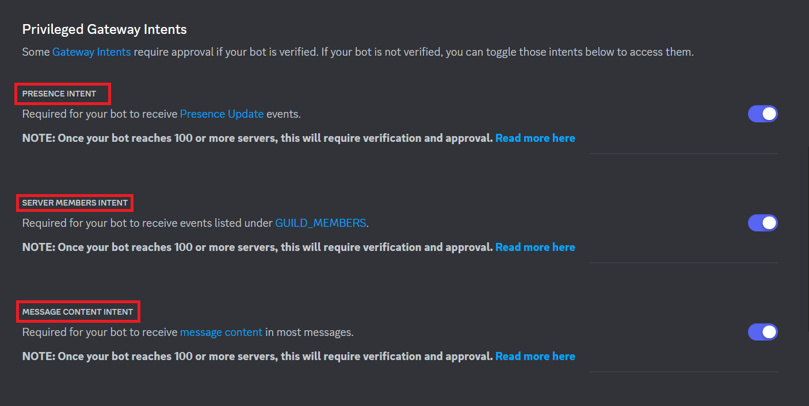
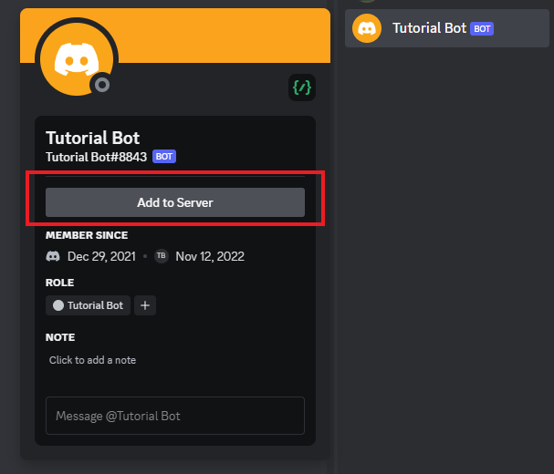

# Creating a Discord Bot

## Introduction

This is a tutorial on how to create a Discord bot using the [discord.py](https://discordpy.readthedocs.io/en/latest/) library. This tutorial will cover the basics of creating a bot and how to use the library's commands and events. To follow this tutorial, you will need to have Python 3.8 or higher installed on your computer. You can download Python [here](https://www.python.org/downloads/).

### Installing Python

To install Python, you will need to go to the [Python website](https://www.python.org/downloads/) and download the latest version of Python. It's recommended to atleast have Python `3.9>` installed on your computer. For more ease of use of python and easily leveraging features like more convenient typehints, it's recommended to install `3.10` or higher.


#### For Linux

If you are using Linux, you can install Python using your package manager. For example, if you are using Ubuntu, you can install Python using the following command:

```bash
sudo apt install python3.9
```

> **_NOTE:_**
    Depending on your Linux distribution, you may need to use a different command to install Python. Also, based on your linux distro version you may already have python installed. To check if you have python installed, you can run `python3 --version` in your terminal.  

Most linux distros however don't come with `pip` installed. To install `pip` you can run `sudo apt install python3-pip` in your terminal.
```bash
sudo apt install python3-pip
```

#### Verify Installation

To verify that you have Python installed, you can run the following command in your terminal:

##### Windows

```bash
py --version
```
##### Mac & Linux

```bash
python3 --version
```

> **_NOTE:_**
    Depending on your Python installation, the version displayed may be different.


#### For Windows & Mac

When installing Python on Windows or Mac, you will need to make sure that you have the `Add Python to PATH` option checked. This will allow you to use Python in your command prompt or terminal.

## Creating a Bot

To interact with the Discord API, we need to create a bot. To do this, we need to go to the [Discord Developer Portal](https://discord.com/developers/applications) and create a new application.


## Configuring the Bot

After creating the application, we need to configure the bot and get the bot token. To do this, we need to go to the `Bot` tab.


`Username`
:   This is the username of the bot. You can change this to whatever you want.

`Avatar`
:   This is the avatar of the bot. You can change this to whatever you want.

`Token`
:   This is the token of the bot. This is used to control the bot. You should keep this token private and not share it with anyone. Click on the `Copy` button to copy the token to your clipboard.

`Public Bot`
:   This is used to determine if the bot is public or not. If you want to make the bot public, you can enable this option.

## Configuring Intents

After configuring the bot, we need to configure intents. To do this, just scroll down to the `Privileged Gateway Intents` section and enable intents keeping in mind the following:

`Presence Intent`
:   This is used to determine if the bot can see the presence of users. For example, if this is enabled, the bot can see if a user is playing a game, streaming, listening to Spotify and statuses like online, idle, dnd and offline etc.

`Server Members Intent`
:   This is used to determine if the bot can see the members of a server. For example, if this is enabled, the bot can see if a user joins or leaves a server and related server member events.

`Message Content Intent`
:   This is used to determine if the bot can see the content of messages. For example, if this is enabled, the bot can see the content of messages and related message events.

!!! info "Tip"
    If you want to get contents of messages, embeds, attachments and use prefix commands, you will need to enable the `Message Content Intent`. As long as your bot is in less than 100 servers, you can enable all intents without any verification. If your bot is in more than 100 servers, you will need to verify your bot and get intents you need approved.



## Adding the Bot to a Server

After configuring intents, we need to add the bot to a server. To do this, we need to go to the `OAuth2` tab. Under the `OAuth2 URL Generator` section, go to select the `bot` scope, if you want slash commands for your bot as well check `applications.commands` scope also. Then, we need to select the permissions that we want the bot to have. After selecting the all the permissions, scroll down and copy the invite URL. You can use this URL to add the bot to a server.


> **_NOTE:_**
    For this tutorial, we will be using the `Administrator` permission. This is not recommended for production bots. You should only give your bot the permissions that it needs. If its a personal bot, you can give it the `Administrator` permission.

## In-App Authorization

<div style="text-align:center">
  
</div>

In order to add in-app authorization, you need to complete a few extra steps. Travel to `General` section under `OAuth2` tab and select `In-App Authorization` option. After that all steps are the same as above.


## Conclusion

With that, we have created a Discord bot. In the next section, we will be creating a bot using the discord.py library. After completing this tutorial, you should have a basic understanding of how to create a Discord bot.
Before we move on to the next section, make sure to have the following ready:

- [x] Python 3.9 or higher installed on your computer.
- [x] A Discord bot created on the [Discord Developer Portal](https://discord.com/developers/applications).
- [x] The bot token copied to your clipboard or saved somewhere safe.
- [x] The bot added to a server.
