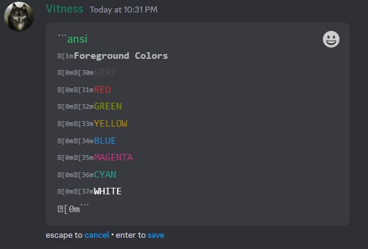
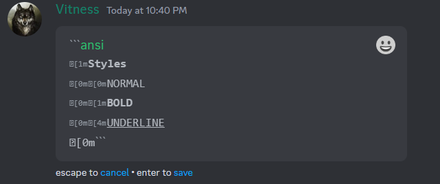
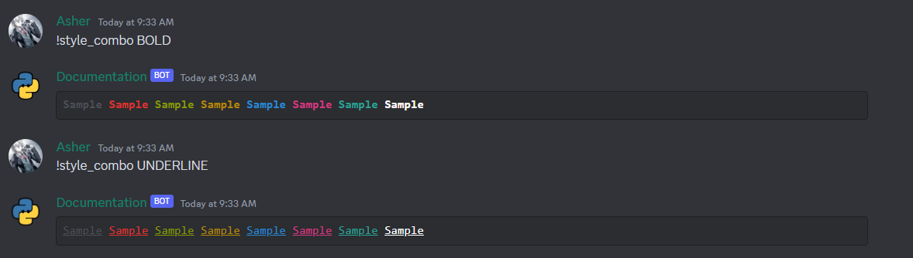

## ANSI

ANSI stands for American National Standards Institute. It is a set of standards for character and terminal handling. It is used by many programs, including the Linux kernel itself, to produce colored terminal output. The most basic Ansi escape codes are those involved in rendering text. These let you add decorations like Colors, Background Colors or other Decorations to your printed text, but don't do anything fancy.


Most ANSI escape codes start with `\u001b[` and end with `m`. The codes in between are the actual codes. For example, `\u001b[31m` is the code for red text. You can find a list of all the codes [here](https://en.wikipedia.org/wiki/ANSI_escape_code#SGR_(Select_Graphic_Rendition)_parameters). All the codes are separated by a `;`. For example, `\u001b[31;1m` is the code for bold red text. You can also combine multiple codes. For example, `\u001b[31;1;4m` is the code for bold red underlined text.

``` title="Ansi Format"
\u001b[{code}m{text}\u001b[0m
```

!!! info "Note"
    The `\u001b[0m` at the end is the code for resetting the text. If you don't add it, the text will stay in the same format.

!!! warning "Warning"
    So far discord supports only 8 colors each for foreground and background and 3 possible formats (bold, italic, underline).

### Building an Ansi Generator

```python
import enum


class Style(enum.IntEnum):
    def __str__(self) -> str:
        return f"{self.value}"
```

### Foreground Colors

| Color   | Code         |
|---------|--------------|
| Gray    | `\u001b[30m` |
| Red     | `\u001b[31m` |
| Green   | `\u001b[32m` |
| Yellow  | `\u001b[33m` |
| Blue    | `\u001b[34m` |
| Magenta | `\u001b[35m` |
| Cyan    | `\u001b[36m` |
| White   | `\u001b[37m` |

```python
class Colors(Style):
    GRAY = 30
    RED = 31
    GREEN = 32
    YELLOW = 33
    BLUE = 34
    MAGENTA = 35
    CYAN = 36
    WHITE = 37
```




### Background Colors


| Color             | Code         |
|-------------------|--------------|
| Firefly Dark Blue | `\u001b[40m` |
| Orange            | `\u001b[41m` |
| Marble Blue       | `\u001b[42m` |
| Greyish Turquoise | `\u001b[43m` |
| Gray              | `\u001b[44m` |
| Indigo            | `\u001b[45m` |
| Light Gray        | `\u001b[46m` |
| White             | `\u001b[47m` |

```python
class Backgrounds(Style):
    GRAY = 40
    RED = 41
    GREEN = 42
    YELLOW = 43
    BLUE = 44
    MAGENTA = 45
    CYAN = 46
    WHITE = 47
```


### Text Formats

| Format | Code         |
|--------|--------------|
| Normal | `\u001b[0m`  |
| Bold   | `\u001b[1m`  |
| Underline | `\u001b[4m`  |

```python
class Formats(Style):
    NORMAL = 0
    BOLD = 1
    UNDERLINE = 4
```




### Putting it all together

```python
import enum


class Style(enum.IntEnum):
    def __str__(self) -> str:
        return f"{self.value}"


class Colors(Style):
    GRAY = 30
    RED = 31
    GREEN = 32
    YELLOW = 33
    BLUE = 34
    MAGENTA = 35
    CYAN = 36
    WHITE = 37


class BackgroundColors(Style):
    FIREFLY_DARK_BLUE = 40
    ORANGE = 41
    MARBLE_BLUE = 42
    GREYISH_TURQUOISE = 43
    GRAY = 44
    INDIGO = 45
    LIGHT_GRAY = 46
    WHITE = 47


class Styles(Style):
    NORMAL = 0
    BOLD = 1
    UNDERLINE = 4


class AnsiBuilder:
    def __init__(self, text: str = "", *styles: Style) -> None:
        self.styles = styles
        self.cursor = len(text)
        self.text = f"\033[{';'.join(map(str, styles))}m{text}\033[0m" if styles and text else text

    def __add__(self, other: str) -> "AnsiBuilder":
        self.text += other
        self.cursor += len(other)
        return self

    def write(self, cursor: int, text: str) -> "AnsiBuilder":
        if cursor > self.cursor or cursor > len(self.text):
            raise ValueError("Cursor cannot be greater than the length of the text")
        if cursor < 0:
            raise ValueError("Cursor cannot be less than 0")
        self.text = self.text[:cursor] + text + self.text[cursor:]
        self.cursor += len(text)
        return self

    def __str__(self) -> str:
        return self.text

    @classmethod
    def to_ansi(cls, text: str, *styles: Style) -> str:
        return str(cls(text, *styles))

    @property
    def block(self) -> str:
        return f"```ansi\n{self.text}```"
```

### Implementation in a Bot

```python
import os

import discord
from discord.ext import commands
from dotenv import load_dotenv

bot = commands.Bot(command_prefix="!", intents=discord.Intents.all())
load_dotenv()


@bot.command()
async def foreground(ctx: commands.Context[commands.Bot]) -> None:
    fg = AnsiBuilder("Foreground Colors\n", Styles.BOLD)
    for color in Colors:
        fg += AnsiBuilder.to_ansi(f"{color.name}\n", color)
    await ctx.send(fg.block)


@bot.command()
async def background(ctx: commands.Context[commands.Bot]) -> None:
    bg = AnsiBuilder("Background Colors\n", Styles.BOLD)
    for color in BackgroundColors:
        bg += AnsiBuilder.to_ansi(f"{color.name}\n", color)
    await ctx.send(bg.block)


@bot.command()
async def style(ctx: commands.Context[commands.Bot]) -> None:
    _style = AnsiBuilder("Styles\n", Styles.BOLD)
    for s in Styles:
        _style += AnsiBuilder.to_ansi(f"{s.name}\n", s)
    await ctx.send(_style.block)


@bot.command()
async def combo(ctx: commands.Context[commands.Bot]) -> None:
    # combination of all foreground colors on all background colors
    for bg in BackgroundColors:
        combined = AnsiBuilder()
        for fg in Colors:
            combined += f"{AnsiBuilder.to_ansi('Sample', fg, bg)} "
        await ctx.send(combined.block)


@bot.command()
async def style_combo(ctx: commands.Context[commands.Bot], style_: str) -> None:
    if style_ not in Styles.__members__:
        await ctx.send("Invalid style")
        return
    _style = Styles[style_]
    combined = AnsiBuilder()
    for fg in Colors:
        combined += f"{AnsiBuilder.to_ansi('Sample', fg, _style)} "
    await ctx.send(combined.block)


bot.run(str(os.getenv("TOKEN")))
```




!!! failure "Note"
    So far, ansi highlighting is available on all stable desktop and web clients, but not on mobile clients.

## Markdown

### Text Formatting

| Format        | Code                                            |
|---------------|-------------------------------------------------|
| Bold          | `**bold**` like this **bold**                   |
| Italic        | `*italic*` like this *italic*                   |
| Underline     | `__underline__` like this ^^underline^^         |
| Strikethrough | `~~strikethrough~~` like this ~~strikethrough~~ |


!!! tip "Tip"
    You can combine formats like `***bold italic***` like this ***bold italic***, `__**underline bold**__` like this ^^**underline bold**^^ etc.

#### Headers

| Format | Code              |
|--------|-------------------|
| H1     | `# Header 1`      |
| H2     | `## Header 2`     |
| H3     | `### Header 3`    |


#### Links

| Format | Code              |
|--------|-------------------|
| Link   | `[text](url)`     |

```markdown
[Here](https://google.com)
```


#### Spoilers

| Format  | Code |
|---------|------|
| Spoiler | `    ||spoiler||`     |

```markdown
||spoiler||
```


### Lists

#### Unordered Lists

```markdown
- Item 1
- Item 2
  - Item 2.1
- Item 3
```

!!! tip "Tip"
    You can use `*` instead of `-` to create unordered lists.


#### Ordered Lists

```markdown
1. Item 1
3. Item 2
   1. Item 2.1
2. Item 3
```


!!! tip "Tip"
    The numbers don't have to be in numerical order, they will be automatically sorted.

### Blockquotes

```markdown
> This is a single line blockquote
> This is another line
```


```markdown
>>> This is a multiline blockquote
this continues
```


### Code Blocks

#### Inline Code

```markdown
This is `inline code`
```


#### Code Blocks


!!! warning "Warning"
    Use backticks `` ` `` and not single quotes `'` to create code blocks.

### Syntax Highlighting

To have syntax highlighting in code blocks, you can specify the language after the first set of backticks. For example, to have syntax highlighting for Python, you can use `` ```py ``.

=== "SQL"

    ```sql
    SELECT * FROM table
    ```
    

=== "HTML"

    ```html
    <html>
        <head>
            <title>Test</title>
        </head>
        <body>
            <h1>Test</h1>
        </body>
    </html>
    ```
    

=== "Rust"

    ```rust
    fn main() {
        println!("Hello, world!");
    }
    ```
    

=== "Diff"

    ```diff
    - this is a removed line
    + this is an added line
    ```
    

!!! tip "Tip"
    Above were just a few examples, You can find a list of supported languages [here](https://highlightjs.org/static/demo/).

## Conclusion

In this tutorial, we learned how to use markdown and ansi highlighting in discord.py. We also learned how to use the `AnsiBuilder` class to create custom ansi blocks.
Discord allows you to use markdown and ansi highlighting in embeds and messages. You can leverage this to make your bot's messages more readable and attractive.
