# Pagination

Pagination is a way to split a large list of items into multiple pages or subsets. This is useful when you have a large number of items to display, and you don't want to overwhelm the user with a long list or when your message surpasses the [discord limits for messages](https://discord.com/developers/docs/resources/message#create-message-jsonform-params).

In discord bots, pagination is often used to display a list of items in a more user-friendly way. Instead of displaying all items at once, you can split them information into multiple pages/enbeds, and allow the user to navigate between them.

There are primarily two ways to implement pagination in discord bots:

| Reaction-based pagination                                                                                                                   | View-based pagination                                                                                                                              |
|---------------------------------------------------------------------------------------------------------------------------------------------|----------------------------------------------------------------------------------------------------------------------------------------------------|
| In this method, you display a list of items in an embed, and allow the user to navigate between pages by reacting to the embed with emojis. | In this method, you display a list of items in an embed, and allow the user to navigate between pages by clicking on buttons or selecting options. |
| Reactions can only include a single emoji, limited interactivity and usually used for simplistic logic handling.                            | Views can include multiple buttons, dropdowns, and other interactive elements, allowing for more complex logic handling.                           |
| Utilizes `reaction_add` and `reaction_remove` events to handle user interactivity.                                                          | Utilizes custom interaction objects sent to your application to handle user interactivity.                                                         |
| Easier to implement but becomes cluttered with more complex logic or handling.                                                              | Simple to implement using `discord.ui` components, but requires more setup and understanding of interactions.                                      |

In this guide, we'll be focusing on view-based pagination, as it provides more flexibility and control over the user experience.

!!! tip "Prerequisites"
    Before you continue, make sure you have a basic understanding of [views](./views.md) because we'll be using views to implement pagination in this guide.

## Parts of Pagination

When implementing pagination in discord bots, there are a few key components that you need to consider:

1. **Data**: The list of items that you want to paginate. This could be a list of simple strings, embeds, or attachments.
2. **Pagination Logic**: The logic that handles how the data is split into pages and how the user can navigate between them.
3. **User Interface**: The visual representation of the data and the controls that allow the user to interact with the pagination.
4. **Interaction Handling**: The code that listens for user interactions and updates the pagination accordingly.

By understanding these components and how they interact with each other, you can create a smooth and intuitive pagination system for your discord bot.

## A Basic Pagination

```python title="paginators/__init__.py"
"""Base class for paginators."""

from __future__ import annotations

from io import BufferedIOBase
from os import PathLike
from typing import TYPE_CHECKING, Any, Generic, List, TypeVar, Union

import discord
from views import BaseView

if TYPE_CHECKING:
    from typing_extensions import TypeAlias

PageLike: TypeAlias = Union[discord.Embed, str, bytes, PathLike[Any], BufferedIOBase, discord.File]
FileLike: TypeAlias = Union[str, bytes, PathLike[Any], BufferedIOBase]

T = TypeVar("T", bound=PageLike)


class BasePaginator(Generic[T], BaseView):
    pages: List[T]
    current_page: int

    def __init__(
        self,
        user: Union[discord.User, discord.Member],
        pages: List[T],
        *,
        attachments: List[discord.File] = None
    ) -> None:
        super().__init__(user=user, timeout=180)
        self.pages = pages
        self.current_page: int = 0
        self.attachments = attachments or []

    async def send_page(self, inter: discord.Interaction, page: T) -> None:
        if isinstance(page, discord.Embed):  # Embed
            # Check if the embed has an associated attachment and send it along with the embed
            attachment = None
            if (page.image.url or "").startswith("attachment://") and len(self.attachments) > self.current_page:
                attachment = discord.File(self.attachments[self.current_page].fp.name)
            attachments = [attachment] if attachment else []
            if self.message is None:
                return await inter.response.send_message(embed=page, view=self, files=attachments)
            self.message = await inter.edit_original_response(embed=page, view=self, attachments=attachments)
            return

        if isinstance(page, str):  # String
            # Check if the string has an associated attachment and send it along with the string
            attachment = None
            if len(self.attachments) > self.current_page:
                attachment = discord.File(self.attachments[self.current_page].fp.name)
            attachments = [attachment] if attachment else []
            if self.message is None:
                return await inter.response.send_message(content=page, view=self, files=attachments)
            self.message = await inter.edit_original_response(content=page, view=self, attachments=attachments)
            return

        # File
        file = discord.File(page) if not isinstance(page, discord.File) else discord.File(page.fp.name)
        if self.message is None:
            return await inter.response.send_message(file=file, view=self)
        self.message = await inter.edit_original_response(attachments=[file], view=self)

    async def start_paginator(self, inter: discord.Interaction, *, starting_page: int = 0) -> None:
        self.current_page = starting_page
        page = self.pages[starting_page]
        await self.send_page(inter, page)
        self.message = await inter.original_response()

    async def stop_paginator(self) -> None:
        self._disable_all()
        await self._edit(view=self)

    async def next_page(self, inter: discord.Interaction) -> None:
        self.current_page = (self.current_page + 1) % len(self.pages)
        page = self.pages[self.current_page]
        await self.send_page(inter, page)

    async def previous_page(self, inter: discord.Interaction) -> None:
        self.current_page = (self.current_page - 1) % len(self.pages)
        page = self.pages[self.current_page]
        await self.send_page(inter, page)
```

So, let's break down the code above:

- We define a `BasePaginator` class that extends `BaseView` which is just a simple wrapper around `discord.ui.View` which we defined [here](./views.md#working-with-views).
- The `BasePaginator` class takes a list of pages and an optional list of attachments as input. A page can be an embed, a string, or a file-like object, an additional list of attachments can be provided to be used with the embeds in case they are local files.
- The `send_page` method sends the current page to the user. If the page is an embed with an attachment, it sends the attachment along with the embed. If the page is a string or a file, it sends the content or file to the user.
- The `start_paginator` method initializes the paginator by sending the first page to the user and storing the message object for future edits and cleanup.
- The `stop_paginator` method disables all interactions and disables the view.
- The `next_page` and `previous_page` methods handle moving to the next and previous pages respectively. They update the current page index and send the new page to the user. The modulo operation is used to loop around the pages when reaching the end or beginning of the list.

This class we implemented satisfies requirements `2 - Pagination Logic` and `4 - Interaction Handling` from the list above. Now let's look at how we can implement the `User Interface` part of the pagination based on our `Data` we possess.

## Pagination Interfaces

Lets took a look at typical bulk data we could paginate:

### Button Based Pagination

The simplest form of a collection is a list or an array. This can be a list of strings, a list of embeds, or a list of file-like objects.

```python
strings = ["Page 1", "Page 2", "Page 3"]
embeds = [discord.Embed(title=f"Page {i}", description=f"This is page {i}") for i in range(1, 4)]
files = [discord.File(f"page_{i}.txt") for i in range(1, 4)]
```

=== "Strings"
    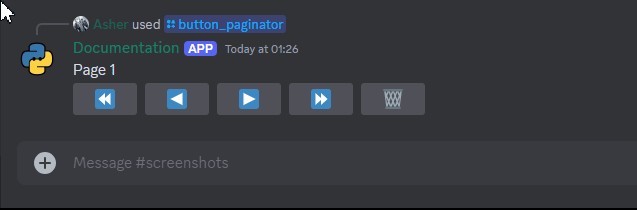

=== "Embeds"
    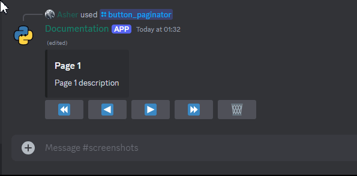

=== "Files"
    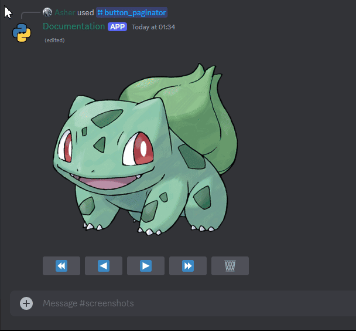

=== "Embeds with Attachments"
    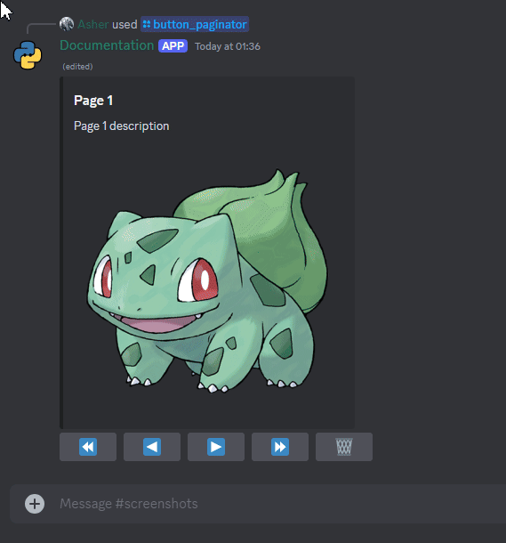

```python title="paginators/button_paginator.py"
from __future__ import annotations

from typing import TYPE_CHECKING, Generic, List, TypeVar, Union

import discord
from discord import PartialEmoji
from paginators import BasePaginator, FileLike, PageLike

if TYPE_CHECKING:
    from views import BaseView


T = TypeVar("T", bound=PageLike)


class ButtonBasedPaginator(Generic[T], BasePaginator[T]):
    @discord.ui.button(emoji=PartialEmoji.from_str("⏪"))
    async def goto_first_page_callback(self, inter: discord.Interaction, _: discord.ui.Button[BaseView]) -> None:
        await inter.response.defer()
        self.current_page = 0
        page = self.pages[self.current_page]
        await self.send_page(inter, page)

    @discord.ui.button(emoji=PartialEmoji.from_str("◀️"))
    async def previous_page_callback(self, inter: discord.Interaction, _: discord.ui.Button[BaseView]) -> None:
        await inter.response.defer()
        await self.previous_page(inter)

    @discord.ui.button(emoji=PartialEmoji.from_str("▶️"))
    async def next_page_callback(self, inter: discord.Interaction, _: discord.ui.Button[BaseView]) -> None:
        await inter.response.defer()
        await self.next_page(inter)

    @discord.ui.button(emoji=PartialEmoji.from_str("⏩"))
    async def goto_last_page_callback(self, inter: discord.Interaction, _: discord.ui.Button[BaseView]) -> None:
        await inter.response.defer()
        self.current_page = len(self.pages) - 1
        page = self.pages[self.current_page]
        await self.send_page(inter, page)

    @discord.ui.button(emoji=PartialEmoji.from_str("🗑️"))
    async def stop_paginator_callback(self, inter: discord.Interaction, _: discord.ui.Button[BaseView]) -> None:
        await inter.response.defer()
        await self.stop_paginator()
```

- We define a `ButtonBasedPaginator` class that extends `BasePaginator` and adds buttons for navigating between pages.
- The `ButtonBasedPaginator` class defines button callbacks for going to the first, previous, next, and last pages, as well as stopping the paginator.
- You may notice the usage of `Generic` type hints in the class definition and method signatures. This allows us to specify the type of pages that the paginator will handle, which can be a string, an embed, or a file-like object.

Here is how you can use the `ButtonBasedPaginator` class:

=== "Strings"
    ```python
    import discord
    from discord.ext import commands
    from paginators.button_paginator import ButtonBasedPaginator

    class StringButtonPaginator(ButtonBasedPaginator[str]):
        def __init__(
            self,
            user: Union[discord.User, discord.Member],
            pages: List[str],
            *,
            attachments: List[discord.File] = None,
        ) -> None:
            super().__init__(user, pages, attachments=attachments)

    # Assuming a bot command
    @bot.tree.command()
    async def paginate(inter: discord.Interaction):
        pages = ["Page 1", "Page 2", "Page 3"]
        paginator = StringButtonPaginator(inter.user, pages=pages)
        await paginator.start_paginator(inter)

    @bot.tree.command()
    async def paginate_with_attachments(inter: discord.Interaction):
        pages = ["Page 1", "Page 2", "Page 3"]
        attachments = [discord.File(f"assets/{i}.png") for i in range(1, 4)]
        paginator = StringButtonPaginator(inter.user, pages=pages, attachments=attachments)
        await paginator.start_paginator(inter)
    ```

=== "Embeds"
    ```python
    import discord
    from discord.ext import commands
    from paginators.button_paginator import ButtonBasedPaginator

    class EmbedButtonPaginator(ButtonBasedPaginator[discord.Embed]):
        def __init__(
            self,
            user: Union[discord.User, discord.Member],
            pages: List[discord.Embed],
            *,
            attachments: List[discord.File] = None,
        ) -> None:
            super().__init__(user, pages, attachments=attachments)

    # Assuming a bot command
    @bot.tree.command()
    async def paginate(inter: discord.Interaction):
        pages = [discord.Embed(title=f"Page {i}", description=f"This is page {i}") for i in range(1, 4)]
        paginator = EmbedButtonPaginator(inter.user, pages=pages)
        await paginator.start_paginator(inter)

    @bot.tree.command()
    async def paginate_with_attachments(inter: discord.Interaction):
        pages = [discord.Embed(title=f"Page {i}", description=f"This is page {i}") for i in range(1, 4)]
        attachments = [discord.File(f"assets/{i}.png") for i in range(1, 4)]
        paginator = EmbedButtonPaginator(inter.user, pages=pages, attachments=attachments)
        await paginator.start_paginator(inter)
    ```

=== "Files"
    ```python
    import discord
    from discord.ext import commands
    from paginators.button_paginator import ButtonBasedPaginator

    class FileButtonPaginator(ButtonBasedPaginator[FileLike]):
        def __init__(self, user: Union[discord.User, discord.Member], pages: List[FileLike]) -> None:
            super().__init__(user, pages)

    # Assuming a bot command
    @bot.tree.command()
    async def paginate(inter: discord.Interaction):
        pages = [discord.File(f"assets/{i}.png") for i in range(1, 4)]
        paginator = FileButtonPaginator(inter.user, pages=pages)
        await paginator.start_paginator(inter)
    ```

!!! note "Note"
    Notice that the `ButtonBasedPaginator` class is generic and can handle different types of pages, such as strings, embeds, or files. This allows you to reuse the same pagination logic for different types of data.

### Select Based Pagination

A more complex form of data could be a dictionary or a mapping of keys to values. This can be useful when you want to display more structured or categorized data.

```python
data = {
    "Name": "John Doe",
    "Age": 30,
    "Location": "New York"
}
```

=== "Strings"
    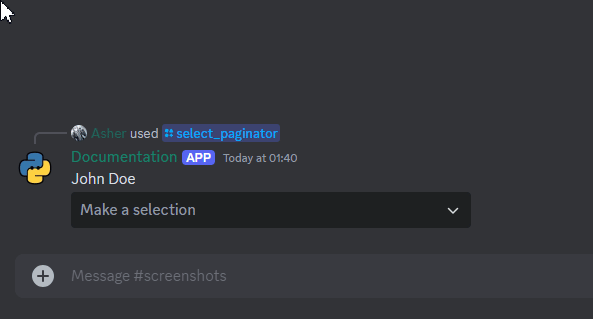

=== "Embeds"
    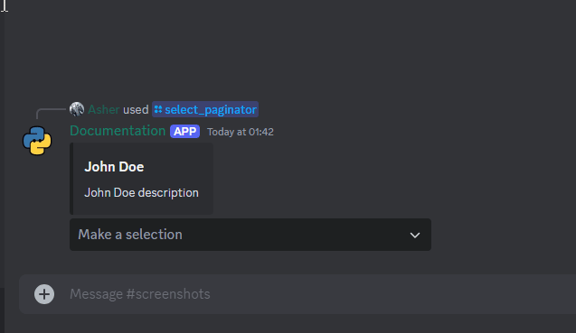

=== "Files"
    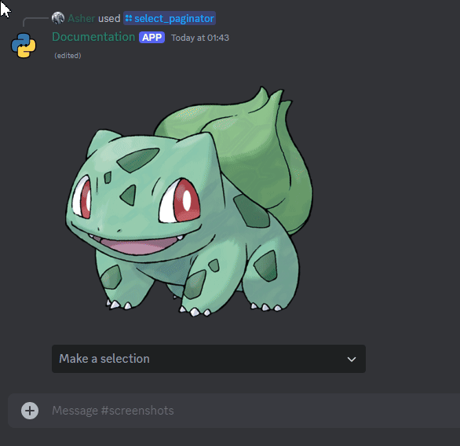

=== "Embeds with Attachments"
    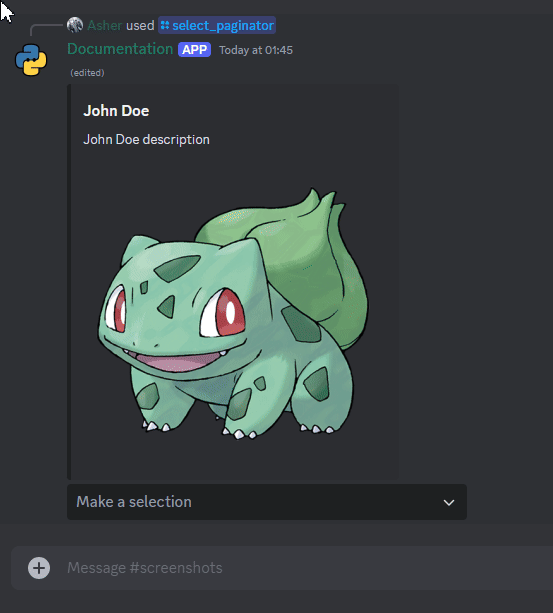

```python title="paginators/select_paginator.py"
from __future__ import annotations

from typing import Generic, List, Optional, TypeVar, Union

import discord
from paginators import BasePaginator, FileLike, PageLike

T = TypeVar("T", bound=PageLike)


class PageEntry(Generic[T]):
    def __init__(
        self,
        value: T,
        *,
        page_title: str,
        page_description: Optional[str] = None,
        attachment: discord.File = None,
    ) -> None:
        self.page_title = page_title
        self.page_description = page_description
        self.value = value
        self.attachment = attachment


class SelectMenuBasedPaginator(Generic[T], BasePaginator[T]):
    def __init__(
        self,
        user: Union[discord.User, discord.Member],
        *,
        pages: List[PageEntry[T]],
    ) -> None:
        self.select = PaginatorSelect(view=self)
        pages_: List[T] = []
        attachments_: List[discord.File] = []
        for i, page in enumerate(pages):
            pages_.append(page.value)
            if page.attachment:
                attachments_.append(page.attachment)
            self.select.add_option(
                label=page.page_title,
                value=str(i),
                description=page.page_description,
            )
        super().__init__(user, pages=pages_, attachments=attachments_)
        self.add_item(self.select)


class PaginatorSelect(discord.ui.Select[SelectMenuBasedPaginator[PageLike]]):
    def __init__(self, view: SelectMenuBasedPaginator[PageLike]) -> None:
        super().__init__(min_values=1, max_values=1)
        self.base_view = view

    async def callback(self, interaction: discord.Interaction) -> None:
        # the user can only select one value and shoud at least select it
        # so this is always fine
        await interaction.response.defer()
        self.base_view.current_page = int(self.values[0])
        page = self.base_view.pages[self.base_view.current_page]
        await self.base_view.send_page(interaction, page)

    async def interaction_check(self, interaction: discord.Interaction) -> bool:
        return await self.base_view.interaction_check(interaction)
```

- We define a `PageEntry` class that represents an entry in the select menu. It contains the value to be displayed, the title and description of the page added to the select menu, and an optional attachment.
- We define a `SelectMenuBasedPaginator` class that extends `BasePaginator` and adds a select menu for navigating between pages.
- The `SelectMenuBasedPaginator` class takes a list of `PageEntry` objects as input and creates a select menu with options for each entry.
- The `PaginatorSelect` class is a custom select menu that handles user interactions and updates the current page based on the selected option and sends the new page to the user.

Here is how you can use the `SelectMenuBasedPaginator` class:

=== "Strings"
    ```python
    import discord
    from discord.ext import commands
    from paginators.select_paginator import SelectMenuBasedPaginator, PageEntry

    class StringSelectPaginator(SelectMenuBasedPaginator[str]):
        def __init__(self, user: Union[discord.User, discord.Member], *, pages: List[PageEntry[str]]) -> None:
            super().__init__(user, pages=pages)

    # Assuming a bot command
    @bot.tree.command()
    async def paginate(inter: discord.Interaction):
        pages = [
            PageEntry("Page 1", page_title="Page 1", page_description="This is page 1"),
            PageEntry("Page 2", page_title="Page 2", page_description="This is page 2"),
            PageEntry("Page 3", page_title="Page 3", page_description="This is page 3"),
        ]
        paginator = StringSelectPaginator(inter.user, pages=pages)
        await paginator.start_paginator(inter)

    @bot.tree.command()
    async def paginate_with_attachments(inter: discord.Interaction):
        pages = [
            PageEntry("Page 1", page_title="Page 1", page_description="This is page 1", attachment=discord.File("assets/1.png")),
            PageEntry("Page 2", page_title="Page 2", page_description="This is page 2", attachment=discord.File("assets/2.png")),
            PageEntry("Page 3", page_title="Page 3", page_description="This is page 3", attachment=discord.File("assets/3.png")),
        ]
        paginator = StringSelectPaginator(inter.user, pages=pages)
        await paginator.start_paginator(inter)
    ```

=== "Embeds"
    ```python
    import discord
    from discord.ext import commands
    from paginators.select_paginator import SelectMenuBasedPaginator, PageEntry

    class EmbedSelectPaginator(SelectMenuBasedPaginator[discord.Embed]):
        def __init__(self, user: Union[discord.User, discord.Member], *, pages: List[PageEntry[discord.Embed]]) -> None:
            super().__init__(user, pages=pages)

    # Assuming a bot command
    @bot.tree.command()
    async def paginate(inter: discord.Interaction):
        pages = [
            PageEntry(
                discord.Embed(title="Page 1", description="This is page 1"),
                page_title="Page 1",
                page_description="This is page 1",
            ),
            PageEntry(
                discord.Embed(title="Page 2", description="This is page 2"),
                page_title="Page 2",
                page_description="This is page 2",
            ),
            PageEntry(
                discord.Embed(title="Page 3", description="This is page 3"),
                page_title="Page 3",
                page_description="This is page 3",
            ),
        ]
        paginator = EmbedSelectPaginator(inter.user, pages=pages)
        await paginator.start_paginator(inter)

    @bot.tree.command()
    async def paginate_with_attachments(inter: discord.Interaction):
        pages = [
            PageEntry(
                discord.Embed(title="Page 1", description="This is page 1"),
                page_title="Page 1",
                page_description="This is page 1",
                attachment=discord.File("assets/1.png"),
            ),
            PageEntry(
                discord.Embed(title="Page 2", description="This is page 2"),
                page_title="Page 2",
                page_description="This is page 2",
                attachment=discord.File("assets/2.png"),
            ),
            PageEntry(
                discord.Embed(title="Page 3", description="This is page 3"),
                page_title="Page 3",
                page_description="This is page 3",
                attachment=discord.File("assets/3.png"),
            ),
        ]
        paginator = EmbedSelectPaginator(inter.user, pages=pages)
        await paginator.start_paginator(inter)
    ```

=== "Files"
    ```python
    import discord
    from discord.ext import commands
    from paginators.select_paginator import SelectMenuBasedPaginator, PageEntry

    class FileSelectPaginator(SelectMenuBasedPaginator[FileLike]):
        def __init__(self, user: Union[discord.User, discord.Member], *, pages: List[PageEntry[FileLike]]) -> None:
            super().__init__(user, pages=pages)

    # Assuming a bot command
    @bot.tree.command()
    async def paginate(inter: discord.Interaction):
        pages = [
            PageEntry(discord.File("assets/1.png"), page_title="Page 1", page_description="This is page 1"),
            PageEntry(discord.File("assets/2.png"), page_title="Page 2", page_description="This is page 2"),
            PageEntry(discord.File("assets/3.png"), page_title="Page 3", page_description="This is page 3"),
        ]
        paginator = FileSelectPaginator(inter.user, pages=pages)
        await paginator.start_paginator(inter)
    ```

### Hybrid Pagination

Finally you could have a combination or hybrid of both lists and dictionaries nested within each other.

```python
data = {
    "Fruits": ["Apple", "Banana", "Cherry"],
    "Vegetables": ["Carrot", "Broccoli", "Spinach"],
    "Grains": ["Rice", "Wheat", "Barley"]
}
```

=== "Strings"
    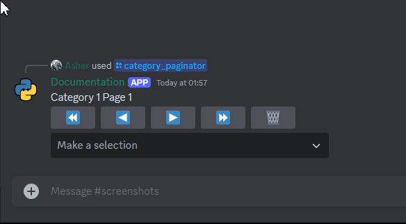

=== "Embeds"
    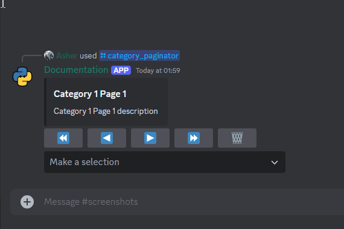

=== "Files"
    

=== "Embeds with Attachments"
    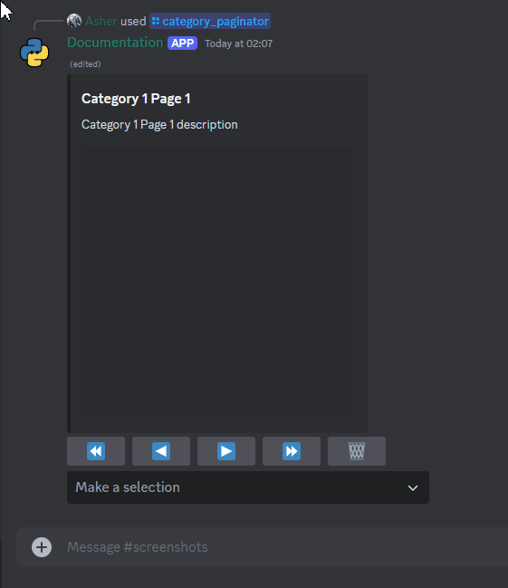

```python title="paginators/advanced_paginator.py"
from __future__ import annotations

from typing import Generic, List, Optional, TypeVar, Union

import discord
from discord import File, Member, User
from paginators import PageLike
from paginators.button_paginator import ButtonBasedPaginator

T = TypeVar("T", bound=PageLike)


class CategoryEntry(Generic[T]):
    def __init__(
        self,
        *,
        category_title: str,
        category_description: Optional[str] = None,
        pages: Optional[List[T]] = None,
        attachments: Optional[List[File]] = None,
    ) -> None:
        self.category_title = category_title
        self.category_description = category_description
        self.pages = pages or []
        self.attachments = attachments or []

    def add_page(self, page: T) -> None:
        self.pages.append(page)


class CategoryBasedPaginator(Generic[T], ButtonBasedPaginator[T]):
    def __init__(
        self,
        user: Union[User, Member],
        *,
        pages: List[CategoryEntry[T]],
    ) -> None:
        self.categories = pages
        self.current_category: int = 0

        super().__init__(user, pages[self.current_category].pages, attachments=pages[self.current_category].attachments)

        self.select = CategoryPaginatorSelect()
        for i, page in enumerate(pages):
            self.select.add_option(
                label=page.category_title,
                value=str(i),
                description=page.category_description,
            )
        self.add_item(self.select)


class CategoryPaginatorSelect(discord.ui.Select[CategoryBasedPaginator[PageLike]]):
    def __init__(self) -> None:
        super().__init__(min_values=1, max_values=1)

    async def callback(self, interaction: discord.Interaction) -> None:
        # the user can only select one value and shoud at least select it
        # so this is always fine
        await interaction.response.defer()
        self.view.current_category = int(self.values[0])
        view: CategoryBasedPaginator[PageLike] = self.view
        view.pages = view.categories[self.view.current_category].pages
        view.attachments = view.categories[self.view.current_category].attachments
        view.current_page = 0
        page = view.pages[view.current_page]
        await view.send_page(interaction, page)

    async def interaction_check(self, interaction: discord.Interaction) -> bool:
        return await self.view.interaction_check(interaction)
```

- We define a `CategoryEntry` class that represents a category in the paginator. It contains the value to be displayed, the title and description of the category, a list of pages, and an optional list of attachments.
- We define a `CategoryBasedPaginator` class that extends `ButtonBasedPaginator` and adds a select menu for navigating between categories.
- The `CategoryBasedPaginator` class takes a list of `CategoryEntry` objects as input and creates a select menu with options for each category.
- The `CategoryPaginatorSelect` class is a custom select menu that handles user interactions and updates the current category based on the selected option and sends the first page of the new category to the user.

Here is how you can use the `CategoryBasedPaginator` class:

=== "Strings"
    ```python
    import discord
    from discord.ext import commands
    from paginators.advanced_paginator import CategoryBasedPaginator, CategoryEntry

    class StringCategoryPaginator(CategoryBasedPaginator[str]):
        def __init__(self, user: Union[discord.User, discord.Member], *, pages: List[CategoryEntry[str]]) -> None:
            super().__init__(user, pages=pages)

    # Assuming a bot command
    @bot.tree.command()
    async def paginate(inter: discord.Interaction):
        pages = [
            CategoryEntry(
                category_title="Fruits",
                category_description="A list of fruits",
                pages=["Apple", "Banana", "Cherry"],
            ),
            CategoryEntry(
                category_title="Vegetables",
                category_description="A list of vegetables",
                pages=["Carrot", "Broccoli", "Spinach"],
            ),
            CategoryEntry(
                category_title="Grains",
                category_description="A list of grains",
                pages=["Rice", "Wheat", "Barley"],
            ),
        ]
        paginator = StringCategoryPaginator(inter.user, pages=pages)
        await paginator.start_paginator(inter)

    @bot.tree.command()
    async def paginate_with_attachments(inter: discord.Interaction):
        pages = [
            CategoryEntry(
                category_title="Fruits",
                category_description="A list of fruits",
                pages=["Apple", "Banana", "Cherry"],
                attachments=[discord.File("assets/1.png"), discord.File("assets/2.png"), discord.File("assets/3.png")],
            ),
            CategoryEntry(
                category_title="Vegetables",
                category_description="A list of vegetables",
                pages=["Carrot", "Broccoli", "Spinach"],
                attachments=[discord.File("assets/4.png"), discord.File("assets/5.png"), discord.File("assets/6.png")],
            ),
            CategoryEntry(
                category_title="Grains",
                category_description="A list of grains",
                pages=["Rice", "Wheat", "Barley"],
                attachments=[discord.File("assets/7.png"), discord.File("assets/8.png"), discord.File("assets/9.png")],
            ),
        ]
        paginator = StringCategoryPaginator(inter, pages=pages)
        await paginator.start_paginator(inter)
    ```

=== "Embeds"
    ```python
    import discord
    from discord.ext import commands
    from paginators.advanced_paginator import CategoryBasedPaginator, CategoryEntry

    class EmbedCategoryPaginator(CategoryBasedPaginator[discord.Embed]):
        def __init__(self, user: Union[discord.User, discord.Member], *, pages: List[CategoryEntry[discord.Embed]]) -> None:
            super().__init__(user, pages=pages)

    # Assuming a bot command
    @bot.tree.command()
    async def paginate(inter: discord.Interaction):
        pages = [
            CategoryEntry(
                category_title="Fruits",
                category_description="A list of fruits",
                pages=[
                    discord.Embed(title="Apple", description="A red fruit"),
                    discord.Embed(title="Banana", description="A yellow fruit"),
                    discord.Embed(title="Cherry", description="A red fruit"),
                ],
            ),
            CategoryEntry(
                category_title="Vegetables",
                category_description="A list of vegetables",
                pages=[
                    discord.Embed(title="Carrot", description="An orange vegetable"),
                    discord.Embed(title="Broccoli", description="A green vegetable"),
                    discord.Embed(title="Spinach", description="A green vegetable"),
                ],
            ),
            CategoryEntry(
                category_title="Grains",
                category_description="A list of grains",
                pages=[
                    discord.Embed(title="Rice", description="A white grain"),
                    discord.Embed(title="Wheat", description="A brown grain"),
                    discord.Embed(title="Barley", description="A yellow grain"),
                ],
            ),
        ]
        paginator = EmbedCategoryPaginator(inter.user, pages=pages)
        await paginator.start_paginator(inter)

    @bot.tree.command()
    async def paginate_with_attachments(inter: discord.Interaction):
        pages = [
            CategoryEntry(
                category_title="Fruits",
                category_description="A list of fruits",
                pages=[
                    discord.Embed(title="Apple", description="A red fruit"),
                    discord.Embed(title="Banana", description="A yellow fruit"),
                    discord.Embed(title="Cherry", description="A red fruit"),
                ],
                attachments=[discord.File("assets/1.png"), discord.File("assets/2.png"), discord.File("assets/3.png")],
            ),
            CategoryEntry(
                category_title="Vegetables",
                category_description="A list of vegetables",
                pages=[
                    discord.Embed(title="Carrot", description="An orange vegetable"),
                    discord.Embed(title="Broccoli", description="A green vegetable"),
                    discord.Embed(title="Spinach", description="A green vegetable"),
                ],
                attachments=[discord.File("assets/4.png"), discord.File("assets/5.png"), discord.File("assets/6.png")],
            ),
            CategoryEntry(
                category_title="Grains",
                category_description="A list of grains",
                pages=[
                    discord.Embed(title="Rice", description="A white grain"),
                    discord.Embed(title="Wheat", description="A brown grain"),
                    discord.Embed(title="Barley", description="A yellow grain"),
                ],
                attachments=[discord.File("assets/7.png"), discord.File("assets/8.png"), discord.File("assets/9.png")],
            ),
        ]
        paginator = EmbedCategoryPaginator(inter.user, pages=pages)
        await paginator.start_paginator(inter)
    ```

=== "Files"
    ```python
    import discord
    from discord.ext import commands
    from paginators.advanced_paginator import CategoryBasedPaginator, CategoryEntry

    class FileCategoryPaginator(CategoryBasedPaginator[FileLike]):
        def __init__(self, user: Union[discord.User, discord.Member], *, pages: List[CategoryEntry[FileLike]]) -> None:
            super().__init__(user, pages=pages)

    # Assuming a bot command
    @bot.tree.command()
    async def paginate(inter: discord.Interaction):
        pages = [
            CategoryEntry(
                category_title="Fruits",
                category_description="A list of fruits",
                pages=[discord.File("assets/1.png"), discord.File("assets/2.png"), discord.File("assets/3.png")],
            ),
            CategoryEntry(
                category_title="Vegetables",
                category_description="A list of vegetables",
                pages=[discord.File("assets/4.png"), discord.File("assets/5.png"), discord.File("assets/6.png")],
            ),
            CategoryEntry(
                category_title="Grains",
                category_description="A list of grains",
                pages=[discord.File("assets/7.png"), discord.File("assets/8.png"), discord.File("assets/9.png")],
            ),
        ]
        paginator = FileCategoryPaginator(inter.user, pages=pages)
        await paginator.start_paginator(inter)
    ```

And that's it! You've now implemented a pagination system for your discord bot using views and interactions. You can customize the pagination logic, user interface, and interaction handling to suit your specific use case and provide a better user experience.

You can copy and paste the code snippets above into your project and modify them as needed to fit your requirements. Here is the directory structure for the files we created:

```plaintext
.
├── assets
│   ├── 1.png
│   ├── 2.png
│   ├── 3.png
│   ├── 4.png
│   ├── 5.png
│   ├── 6.png
│   ├── 7.png
│   ├── 8.png
│   └── 9.png
├── main.py
├── paginators
│   ├── __init__.py  # Contains the BasePaginator class
│   ├── advanced_paginator.py
│   ├── button_paginator.py
│   └── select_paginator.py
└── views
    └── __init__.py  # Contains the BaseView class
```

## Conclusion

In this guide, we've covered the basics of pagination in discord bots and how to implement it using views and interactions. We've also explored different types of pagination interfaces, such as button-based and select-based pagination, and how to use them with different types of data.

By understanding the key components of pagination and how they interact with each other, you can create a smooth and intuitive pagination system for your discord bot.
