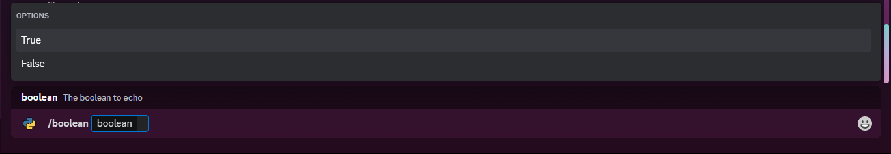
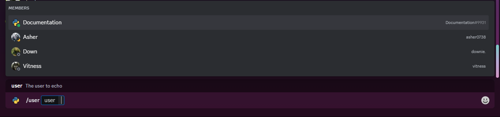
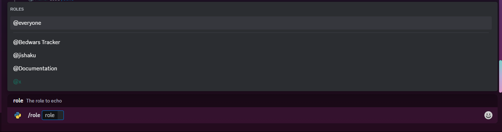
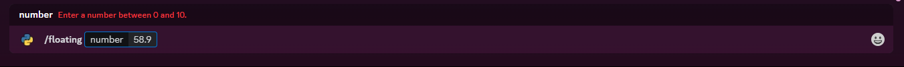
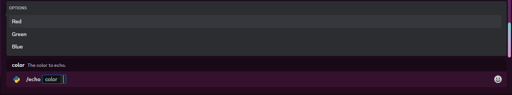

# Slash Commands

A slash command is one of the types of client-integrated interactions a bot can create. Unlike prefix and hybrid commands, these do not require the message content intent.

Application commands are native ways to interact with apps in the Discord client. There are 3 types of commands accessible in different interfaces: the chat input, a message's context menu (top-right menu or right-clicking in a message), and a user's context menu (right-clicking on a user).

{: style="width: 100%;"}

!!! note "Note"
    By default, slash commands are available globally. This means that they can be used in anywhere from servers to DMs. However, you can also limit them to specific guilds and set permissions for them.

## The CommandTree

The `CommandTree` is the main container class defined by `discord.py` for slash commands. It is used to register and manage all slash commands and provides an interface for interacting with them.

To use the slash commands registered in the `CommandTree`, you also need to sync them with Discord. This is done by calling `CommandTree.sync()`.

When you call `CommandTree.sync`, you sync one scope of the CommandTree, either the list of global commands `(sync())` or the list for one guild `(sync(guild=discord.Object(...)))`.

You can read more about how to sync commands in the [Syncing Commands](./hybrid-commands.md#syncing-commands) section.

=== "Using commands.Bot"

    If you are using `commands.Bot`, you can directly access the `CommandTree` through the `commands.Bot.tree` attribute as the tree is already instantiated for you when you create the bot.

    ```py
    from discord.ext import commands

    bot = commands.Bot(...)
    tree = bot.tree
    ```

=== "Using discord.Client"

    If you are using `discord.Client`, you need to instantiate the `CommandTree` yourself.

    ```py
    import discord
    from discord import app_commands

    client = discord.Client(...)
    tree = app_commands.CommandTree(client)
    # protip: you set the tree as an attribute of the client for easy access
    client.tree = tree
    ```

## Creating a Slash Command

To create a slash command, you can use the `CommandTree.command` decorator. Unlike prefix and hybrid commands, here instead of a `commands.Context` object, you get a `discord.Interaction` object. This object contains all the information about the interaction, including the command name, the guild it was used in, the user who used it, etc.

The `discord.Interaction` object also has a `response` attribute which is a `discord.InteractionResponse` object. This object is used to send responses to the interaction. Unlike the `commands.Context` object, you can only send one response per interaction and any further responses need to be sent as followups.

Similarly to regular and hybrid commands, you can pass in a `name` argument to the decorator to set the name of the command. If you do not pass in a name, the name of the function will be used as the name of the command.

You can utilize the app_commands.describe decorator to set information about the parameters for the slash command.

=== "Using Parameters"

    ```py
    import discord
    from discord import app_commands
    from discord.ext import commands

    @bot.tree.command(name="echo", description="Echoes a message.")
    @app_commands.describe(message="The message to echo.")
    async def echo(interaction: discord.Interaction, message: str) -> None:
        await interaction.response.send_message(message)
    ```

=== "Using Docstrings"

    ```py
    import discord
    from discord.ext import commands

    @bot.tree.command()
    async def echo(interaction: discord.Interaction, message: str) -> None:
        """
        Echoes a message.

        Parameters
        ----------
        interaction : discord.Interaction
            The interaction object.
        message : str
            The message to echo.
        """
        await interaction.response.send_message(message)
    ```

{: style="width: 100%;"}
{: style="width: 100%;"}

### Sending Responses

To send a response to an interaction, you can use the `discord.InteractionResponse.send_message` method. This method is same as your usual `commands.Context.send` method and takes in the same arguments.

```py
@bot.tree.command()
async def echo(interaction: discord.Interaction, message: str) -> None:
    await interaction.response.send_message(message)
```

!!! warning "Warning"
    You can only send one response per interaction. Any further responses will lead to `InteractionResponded` error.

    ```py
    @bot.tree.command()
    async def ping(inter: discord.Interaction) -> None:
        """Get the bot's latency"""
        await inter.response.send_message(f"Pong! ({round(bot.latency * 1000)}ms)")
        try:
            await inter.response.send_message(f"Trying to send a second message...")
        except discord.InteractionResponded:
            await inter.followup.send(f"Respoding again failed, as expected.")
    ```

    {: style="width: 100%;"}

    If you do not send a response, the interaction will be marked as failed and the user will be notified that the interaction failed.

    {: style="width: 100%;"}

### Sending Followups

To send followups, you can use the `discord.Interaction.followup.send` method. This method is same as your usual `commands.Context.reply` method and basically replies to your original response.

```py
@bot.tree.command()
async def echo(interaction: discord.Interaction, message: str) -> None:
    await interaction.response.send_message(message)
    await interaction.followup.send("This is a followup message.")
```

!!! warning "Warning"
    Before you can send followups, you need to send a response first.
    You can send as many followups as you want, but you can only send one response per interaction.

    ```py
    @bot.tree.command()
    async def ping(inter: discord.Interaction) -> None:
        """Get the bot's latency"""
        await inter.response.send_message(f"Pong! ({round(bot.latency * 1000)}ms)")
        await inter.followup.send(f"Trying to send a second message...")
        await inter.followup.send(f"Respoding again failed, as expected.")
    ```

    {: style="width: 100%;"}

    You can send followups only for `15 minutes` after the interaction was created. To check if you can send followups, you can use the `discord.Interaction.is_expired()` method.`

### Editing Responses

To edit a response, you can use the `discord.Interaction.edit_original_response` method.

```py
@bot.tree.command()
async def echo(interaction: discord.Interaction, message: str) -> None:
    await interaction.response.send_message(message)
    await interaction.response.edit_original_message("This is an edited message.")
```

{: style="width: 100%;"}

### Deleting Responses

To delete a response, you can use the `discord.Interaction.delete_original_response` method.

```py
@bot.tree.command()
async def echo(interaction: discord.Interaction, message: str) -> None:
    await interaction.response.send_message(message)
    await interaction.response.delete_original_message()
```

### Deferring Responses

You have `3 seconds` to respond to an interaction if you delay the response, otherwise the interaction will be marked as failed and the user will be notified that the interaction failed. To make sure that you can respond to the interaction, you can defer the response. This will make the user see a loading state until you send a response and will give you `15 minutes` to respond to the interaction.

To defer a response, you can use the `discord.InteractionResponse.defer` method. After deferring the response, you can no longer use the `send_message` method to send a response. Instead, you need to use the `edit_original_response` method to edit the deferred response.

```py
import asyncio

@bot.tree.command()
async def echo(interaction: discord.Interaction, message: str) -> None:
    await interaction.response.defer()
    await asyncio.sleep(5)
    await interaction.edit_original_response(content=message)
```

{: style="width: 100%;"}

### Ephemeral Responses

You can send ephemeral responses to an interaction. These responses are only visible to the user who used the command and are not visible to other users. To send an ephemeral response, you can use the `discord.InteractionResponse.send_message` method and pass in `ephemeral=True`, or if you are using the `discord.InteractionResponse.defer` method, you can pass in `ephemeral=True` to `defer` method.

=== "Using `send_message`"

    ```py
    @bot.tree.command()
    async def echo(interaction: discord.Interaction, message: str) -> None:
        await interaction.response.send_message(message, ephemeral=True)
    ```

=== "Using `defer`"

    ```py
    @bot.tree.command()
    async def echo(interaction: discord.Interaction, message: str) -> None:
        await interaction.response.defer(ephemeral=True)
        await asyncio.sleep(5)
        await interaction.edit_original_response(content=message)
    ```

{: style="width: 100%;"}

## Slash Command Parameters

Slash commands, have a few parameters that are supported by discord when registering the command.

- `str [AppCommandOptionType.string]` - A string parameter
- `int [AppCommandOptionType.integer]` - An integer parameter
- `float [AppCommandOptionType.number]` - A float parameter
- `bool [AppCommandOptionType.boolean]` - A boolean parameter
- `discord.User [AppCommandOptionType.user]` or `discord.Member` - A user or member parameter. A user annotation can also result in a member parameter.
- \* `discord.abc.GuildChannel` - A channel parameter
- `discord.Role [AppCommandOptionType.role]` - A role parameter
- `discord.Attachment [AppCommandOptionType.attachment]` - An attachment parameter

All other parameters will be treated as a string parameter and can be converted implicitly using [transformers](#transformers).

!!! info "Info"
    - \* All channel subclasses and unions (e.g. Union[TextChannel, StageChannel]) are also supported.

    - Some combinations of types are also allowed, including:
        - Union[User, Member] (results in AppCommandOptionType.user)
        - Union[Member, Role] (results in AppCommandOptionType.mentionable)
        - Union[User, Role] (results in AppCommandOptionType.mentionable)
        - Union[User, Member, Role] (results in AppCommandOptionType.mentionable)

=== "String"

    ```python
    @bot.tree.command()
    async def echo(interaction: discord.Interaction, message: str) -> None:
        """
        Echoes a message

        Parameters
        ----------
        interaction : discord.Interaction
            The interaction object.
        message : str
            The message to echo.
        """
        await interaction.response.send_message(message)
    ```

    {: style="width: 100%;"}

=== "Integer"

    ```python
    @bot.tree.command()
    async def echo(interaction: discord.Interaction, number: int) -> None:
        """
        Echoes a number

        Parameters
        ----------
        interaction : discord.Interaction
            The interaction object.
        number : int
            The number to echo.
        """
        await interaction.response.send_message(number)
    ```

    {: style="width: 100%;"}

=== "Float"

    ```python
    @bot.tree.command()
    async def echo(interaction: discord.Interaction, number: float) -> None:
        """
        Echoes a number

        Parameters
        ----------
        interaction : discord.Interaction
            The interaction object.
        number : float
            The number to echo.
        """
        await interaction.response.send_message(number)
    ```

    {: style="width: 100%;"}

=== "Boolean"

    ```python
    @bot.tree.command()
    async def echo(interaction: discord.Interaction, boolean: bool) -> None:
        """
        Echoes a boolean

        Parameters
        ----------
        interaction : discord.Interaction
            The interaction object.
        boolean : bool
            The boolean to echo.
        """
        await interaction.response.send_message(boolean)
    ```

    {: style="width: 100%;"}

=== "User"

    ```python
    @bot.tree.command()
    async def echo(interaction: discord.Interaction, user: discord.User) -> None:
        """
        Echoes a user

        Parameters
        ----------
        interaction : discord.Interaction
            The interaction object.
        user : discord.User
            The user to echo.
        """
        embed = discord.Embed(title=user.name, description=f"{user.mention} is cool", color=discord.Color.random())
        embed.set_thumbnail(url=user.display_avatar)
        await interaction.response.send_message(embed=embed)
    ```

    {: style="width: 100%;"}

=== "Channel"

    ```python
    @bot.tree.command()
    async def echo(interaction: discord.Interaction, channel: discord.abc.GuildChannel) -> None:
        """
        Echoes a channel

        Parameters
        ----------
        interaction : discord.Interaction
            The interaction object.
        channel : discord.abc.GuildChannel
            The channel to echo.
        """
        # channel types include StageChannel, TextChannel, VoiceChannel, CategoryChannel, ForumChannel
        await interaction.response.send_message(channel.mention)
    ```

    {: style="width: 100%;"}

=== "Role"

    ```python
    @bot.tree.command()
    async def echo(interaction: discord.Interaction, role: discord.Role) -> None:
        """
        Echoes a role

        Parameters
        ----------
        interaction : discord.Interaction
            The interaction object.
        role : discord.Role
            The role to echo.
        """
        embed = discord.Embed(title=role.name, description=f"{role.mention} is cool", color=role.color)
        await interaction.response.send_message(embed=embed)
    ```

    {: style="width: 100%;"}

=== "Attachment"

    ```python
    @bot.tree.command()
    async def echo(interaction: discord.Interaction, attachment: discord.Attachment):
        """
        Echoes an attachment

        Parameters
        ----------
        interaction : discord.Interaction
            The interaction object.
        attachment: discord.Attachment
            The attachment to echo
        """
        embed = discord.Embed(title=attachment.filename, description=f"Attachment from {attachment.url}\nSize: {attachment.size / 1024} KB", color=discord.Color.random())
        embed.set_image(url=attachment.url)
        await interaction.response.send_message(embed=embed)
    ```

    {: style="width: 100%;"}

### Parameter Ranges

You can also specify a range for integer and float parameters. This can be done by annotating using `app_commands.Range`, and for string you can specify the minimum and maximum length.

=== "Integer"

    ```python
    @bot.tree.command()
    async def echo(inter: discord.Interaction, number: app_commands.Range[int, 0, 10]):
        """
        Echoes a number

        Parameters
        ----------
        inter: discord.Interaction
            The interaction object
        number: app_commands.Range[int, 0, 10]
            The number to echo
        """
        await inter.response.send_message(number)
    ```

    {: style="width: 100%;"}

=== "Float"

    ```python
    @bot.tree.command()
    async def echo(inter: discord.Interaction, number: app_commands.Range[float, 0.0, 10.0]):
        """
        Echoes a number

        Parameters
        ----------
        inter: discord.Interaction
            The interaction object
        number: app_commands.Range[float, 0.0, 10.0]
            The number to echo
        """
        await inter.response.send_message(number)
    ```

    {: style="width: 100%;"}

=== "String"

    ```python
    @bot.tree.command()
    async def echo(inter: discord.Interaction, message: app_commands.Range[str, 1, 10]):
        """
        Echoes a message

        Parameters
        ----------
        inter: discord.Interaction
            The interaction object
        message: app_commands.Range[str, 1, 10]
            The message to echo
        """
        await inter.response.send_message(message)
    ```

    {: style="width: 100%;"}

### Choices

You can also specify choices for parameters. This gives a dropdown menu with the specified choices for the parameter in discord.

=== "Using Enums"

    ```python
    import enum

    class Color(str, enum.Enum):
        Red = "red"
        Green = "green"
        Blue = "blue"

    @bot.tree.command()
    async def echo(inter: discord.Interaction, color: Color):
        """
        Echoes a color

        Parameters
        ----------
        inter: discord.Interaction
            The interaction object
        color: Color
            The color to echo
        """
        await inter.response.send_message(color)
    ```

=== "Using Literal"

    ```python
    from typing import Literal

    @bot.tree.command()
    async def echo(inter: discord.Interaction, color: Literal["red", "green", "blue"]):
        """
        Echoes a color

        Parameters
        ----------
        inter: discord.Interaction
            The interaction object
        color: Literal["red", "green", "blue"]
            The color to echo
        """
        await inter.response.send_message(color)
    ```

=== "Using Decorator"

    ```python
    @bot.tree.command()
    @app_commands.choices(color=[
        app_commands.Choice(name="Red", value="red"),
        app_commands.Choice(name="Green", value="green"),
        app_commands.Choice(name="Blue", value="blue")
    ])
    async def echo(inter: discord.Interaction, color: str):
        """
        Echoes a color

        Parameters
        ----------
        inter: discord.Interaction
            The interaction object
        color: str
            The color to echo
        """
        await inter.response.send_message(color)
    ```

{: style="width: 100%;"}

!!! warning "Warning"
    You can have a maximum of 25 choices.

### Autocomplete

You can also specify autocomplete options for parameters. This gives a dropdown menu with the specified autocomplete options for the parameter in discord based on the user's input.

Currently, autocomplete is only supported for string, integer and float parameters.

=== "Using Callback"

    ```python
    async def color_autocomplete(interaction: discord.Interaction, current: str) -> list[app_commands.Choice[str]]:
        options = ["Red", "Green", "Blue"]
        return [app_commands.Choice(name=option, value=option) for option in options if option.lower().startswith(current.lower())][:25]

    @bot.tree.command()
    @app_commands.autocomplete(color=color_autocomplete)
    async def echo(inter: discord.Interaction, color: str):
        """
        Echoes a color

        Parameters
        ----------
        inter: discord.Interaction
            The interaction object
        color: str
            The color to echo
        """
        await inter.response.send_message(color)
    ```

=== "Using Decorator"

    ```python
    @bot.tree.command()
    async def echo(inter: discord.Interaction, color: str):
        """
        Echoes a color

        Parameters
        ----------
        inter: discord.Interaction
            The interaction object
        color: str
            The color to echo
        """
        await inter.response.send_message(color)

    @echo.autocomplete("color")
    async def color_autocomplete(interaction: discord.Interaction, current: str) -> list[app_commands.Choice[str]]:
        options = ["Red", "Green", "Blue"]
        return [app_commands.Choice(name=option, value=option) for option in options if option.lower().startswith(current.lower())][:25]
    ```

{: style="width: 100%;"}

!!! warning "Warning"
    You can have a maximum of 25 autocomplete options.

### Transformers

Transformers are equivalent to converters in regular and hybrid commands. They are used to convert the parameter to the desired type. You can use the `app_commands.Transformer` decorator to register a transformer.

The difference between transformers and converters are the following:

- Transformers inherit from `app_commands.Transformer` instead of `commands.Converter`.
- It requires you to implement the `transform` method instead of the `convert` method.
- Passed parameters are `discord.Interaction` instead of `commands.Context`.

```py
class DurationConverter(app_commands.Transformer):
    async def transform(self, inter: discord.Interaction, argument: str) -> datetime.timedelta:
        multipliers = {
            's': 1,  # seconds
            'm': 60,  # minutes
            'h': 3600,  # hours
            'd': 86400,  # days
            'w': 604800  # weeks
        }

        try:
            amount = int(argument[:-1])
            unit = argument[-1]
            seconds = amount * multipliers[unit]
            delta = datetime.timedelta(seconds=seconds)
            return delta
        except (ValueError, KeyError):
            raise commands.BadArgument("Invalid duration provided.")

@bot.tree.command()
async def echo(inter: discord.Interaction, duration: app_commands.Transform[datetime.timedelta, DurationConverter]) -> None:
    """
    Echoes a duration

    Parameters
    ----------
    inter: discord.Interaction
        The interaction object
    duration: app_commands.Transform[datetime.timedelta, DurationConverter]
        The duration to echo
    """
    # it will work with app_commands.Transform[datetime.timedelta, DurationConverter] as well but with it duration is typed as datetime.timedelta instead of DurationConverter
    await inter.response.send_message(duration)
```

{: style="width: 100%;"}

The core principles of transformers are the same as converters. You can read more about them in the [Converters](./converters.md) section.

## Slash Command Groups

You can also create slash command groups. These are similar to regular command groups and can be used to group slash commands together. You can create a slash command group using the `app_commands.Group` class.

=== "Individual Group"

    ```py
    group = app_commands.Group(name="math", description="Math commands")
    child = app_commands.Group(name="functions", description="Math functions")

    @child.command(name="pow", description="Raise a number to a power")
    async def pow(inter: discord.Interaction, a: int, b: int) -> None:
        await inter.response.send_message(f"{a} ^ {b} = {a ** b}")

    @group.command(name="add", description="Add two numbers")
    async def add(inter: discord.Interaction, a: int, b: int) -> None:
        await inter.response.send_message(f"{a} + {b} = {a + b}")

    @group.command(name="subtract", description="Subtract two numbers")
    async def subtract(inter: discord.Interaction, a: int, b: int) -> None:
        await inter.response.send_message(f"{a} - {b} = {a - b}")

    group.add_command(child)
    bot.tree.add_command(group)
    ```
=== "Subclass Group"

    ```py
    class MathGroup(app_commands.Group):
        def __init__(self):
            super().__init__(name="math", description="Math commands")

        @app_commands.command(name="add", description="Add two numbers")
        async def add(self, inter: discord.Interaction, a: int, b: int) -> None:
            await inter.response.send_message(f"{a} + {b} = {a + b}")

        @app_commands.command(name="subtract", description="Subtract two numbers")
        async def subtract(self, inter: discord.Interaction, a: int, b: int) -> None:
            await inter.response.send_message(f"{a} - {b} = {a - b}")

    class FunctionsGroup(app_commands.Group):
        def __init__(self):
            super().__init__(name="functions", description="Math functions")

        @app_commands.command(name="pow", description="Raise a number to a power")
        async def pow(self, inter: discord.Interaction, a: int, b: int) -> None:
            await inter.response.send_message(f"{a} ^ {b} = {a ** b}")

    parent = MathGroup()
    parent.add_command(FunctionsGroup())
    bot.tree.add_command(parent)
    ```
=== "Using GroupCog"

    ```py
    import discord
    from discord import app_commands
    from discord.ext import commands

    class MathGroup(commands.GroupCog, name="math", description="Math commands"):
        group = app_commands.Group(name="functions", description="Math functions")

        def __init__(self, bot: commands.Bot) -> None:
            self.bot = bot
            super().__init__()

        # available as /math functions pow <a> <b>
        @group.command(name="pow", description="Raise a number to a power")
        async def pow(self, inter: discord.Interaction, a: int, b: int) -> None:
            await inter.response.send_message(f"{a} ^ {b} = {a ** b}")

        # available as /math add <a> <b>
        @app_commands.command(name="add", description="Add two numbers")
        async def add(self, inter: discord.Interaction, a: int, b: int) -> None:
            await inter.response.send_message(f"{a} + {b} = {a + b}")

        # available as /math subtract <a> <b>
        @app_commands.command(name="subtract", description="Subtract two numbers")
        async def subtract(self, inter: discord.Interaction, a: int, b: int) -> None:
            await inter.response.send_message(f"{a} - {b} = {a - b}")

        # available as /math multiply <a> <b>
        @commands.hybrid_command(name="multiply", description="Multiply two numbers")
        async def multiply(self, ctx: commands.Context[commands.Bot], a: int, b: int) -> None:
            await ctx.send(f"{a} * {b} = {a * b}")

        # available as <prefix>divide <a> <b>
        @commands.command(name="divide", description="Divide two numbers")
        async def divide(self, ctx: commands.Context[commands.Bot], a: int, b: int) -> None:
            await ctx.send(f"{a} / {b} = {a / b}")

    async def setup(bot: commands.Bot) -> None:
        await bot.add_cog(MathGroup(bot))
    ```

    !!! info "Info"
        Group cogs are special cogs that are used to create slash command groups.

        - They group all slash commands defined in the cog under a single slash command group.
        - They group all hybrid commands defined in the cog are also grouped but they are only available as slash commands and not as regular commands.
        - Regular commands are not grouped and are left as is.

{: style="width: 100%;"}

!!! warning "Warning"
    You can have only maximum of 1 level of nesting for slash command groups.

## Slash Commands in Cogs

Here is an example of how you can use slash commands in cogs.

```py
import discord
from discord import app_commands
from discord.ext import commands


class General(commands.Cog):
    group = app_commands.Group(name="utility", description="Utility commands")

    def __init__(self, bot: commands.Bot) -> None:
        self.bot = bot

    @group.command(name="ping", description="Get the bot's latency")
    async def ping(self, inter: discord.Interaction) -> None:
        await inter.response.send_message(f"Pong! {round(self.bot.latency * 1000)}ms")

    @app_commands.command(name="echo", description="Echo a message")
    async def echo(self, inter: discord.Interaction, message: str) -> None:
        await inter.response.send_message(message)


async def setup(bot: commands.Bot) -> None:
    await bot.add_cog(General(bot))
```

{: style="width: 100%;"}

## Error Handling and Checks

### Error Handling

To handle errors in slash commands globally, you need to override the `CommandTree.on_error` method. This method is called whenever an error occurs in a slash command.

=== "Using `on_error`"

    ```py
    from __future__ import annotations

    import discord
    from discord import app_commands
    from discord.ext import commands

    bot = commands.Bot(...)

    @bot.tree.command()
    async def test(inter: discord.Interaction) -> None:
        await inter.response.send_message(f"{1 / 0}")

    @bot.tree.error
    async def on_error(interaction: discord.Interaction[discord.Client], error: app_commands.AppCommandError | Exception) -> None:
        if isinstance(error, app_commands.errors.CommandInvokeError):
            error = error.original
        message = f"\nException: {error.__class__.__name__}, Command: {interaction.command.qualified_name if interaction.command else None}, User: {interaction.user}, Time: {discord.utils.format_dt(interaction.created_at, style='F')}\n"
        try:
            await interaction.response.send_message(f"An error occurred: {message}")
        except discord.InteractionResponded:
            await interaction.followup.send(f"An error occurred: {message}")
    ```

=== "Subclassing `CommandTree`"

    ```py
    from __future__ import annotations

    import discord
    from discord import app_commands
    from discord.ext import commands

    class CustomTree(app_commands.CommandTree):
        async def on_error(self, interaction: discord.Interaction[discord.Client], error: app_commands.AppCommandError | Exception) -> None:
            if isinstance(error, app_commands.errors.CommandInvokeError):
                error = error.original
            message = f"\nException: {error.__class__.__name__}, Command: {interaction.command.qualified_name if interaction.command else None}, User: {interaction.user}, Time: {discord.utils.format_dt(interaction.created_at, style='F')}\n"
            try:
                await interaction.response.send_message(f"An error occurred: {message}")
            except discord.InteractionResponded:
                await interaction.followup.send(f"An error occurred: {message}")

    bot = commands.Bot(..., tree_cls=CustomTree) # don't instantiate the tree yourself
    ```
    !!! note "Note"
        A benefit of subclassing `CommandTree` is that you can also override other methods such as `interaction_check` to perform custom checks before invoking the command.

#### Error Handling in Cogs

To handle errors in slash commands in cogs, you need to override the `commands.Cog.cog_app_command_error` method. This method is called whenever an error occurs in a slash command in a cog.

```py
from __future__ import annotations

import discord

from discord import app_commands
from discord.ext import commands


class General(commands.Cog):
    def __init__(self, bot: commands.Bot) -> None:
        self.bot = bot

    @bot.tree.command()
    async def test(inter: discord.Interaction) -> None:
        await inter.response.send_message(f"{1 / 0}")

    async def cog_app_command_error(self, inter: discord.Interaction, error: app_commands.AppCommandError | Exception) -> None:
        if isinstance(error, app_commands.errors.CommandInvokeError):
            error = error.original
        message = f"\nException: {error.__class__.__name__}, Command: {inter.command.qualified_name if inter.command else None}, User: {inter.user}, Time: {discord.utils.format_dt(inter.created_at, style='F')}\n"
        try:
            await inter.response.send_message(f"An error occurred: {message}")
        except discord.InteractionResponded:
            await inter.followup.send(f"An error occurred: {message}")


async def setup(bot: commands.Bot) -> None:
    await bot.add_cog(General(bot))
```

#### Per-Command Error Handling

You can also handle errors for a specific slash commands similar to regular and hybrid commands. To do this, you need to use the `app_commands.error` decorator.

```py
@bot.tree.command()
async def test(inter: discord.Interaction) -> None:
    await inter.response.send_message(f"{1 / 0}")

@test.error
async def test_error(inter: discord.Interaction, error: app_commands.AppCommandError | Exception) -> None:
    if isinstance(error, app_commands.errors.CommandInvokeError):
        error = error.original
    message = f"\nException: {error.__class__.__name__}, Command: {inter.command.qualified_name if inter.command else None}, User: {inter.user}, Time: {discord.utils.format_dt(inter.created_at, style='F')}\n"
    try:
        await inter.response.send_message(f"An error occurred: {message}")
    except discord.InteractionResponded:
        await inter.followup.send(f"An error occurred: {message}")
```

### Checks

You can also use checks to check if a user is allowed to use a slash command. These checks are same as regular and hybrid commands and can be used to check if a user is allowed to use a slash command.

Here is how to make a custom check for slash commands.

=== "Using In-built Decorator"

    ```py
    from __future__ import annotations

    import discord
    from discord import app_commands
    from discord.ext import commands

    bot = commands.Bot(...)

    async def is_owner(inter: discord.Interaction) -> bool:
        return inter.user.id == 1234567890

    @bot.tree.command()
    @app_commands.check(is_owner)
    async def test(inter: discord.Interaction) -> None:
        await inter.response.send_message("You are the owner!")
    ```

=== "Using Decorator"

    ```py
    from __future__ import annotations

    import discord
    from discord import app_commands
    from discord.ext import commands

    bot = commands.Bot(...)

    def is_owner():
        async def predicate(inter: discord.Interaction) -> bool:
            return inter.user.id == 1234567890
        return app_commands.check(predicate)

    @bot.tree.command()
    @is_owner()
    async def test(inter: discord.Interaction) -> None:
        await inter.response.send_message("You are the owner!")
    ```

Further documentation on checks can be found in the [Checks](./checks.md) section.

### Permissions

#### `app_commands.default_permissions`

You can set the default permissions for a hybrid command using the `app_commands.default_permissions` decorator. This will set the default permissions for the slash command.

Leaving the `permissions` parameter empty will disable the command for everyone except server administrators.

```python
@bot.tree.command()
@app_commands.default_permissions(permissions=discord.Permissions(manage_messages=True))
async def echo(inter: discord.Interaction, message: str):
    """
    Echoes a message

    Parameters
    ----------
    inter: discord.Interaction
        The interaction object
    message: str
        The message to echo
    """
    await interaction.response.send_message(message)
```

Can be used as a `kwarg` for `Group` as well.

```python
group = app_commands.Group(name="utility", description="Utility commands", default_permissions=discord.Permissions(manage_messages=True))
```

#### `app_commands.guilds`

You can also specify the guilds where the command should be enabled using the `app_commands.guilds` decorator. This will set the guilds where the slash command should be enabled.

```python
@bot.tree.command()
@app_commands.guilds(discord.Object(id=1234567890), ...)
async def echo(inter: discord.Interaction, message: str):
    """
    Echoes a message

    Parameters
    ----------
    inter: discord.Interaction
        The interaction object
    message: str
        The message to echo
    """
    await interaction.response.send_message(message)
```

Can be used as a `kwarg` for `Group` as well.

```python
group = app_commands.Group(name="utility", description="Utility commands", guild_ids=[discord.Object(id=1234567890), ...])
```

#### `app_commands.guild_only`

You can also specify that the command should only be enabled in guilds using the `app_commands.guild_only` decorator. This will set the command to only be enabled in guilds and will not be available in DMs.

```python
@bot.tree.command()
@app_commands.guild_only()
async def echo(inter: discord.Interaction, message: str):
    """
    Echoes a message

    Parameters
    ----------
    inter: discord.Interaction
        The interaction object
    message: str
        The message to echo
    """
    await interaction.response.send_message(message)
```

Can be used as a `kwarg` for `Group` as well and as a decorator for `GroupCog`.

```python
@app_commands.guild_only()
class UtilityGroup(commands.GroupCog, name="utility", description="Utility commands"):
    ...
```

```python
group = app_commands.Group(name="utility", description="Utility commands", guild_only=True)
```

## User Menu

You can access these commands by right clicking on a user profile > `Apps` > `Commands`. These allow a command to be invoked on a user, without any arguments or text input.

=== "Using Decorator"

    ```py
    @bot.tree.context_menu(name="info")
    async def info(inter: discord.Interaction, member: discord.Member) -> None:
        embed = discord.Embed(title=member.name, description=f"{member.mention} is cool", color=member.color)
        embed.set_thumbnail(url=member.display_avatar)
        await inter.response.send_message(embed=embed)
    ```

=== "In Cogs"

    ```py
    from __future__ import annotations

    import discord
    from discord import app_commands
    from discord.ext import commands


    class Cog(commands.Cog):
        def __init__(self, bot: commands.Bot) -> None:
            self.bot = bot
            self.user_menu = app_commands.ContextMenu(callback=self.info, name="info")
            self.user_menu.error(self.info_error)
            self.bot.tree.add_command(self.user_menu)

        async def info(self, inter: discord.Interaction, member: discord.Member) -> None:
            embed = discord.Embed(title=member.name, description=f"{member.mention} is cool", color=member.color)
            embed.set_thumbnail(url=member.display_avatar)
            await inter.response.send_message(embed=embed)

        async def info_error(self, inter: discord.Interaction, error: app_commands.AppCommandError | Exception) -> None:
            if isinstance(error, app_commands.errors.CommandInvokeError):
                error = error.original
            message = f"\nException: {error.__class__.__name__}, Command: {inter.command.qualified_name if inter.command else None}, User: {inter.user}, Time: {discord.utils.format_dt(inter.created_at, style='F')}\n"
            try:
                await inter.response.send_message(f"An error occurred: {message}")
            except discord.InteractionResponded:
                await inter.followup.send(f"An error occurred: {message}")


    async def setup(bot: commands.Bot) -> None:
        await bot.add_cog(Cog(bot))
    ```


{ align="left" width="60%"}
{ align="right" width="30%"}

## Message Menu

You can access these commands by right clicking on a message > `Apps` > `Commands`. These allow a command to be invoked on a message, without any arguments or text input.

=== "Using Decorator"

    ```py
    @bot.tree.context_menu(name="info")
    async def count(inter: discord.Interaction, message: discord.Message) -> None:
        await inter.response.send_message(f"Message count: {len(message.content)} - Word count: {len(message.content.split())}")
    ```

=== "In Cogs"

    ```py
    from __future__ import annotations

    import discord
    from discord import app_commands
    from discord.ext import commands


    class Cog(commands.Cog):
        def __init__(self, bot: commands.Bot) -> None:
            self.bot = bot
            self.message_menu = app_commands.ContextMenu(callback=self.count, name="count")
            self.message_menu.error(self.count_error)
            self.bot.tree.add_command(self.message_menu)

        async def count(self, inter: discord.Interaction, message: discord.Message) -> None:
            await inter.response.send_message(f"Message count: {len(message.content)} - Word count: {len(message.content.split())}")

        async def count_error(self, inter: discord.Interaction, error: app_commands.AppCommandError | Exception) -> None:
            if isinstance(error, app_commands.errors.CommandInvokeError):
                error = error.original
            message = f"\nException: {error.__class__.__name__}, Command: {inter.command.qualified_name if inter.command else None}, User: {inter.user}, Time: {discord.utils.format_dt(inter.created_at, style='F')}\n"
            try:
                await inter.response.send_message(f"An error occurred: {message}")
            except discord.InteractionResponded:
                await inter.followup.send(f"An error occurred: {message}")


    async def setup(bot: commands.Bot) -> None:
        await bot.add_cog(Cog(bot))
    ```

{: style="width: 100%;"}
{: style="width: 100%;"}

## Localization

Localization is supported for slash commands. It allows you to translate all slash command details such as name, description, choices, autocomplete options, etc to different languages for your bot.

```py
from __future__ import annotations

from discord import app_commands
from discord.app_commands.translator import TranslationContextTypes, locale_str
from discord.enums import Locale

from gpytranslate import Translator as GoogleTranslator


class Translator(app_commands.Translator):

    async def translate(self, string: locale_str, locale: Locale, context: TranslationContextTypes) -> str | None:
        t = GoogleTranslator()
        try:
            translation = await t.translate(string.message, sourcelang="en", targetlang=locale.value)
            return translation.text  # type: ignore
        except Exception:
            return None


bot = commands.Bot(...)

async def setup_hook() -> None:
    await bot.tree.set_translator(Translator())
    await bot.tree.sync()

bot.setup_hook = setup_hook

@bot.tree.command(name=locale_str("test"), description=locale_str("A test command"))
@app_commands.choices(test=[
    app_commands.Choice(name=locale_str('One'), value=1),
    app_commands.Choice(name=locale_str('Two'), value=2),
    app_commands.Choice(name=locale_str('Three'), value=3),
])
@app_commands.describe(test=locale_str("A test choice"))
async def translations(interaction: discord.Interaction, test: app_commands.Choice[int]) -> None:
    await interaction.response.send_message(repr(test))

bot.run(...)
```

{: style="width: 100%;"}
{: style="width: 100%;"}

!!! tip "Tip"
    Here I am using [gpytranslate](https://github.com/DavideGalilei/gpytranslate) to translate the strings. You can use any translation library you want. Just make sure that your translation happens asynchronously. In case you are utilizing a synchronous translation library, you can use the following code.

    It's recommended to translate them one time separately and store them in a dictionary and then use that dictionary to translate the strings so as to prevent getting rate limited by the translation API.

    ```py
    # loop is the bot's event loop i.e asyncio.get_event_loop()
    translation = await self.bot.loop.run_in_executor(None, functools.partial(<function>, <arg1>, <arg2>, ...))
    ```

!!! failure "Failure"
    While translating with the `gpytranslate` library, I ran into invalid characters in the translated string in languages `romanian`, `vietnamese` and `turkish`. I am not sure if this is a problem with the library or `Google Translate API` itself. If you run into the same error feel free to either open an issue on the library's repository or use a different translation library.

## Syncing

You can sync your slash commands with discord using the `CommandTree.sync` method. This will sync all the slash commands in your tree with discord.

For information on how to sync your slash commands, refer to the [Syncing](./hybrid-commands.md#syncing-commands) section in the hybrid commands documentation.

## Conclusion

Slash commands are a great way to interact with your bot. They are easy to use and can be used to create a wide variety of commands with amazing interactivity thanks to interface with discord's user interface.
