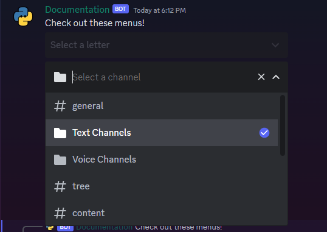
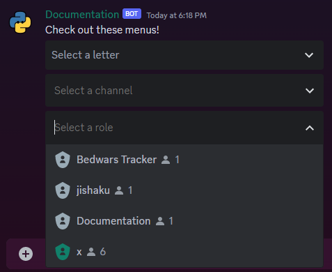
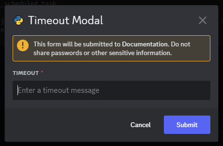

# Views and Components

Components are interactive elements that can be added to messages your bot or app sends to users. Components allow you to leverage discord's built-in UI elements to create interactive messages that users can interact with.

View is a interface defined by discord.py that allows you to manage components and their interactions/callbacks. They are a necessary tool to create interactive messages.

All tools for creating components are located in the `discord.ui` module.

Here are all the components you can create:

- [Button][discord.ui.Button]
- [Select Menu](https://discordpy.readthedocs.io/en/latest/interactions/api.html?highlight=dynamic#select-menus)
    - [Select Menu][discord.ui.Select]
    - [Channel Select Menu][discord.ui.ChannelSelect]
    - [Role Select Menu][discord.ui.RoleSelect]
    - [User Select Menu][discord.ui.UserSelect]
    - [Mentionable Select Menu][discord.ui.MentionableSelect]
- [Modal][discord.ui.Modal]  
    - [Text Input][discord.ui.TextInput]

## Creating a View

To create a view, you must instantiate a subclass of `discord.ui.View` or `discord.ui.View` itself.

Before creating a [View][discord.ui.View] it's necessary to take a look at few of its methods:

- `discord.ui.View.add_item(item)` - Adds a component to the view.
- `discord.ui.View.interaction_check(interaction)` - A check that is called when an interaction is received. If the check returns `True`, the interaction is processed. If the check returns `False`, the interaction is ignored.
- `discord.ui.View.on_error(interaction, error, item)` - A method that is called when an error occurs while processing an interaction, discord.py doesn't handle errors that occur in views, so you must handle them yourself.
- `discord.ui.View.on_timeout()` - A method that is called when the view times out.
- `discord.ui.View.stop()` - Stops the view.
- `discord.ui.View.wait()` - Waits for the view to stop. A view is stopped when `discord.ui.View.stop()` is called or when the view times out.

### Basic View

So keeping these methods in mind, let's create a view:

```py
from __future__ import annotations

import typing

import discord


class MyView(discord.ui.View):
    message: discord.Message | None = None
    count = 0

    def __init__(self, user: discord.User | discord.Member, timeout: float = 60.0) -> None:
        super().__init__(timeout=timeout)
        self.user = user

    # checks for the view's interactions
    async def interaction_check(self, interaction: discord.Interaction[discord.Client]) -> bool:
        # this method should return True if all checks pass, else False is returned
        # for example, you can check if the interaction was created by the user who
        # ran the command:
        if interaction.user == self.user:
            return True
        # else send a message and return False
        await interaction.response.send_message(f"The command was initiated by {self.user.mention}", ephemeral=True)
        return False

    # do stuff on timeout
    async def on_timeout(self) -> None:
        # this method is called when the period mentioned in timeout kwarg passes.
        # we can do tasks like disabling buttons here.
        for button in self.children:
            button.disabled = True  # type: ignore
        # and update the message with the update View.
        if self.message:
            await self.message.edit(view=self)

    # adding a component using it's decorator
    @discord.ui.button(label="0", style=discord.ButtonStyle.green)
    async def counter(self, inter: discord.Interaction, button: discord.ui.Button[MyView]) -> None:
        self.count+=1
        button.label = str(self.count)
        await inter.response.edit_message(view=self)

    # error handler for the view
    async def on_error(
        self, interaction: discord.Interaction[discord.Client], error: Exception, item: discord.ui.Item[typing.Any]
    ) -> None:
        tb = "".join(traceback.format_exception(type(error), error, error.__traceback__))
        message = f"An error occurred while processing the interaction for {str(item)}:\n```py\n{tb}\n```"
        await interaction.response.send_message(message)

@bot.command()
async def test(ctx: commands.Context[commands.Bot]) -> None:
    view = MyView(ctx.author)
    view.message = await ctx.send(
        embed=discord.Embed(
            title="Button Counter", description="Click on the button to count", color=discord.Color.blurple()
        ),
        view=view,
    )

```

{: style="width: 100%;"}

## Working with Views

This is an advance version of the same view system with better content and error handling.

```py
# Our objectives:
# - Create a view that handles errors
# - Create a view that disables all components after timeout
# - Make sure that the view only processes interactions from the user who invoked the command

from __future__ import annotations

import typing
import traceback

import discord
from discord.ui.select import BaseSelect


class BaseView(discord.ui.View):
    interaction: discord.Interaction | None = None
    message: discord.Message | None = None

    def __init__(self, user: discord.User | discord.Member, timeout: float = 60.0):
        super().__init__(timeout=timeout)
        # We set the user who invoked the command as the user who can interact with the view
        self.user = user

    # make sure that the view only processes interactions from the user who invoked the command
    async def interaction_check(self, interaction: discord.Interaction) -> bool:
        if interaction.user.id != self.user.id:
            await interaction.response.send_message(
                "You cannot interact with this view.", ephemeral=True
            )
            return False
        # update the interaction attribute when a valid interaction is received
        self.interaction = interaction
        return True

    def _disable_all(self) -> None:
        # disable all components
        # so components that can be disabled are buttons and select menus
        for item in self.children:
            if isinstance(item, discord.ui.Button) or isinstance(item, BaseSelect):
                item.disabled = True

    # after disabling all components we need to edit the message with the new view
    # now when editing the message there are two scenarios:
    # 1. the view was never interacted with i.e in case of plain timeout here message attribute will come in handy
    # 2. the view was interacted with and the interaction was processed and we have the latest interaction stored in the interaction attribute
    async def _edit(self, **kwargs: typing.Any) -> None:
        if self.interaction is None and self.message is not None:
            # if the view was never interacted with and the message attribute is not None, edit the message
            await self.message.edit(**kwargs)
        elif self.interaction is not None:
            try:
                # if not already responded to, respond to the interaction
                await self.interaction.response.edit_message(**kwargs)
            except discord.InteractionResponded:
                # if already responded to, edit the response
                await self.interaction.edit_original_response(**kwargs)

    # to handle errors we first notify the user that an error has occurred and then disable all components
    async def on_error(self, interaction: discord.Interaction, error: Exception, item: discord.ui.Item[BaseView]) -> None:
        tb = "".join(traceback.format_exception(type(error), error, error.__traceback__))
        message = f"An error occurred while processing the interaction for {str(item)}:\n```py\n{tb}\n```"
        # disable all components
        self._disable_all()
        # edit the message with the error message
        await self._edit(content=message, view=self)
        # stop the view
        self.stop()

    async def on_timeout(self) -> None:
        # disable all components
        self._disable_all()
        # edit the message with the new view
        await self._edit(view=self)
```

!!! tip "Note"
    While all of this seems pretty laborious, it's pretty much just a lot of boilerplate code that you would be having to write over and over again. It's recommended to create a base view class that you can inherit from and then create your own views.

### Testing our view

Now that we have created our view, let's test out wether it works as intended or not:

- Lets start by testing out the `interaction_check` method:

    ```py
    @bot.command()
    async def test(ctx: commands.Context):
        """A command to test our view"""
        # we will set it to the bot user so that the interaction check fails
        view = BaseView(bot.user)
        view.add_item(discord.ui.Button(label="Test", style=discord.ButtonStyle.blurple))
        view.message = await ctx.send("Testing", view=view)
    ```

    {: style="width: 100%;"}

- Now let's test out the `on_error` method by raising an error in the callback:

    ```py
    @bot.command()
    async def test(ctx: commands.Context):
        """A command to test our view"""
        view = BaseView(ctx.author)
        view.add_item(discord.ui.Button(label="Test", style=discord.ButtonStyle.blurple))

        async def callback(interaction: discord.Interaction):
            raise Exception("Test")

        # children is a list of all components in the view
        view.children[0].callback = callback
        view.message = await ctx.send("Testing", view=view)
    ```

    {: style="width: 100%;"}

- Now let's test out the `on_timeout` method by setting the timeout to 5 seconds:

    ```py
    @bot.command()
    async def test(ctx: commands.Context):
        """A command to test our view"""
        view = BaseView(ctx.author, timeout=5.0)
        view.add_item(discord.ui.Button(label="Test", style=discord.ButtonStyle.blurple))
        view.message = await ctx.send("Testing", view=view)
    ```

    {: style="width: 100%;"}

### Using our view

Now that we have created our view, let's use it to make a few simple commands:

=== "A Counter"

    ```py
    @bot.command()
    async def counter(ctx: commands.Context):
        """A counter that counts from 0 to 10"""
        # create a view
        view = BaseView(ctx.author)
        # create a button
        button = discord.ui.Button(label="0", style=discord.ButtonStyle.blurple)
        # create a callback for the button
        async def callback(interaction: discord.Interaction):
            # update the button label
            button.label = str(int(button.label) + 1)
            # edit the message with the new view
            if button.label == "10":
                view._disable_all()
                await view._edit(view=view)
                view.stop()
            else:
                await view._edit(view=view)
        # add the callback to the button
        button.callback = callback
        view.add_item(button)
        # send the message with the view
        view.message = await ctx.send("0-10 Counter", view=view)
    ```

    Now here's the same example but slightly modified to subclass our `BaseView` class:

    ```py
    class CounterView(BaseView):
        @discord.ui.button(label="0", style=discord.ButtonStyle.blurple)
        async def count(self, interaction: discord.Interaction, button: discord.ui.Button[BaseView]):
            button.label = str(int(str(button.label)) + 1)
            if button.label == "10":
                self._disable_all()
                await self._edit(view=self)
                self.stop()
            else:
                await self._edit(view=self)

    @bot.command()
    async def counter(ctx: commands.Context):
        """A counter that counts from 0 to 10"""
        view = CounterView(ctx.author)
        view.message = await ctx.send("0-10 Counter", view=view)
    ```

    Would you look at that, it's so much cleaner and easier to read.

    {: style="width: 100%;"}

=== "A Confirmation View"

    ```py
    @bot.command()
    async def confirm(ctx: commands.Context[CustomBot], user: discord.User | discord.Member):
        """A confirmation view"""
        view = BaseView(ctx.author)
        confirm = discord.ui.Button[BaseView](label="Confirm", style=discord.ButtonStyle.gray, emoji="✅", custom_id="yes")
        cancel = discord.ui.Button[BaseView](label="Cancel", style=discord.ButtonStyle.gray, emoji="❌", custom_id="no")

        async def callback(interaction: discord.Interaction):
            view.confirmed = interaction.data["custom_id"] == "yes"
            view._disable_all()
            await view._edit(view=view)
            view.stop()

        confirm.callback = cancel.callback = callback
        view.add_item(confirm)
        view.add_item(cancel)
        view.message = await ctx.send("Are you sure you want to confirm?", view=view)
        # wait for the view to stop
        await view.wait()
        await ctx.send("Confirmed" if view.confirmed else "Cancelled")
    ```

    And here's the same example but slightly modified to subclass our `BaseView` class:

    ```py
    class ConfirmationView(BaseView):
        confirmed: bool | None = None

        @discord.ui.button(label="Confirm", style=discord.ButtonStyle.gray, emoji="✅", custom_id="yes")
        async def confirm(self, interaction: discord.Interaction, button: discord.ui.Button[BaseView]):
            self.confirmed = True
            self._disable_all()
            await self._edit(view=self)
            self.stop()

        @discord.ui.button(label="Cancel", style=discord.ButtonStyle.gray, emoji="❌", custom_id="no")
        async def cancel(self, interaction: discord.Interaction, button: discord.ui.Button[BaseView]):
            self.confirmed = False
            self._disable_all()
            await self._edit(view=self)
            self.stop()

    @bot.command()
    async def confirm(ctx: commands.Context[CustomBot], user: discord.User | discord.Member):
        """A confirmation view"""
        view = ConfirmationView(ctx.author)
        view.message = await ctx.send("Are you sure you want to confirm?", view=view)
        # wait for the view to stop
        await view.wait()
        await ctx.send("Confirmed" if view.confirmed else "Cancelled")
    ```

    {: style="width: 100%;"}

## Buttons

Buttons are interactive components that render in messages. They can be clicked by users, and send an interaction to your app when clicked. A single message can have up to `25` buttons, 5 in each row.

Buttons have the following attributes:

- `label` - The text that appears on the button.
- `style` - The style of the button. Can be one of `discord.ButtonStyle.primary`, `discord.ButtonStyle.secondary`, `discord.ButtonStyle.success`, `discord.ButtonStyle.danger` or `discord.ButtonStyle.link`.
- `emoji` - The emoji that appears on the button.
- `url` - The url that the button links to if the style is `discord.ButtonStyle.link`.
- `disabled` - Whether the button is disabled or not.
- `custom_id` - The unique identifier for the button. This is used to identify the button when an interaction is received.

{: style="width: 100%;"}

### Creating a Button

Buttons can be created either of two ways:  

- By instantiating a `discord.ui.Button` object and adding it to a view.
- By using the `discord.ui.button` decorator to decorate a qualified callback in a subclass of `discord.ui.View`.

=== "Normal Buttons"
    ```py
    @bot.command()
    async def all_buttons(ctx: commands.Context):
        """A command to test all button styles"""
        view = BaseView(ctx.author)
        styles = [
            discord.ButtonStyle.primary,
            discord.ButtonStyle.secondary,
            discord.ButtonStyle.success,
            discord.ButtonStyle.danger,
        ]
        for style in styles:
            view.add_item(discord.ui.Button(label=style.name.title(), style=style))
        view.message = await ctx.send("All Buttons", view=view)
    ```

    {: style="width: 100%;"}

=== "Link Buttons"
    ```py
    @bot.command()
    async def link_button(ctx: commands.Context):
        """A command to test link buttons"""
        view = BaseView(ctx.author)
        view.add_item(discord.ui.Button(label="Link", style=discord.ButtonStyle.link, url="https://google.com"))
        view.message = await ctx.send("Link Button", view=view)
    ```

    {: style="width: 100%;"}

=== "Emoji Buttons"
    ```py
    @bot.command()
    async def emoji_button(ctx: commands.Context):
        """A command to test emoji buttons"""
        view = BaseView(ctx.author)
        emojis = ['⏮️', '◀️', '⏹️', '▶️', '⏭️']
        for emoji in emojis:
            view.add_item(discord.ui.Button(label=emoji, style=discord.ButtonStyle.gray, emoji=emoji))
        view.message = await ctx.send("Emoji Buttons", view=view)
    ```
    {: style="width: 100%;"}

!!! tip "Note"
    You can use any emoji as a button emoji, even custom emojis. To get the emoji code for a custom emoji, type `\:emoji:` in discord and send the message. Then copy the emoji code and paste it in the `emoji` parameter of the `discord.ui.Button` constructor.

    ```py
    @bot.command()
    async def custom_emoji_button(ctx: commands.Context):
        """A command to test custom emoji buttons"""
        view = BaseView(ctx.author)
        view.add_item(discord.ui.Button(style=discord.ButtonStyle.gray, emoji="<a:loveroll:632598533316542465>"))
        view.message = await ctx.send("Custom Emoji Button", view=view)
    ```

    { align="left" }

Buttons can have `custom_id`s, which are unique identifiers that can be used to identify a button. In a given message, all buttons must have unique `custom_id`s. If two buttons have the same `custom_id`, an error will be raised.

```py
@bot.command()
async def custom_id_button(ctx: commands.Context):
    """A command to test custom id buttons"""
    view = BaseView(ctx.author)
    view.add_item(discord.ui.Button(label="Custom ID", style=discord.ButtonStyle.gray, custom_id="custom_id"))

    async def callback(interaction: discord.Interaction):
        await view._edit(content=str(interaction.data))

    view.children[0].callback = callback
    view.message = await ctx.send("Custom ID Button", view=view)
```

{: style="width: 100%;"}

One major use of custom ids is to create create persistent views. Persistent views are views that work even after the bot restarts and has no time limit.

### Persistent Buttons

In order for a view to be persistent, it must meet the following criteria:

- The timeout must be set to `None`.
- Every component in the view must have a unique `custom_id`.
- The view must be added to the bot's persistent views.

```py
class PersistentView(discord.ui.View):
    def __init__(self):
        super().__init__(timeout=None)  
        colors = [
            discord.ButtonStyle.red,
            discord.ButtonStyle.blurple,
            discord.ButtonStyle.green,
            discord.ButtonStyle.grey,
        ]
        for color in colors:
            self.add_item(discord.ui.Button(label=color.name.title(), style=color, custom_id=color.name))
            self.children[-1].callback = self.callback

    async def callback(self, interaction: discord.Interaction) -> None:
        await interaction.response.send_message(f"You clicked {interaction.data['custom_id']}", ephemeral=True)


@bot.command()
async def persistent(ctx: commands.Context):
    """A command to test persistent views"""
    await ctx.send("Persistent View", view=PersistentView())
```

!!! warning "Warning"
    The persistent view needs to be added to the bot's persistent views, otherwise it will not work.

    ```py
    async def setup_hook():
        bot.add_view(PersistentView())

    bot.setup_hook = setup_hook
    ```
    There are multiple places to add the persistent view, you can add it in the `setup_hook` or in one of the cog's `cog_load` methods. Just make sure that the view is added before the bot starts.

{: style="width: 100%;"}

!!! warning "Warning"
    At the time of writing this guide, the following part of [persistent buttons](#persistent-buttons) tutorial requires the development version of discord.py. So you will have to install the development version of discord.py to `DynamicItem`s.

    ```bash
    pip install -U git+https://github.com/Rapptz/discord.py
    ```

Why did we not use our `BaseView` class? Well, the `BaseView` class has attributes such as `message`, `interaction` and `user` these don't persist after the bot restarts. So to say persistent views don't have any memory of the previous state of the view. Also a large part of our base view class is dedicated to handling timeouts and disabling components after timeout, which is not necessary for persistent views.

Ok so now that we know that memory is not persistent, how do we make it persistent? Well, one way to do it is to use a database to store the state of the view and it's related attributes such as `guild_id`, `channel_id`, `message_id` and `view_state`. Then when the bot restarts, we can fetch the view state from the database and recreate the view in the `interaction_check` method. But this is a lot of work and requires a database.

So is there a simpler way to do this? Well, yes there is. Is it recommended? Well, depends the amount of data you want to store. So in order to deal with such cases `discord.py` provides a [`discord.ui.DynamicItem`][] class which uses the `custom_id` of the component to store data. It takes a parameter `template` which receives a [regex](https://docs.python.org/3/library/re.html) pattern and uses it to extract data from the `custom_id` of the component.

Here's an example:

```py
data = "counter:0:user:1234567890" # this is the data in the custom_id counter:<count>:user:<user_id>
template = re.compile(r"counter:(?P<count>\d+):user:(?P<user_id>\d+)") # this is the regex pattern
match = template.match(data) # match the data with the pattern
print(match.groupdict()) # print the matched data
```

!!! failure "Important"
    You can have a maximum of `100` characters in the `custom_id` of a component.

{: style="width: 100%;"}

Now that we know how to extract data from the `custom_id` of a component, let's create a persistent counter:

```py
from __future__ import annotations

import re
import typing


# DynamicItem is used to work with custom ids of components that store the required data
class DynamicCounter(discord.ui.DynamicItem[discord.ui.Button[discord.ui.View]], template=r"counter:(?P<count>\d+):user:(?P<user_id>\d+)"):
    def __init__(self, count: int, user_id: int):
        self.count = count
        self.user_id = user_id
        super().__init__(
            discord.ui.Button(
                style=discord.ButtonStyle.blurple, label=str(count), custom_id=f"counter:{count}:user:{user_id}"
            )
        )

    # This method needs to be implemented when subclassing DynamicItem
    @classmethod
    async def from_custom_id(cls, interaction: discord.Interaction, item: Item[typing.Any], match: re.Match[str]) -> discord.ui.DynamicItem[typing.Any]:
        return cls(int(match.group("count")), int(match.group("user_id")))

    async def interaction_check(self, interaction: discord.Interaction) -> bool:
        return interaction.user.id == self.user_id

    async def callback(self, interaction: discord.Interaction) -> None:
        self.count += 1
        self.item.label = str(self.count)
        self.item.custom_id = f"counter:{self.count}:user:{self.user_id}"
        await interaction.response.edit_message(view=self.view)


@bot.command()
async def persistent_counter(ctx: commands.Context):
    """A command to test persistent counters"""
    view = discord.ui.View(timeout=None)
    view.add_item(DynamicCounter(0, ctx.author.id))
    await ctx.send("Persistent Counter", view=view)
```

{: style="width: 100%;"}

!!! warning "Warning"
    Similar to persistent views, dynamic items also need to be added to the bot's dynamic items.

    ```py
    async def setup_hook():
        bot.add_dynamic_items(DynamicCounter)

    bot.setup_hook = setup_hook
    ```

    There are multiple places to add the dynamic item, you can add it in the `setup_hook` or in one of the cog's `cog_load` methods. Just make sure that the dynamic item is added before the bot starts.

## Select Menus

Select menus are interactive components that allow users to select one or more options from a dropdown list in messages. A single message can have up to `5` select menus and each select menu can have up to `25` options.

Select menus have the following attributes:

- `placeholder` - The text that appears on the select menu when no option is selected.
- `min_values` - The minimum number of options that can be selected.
- `max_values` - The maximum number of options that can be selected.
- `options` - The options that appear in the select menu.
- `disabled` - Whether the select menu is disabled or not.
- `custom_id` - The unique identifier for the select menu. This is used to identify the select menu when an interaction is received.
- `values` - The values of the selected options it's a list of strings.

{: style="width: 100%;"}

### Creating a Select Menu

Select menus can be created either of two ways:

- By instantiating a `discord.ui.Select` object and adding it to a view.
- By using the `discord.ui.select` decorator to decorate a qualified callback in a subclass of `discord.ui.View`.

=== "Normal Select Menus"

    ```py
    class Menu(BaseView):
        @discord.ui.select(
            cls=discord.ui.Select,
            options=[discord.SelectOption(emoji=f"{chr(127462 + i)}", label=f"{chr(65 + i)}") for i in range(26)][:25],
            placeholder="Select a letter",
            min_values=1,
            max_values=1,
        )
        async def select(self, interaction: discord.Interaction, select: discord.ui.Select[Menus]) -> None:
            await interaction.response.defer()
            await interaction.followup.send(f"You selected {select.values[0]}", ephemeral=True)


    @bot.command()
    async def select_menu(ctx: commands.Context):
        """A command to test select menus"""
        view = Menu(ctx.author)
        view.message = await ctx.send("Select Menu", view=view)
    ```

    

=== "Channel Select Menu"

    ```py
    class ChannelMenu(BaseView):
        @discord.ui.select(
            cls=discord.ui.ChannelSelect,
            placeholder="Select a channel",
            min_values=1,
            max_values=1,
        )
        async def channel_select(self, interaction: discord.Interaction, select: discord.ui.ChannelSelect[Menus]) -> None:
            await interaction.response.defer()
            await interaction.followup.send(f"You selected {select.values[0]}", ephemeral=True)


    @bot.command()
    async def channel_select_menu(ctx: commands.Context):
        """A command to test channel select menus"""
        view = ChannelMenu(ctx.author)
        view.message = await ctx.send("Channel Select Menu", view=view)
    ```

    

=== "Role Select Menu"

    ```py
    class RoleMenu(BaseView):
        @discord.ui.select(
            cls=discord.ui.RoleSelect,
            placeholder="Select a role",
            min_values=1,
            max_values=1,
        )
        async def role_select(self, interaction: discord.Interaction, select: discord.ui.RoleSelect[Menus]) -> None:
            await interaction.response.defer()
            await interaction.followup.send(f"You selected {select.values[0]}", ephemeral=True)


    @bot.command()
    async def role_select_menu(ctx: commands.Context):
        """A command to test role select menus"""
        view = RoleMenu(ctx.author)
        view.message = await ctx.send("Role Select Menu", view=view)
    ```

    

=== "User Select Menu"

    ```py
    class UserMenu(BaseView):
        @discord.ui.select(
            cls=discord.ui.UserSelect,
            placeholder="Select a user",
            min_values=1,
            max_values=1,
        )
        async def user_select(self, interaction: discord.Interaction, select: discord.ui.UserSelect[Menus]) -> None:
            await interaction.response.defer()
            await interaction.followup.send(f"You selected {select.values[0]}", ephemeral=True)


    @bot.command()
    async def user_select_menu(ctx: commands.Context):
        """A command to test user select menus"""
        view = UserMenu(ctx.author)
        view.message = await ctx.send("User Select Menu", view=view)
    ```

    

=== "Mentionable Select Menu"

    ```py
    class MentionableMenu(BaseView):
        @discord.ui.select(
            cls=discord.ui.MentionableSelect,
            placeholder="Select a mentionable",
            min_values=1,
            max_values=1,
        )
        async def mentionable_select(self, interaction: discord.Interaction, select: discord.ui.MentionableSelect[Menus]) -> None:
            await interaction.response.defer()
            await interaction.followup.send(f"You selected {select.values[0]}", ephemeral=True)


    @bot.command()
    async def mentionable_select_menu(ctx: commands.Context):
        """A command to test mentionable select menus"""
        view = MentionableMenu(ctx.author)
        view.message = await ctx.send("Mentionable Select Menu", view=view)
    ```

    

### Persistent Select Menus

In order for a view to be persistent, it must meet the following criteria:

- The timeout must be set to `None`.
- Every component in the view must have a unique `custom_id`.
- The view must be added to the bot's persistent views.

```py
class PersistentMenu(discord.ui.View):
    def __init__(self):
        super().__init__(timeout=None)
        self.menu = discord.ui.Select[PersistentMenu](
            custom_id="persistent_menu",
            placeholder="Select a letter",
            min_values=1,
            max_values=1,
            options=[discord.SelectOption(emoji=f"{chr(127462 + i)}", label=f"{chr(65 + i)}") for i in range(26)][:25],
        )
        self.menu.callback = self.callback
        self.add_item(self.menu)

    async def callback(self, interaction: discord.Interaction) -> None:
        await interaction.response.defer()
        assert interaction.data is not None and "custom_id" in interaction.data, "Invalid interaction data"
        await interaction.followup.send(f"You clicked {self.menu.values[0]}", ephemeral=True)


@bot.command()
async def persistent_select_menu(ctx: commands.Context):
    """A command to test persistent select menus"""
    await ctx.send("Persistent Select Menu", view=PersistentMenu())
```


!!! warning "Warning"
    Similar to persistent views, persistent select menus also need to be added to the bot's persistent views.

    ```py
    async def setup_hook():
        bot.add_view(PersistentMenu())

    bot.setup_hook = setup_hook
    ```

    There are multiple places to add the persistent select menu, you can add it in the `setup_hook` or in one of the cog's `cog_load` methods. Just make sure that the view is added before the bot starts.

!!! warning "Warning"
    At the time of writing this guide, the following part of [persistent menus](#persistent-select-menus) tutorial requires the development version of discord.py. So you will have to install the development version of discord.py to `DynamicItem`s.

    ```bash
    pip install -U git+https://github.com/Rapptz/discord.py
    ```

Similar to how we used `discord.ui.DynamicItem` to create persistent counters with buttons, we can use `discord.ui.DynamicItem` to work with menus as well.

```py
from __future__ import annotations

import re
import typing

class DynamicSelect(discord.ui.DynamicItem[discord.ui.Select[discord.ui.View]], template=r"select-user:(?P<user_id>\d+)"):
    def __init__(self, user_id: int):
        self.user_id = user_id
        super().__init__(
            discord.ui.Select(
                custom_id=f"select-user:{user_id}",
                placeholder="Select a letter",
                min_values=1,
                max_values=1,
                options=[discord.SelectOption(emoji=f"{chr(127462 + i)}", label=f"{chr(65 + i)}") for i in range(26)][:25],
            )
        )

    # This method needs to be implemented when subclassing DynamicItem
    @classmethod
    async def from_custom_id(cls, interaction: discord.Interaction, item: Item[typing.Any], match: re.Match[str]) -> discord.ui.DynamicItem[typing.Any]:
        return cls(int(match.group("user_id")))

    async def interaction_check(self, interaction: discord.Interaction) -> bool:
        return interaction.user.id == self.user_id

    async def callback(self, interaction: discord.Interaction) -> None:
        await interaction.response.defer()
        assert interaction.data is not None and "custom_id" in interaction.data, "Invalid interaction data"
        await interaction.followup.send(f"You clicked {self.item.values[0]}", ephemeral=True)


@bot.command()
async def persistent_dynamic_select_menu(ctx: commands.Context):
    """A command to test persistent dynamic select menus"""
    view = discord.ui.View(timeout=None)
    view.add_item(DynamicSelect(ctx.author.id))
    await ctx.send("Persistent Dynamic Select Menu", view=view)
```


!!! warning "Warning"
    Similar to persistent views, dynamic items also need to be added to the bot's dynamic items.

    ```py
    async def setup_hook():
        bot.add_dynamic_items(DynamicSelect)

    bot.setup_hook = setup_hook
    ```

    There are multiple places to add the dynamic item, you can add it in the `setup_hook` or in one of the cog's `cog_load` methods. Just make sure that the dynamic item is added before the bot starts.

## Modals

Modals are how you can prompt users for further detailed input. They act as form popups, and work in tandem with interactive components called Text Inputs. These inputs can have various formats to accept information from the user on prompt, and use the callback to process that information. A modal can only have [`Text Input`][discord.ui.TextInput] components.

Like views, we need to take a look at a few of the methods of the `discord.ui.Modal` class to understand how to create a modal:

- `on_error(interaction, error, item)` - A method that is called when an error occurs while processing an interaction, discord.py doesn't handle errors that occur in modals, so you must handle them yourself.
- `on_submit(interaction)` - A method that is called when the modal is submitted.
- `interaction_check(interaction)` - A check that is called when an interaction is received. If the check returns `True`, the interaction is processed. If the check returns `False`, the interaction is ignored.
- `stop()` - Stops the modal.
- `wait()` - Waits for the modal to stop. A modal is stopped when `discord.ui.Modal.stop()` is called or when the modal times out.

So now just like how we created a base view class, let's create a base modal class:

```py
from __future__ import annotations

import traceback

import discord

class BaseModal(discord.ui.Modal):
    _interaction: discord.Interaction | None = None

    # sets the interaction attribute when a valid interaction is received i.e modal is submitted
    # via this we can know if the modal was submitted or it timed out
    async def on_submit(self, interaction: discord.Interaction) -> None:
        # if not responded to, defer the interaction
        if not interaction.response.is_done():
            await interaction.response.defer()
        self._interaction = interaction
        self.stop()

    # make sure any errors don't get ignored
    async def on_error(self, interaction: discord.Interaction, error: Exception) -> None:
        tb = "".join(traceback.format_exception(type(error), error, error.__traceback__))
        message = f"An error occurred while processing the interaction:\n```py\n{tb}\n```"
        try:
            await interaction.response.send_message(message, ephemeral=True)
        except discord.InteractionResponded:
            await interaction.edit_original_response(content=message, view=None)
        self.stop()

    @property
    def interaction(self) -> discord.Interaction | None:
        return self._interaction
```

Modals can only have text inputs, so let's take a look at the [`discord.ui.TextInput`][] class:

- `label` - The text that appears above the text input.
- `placeholder` - The text that appears in the text input when no text is entered.
- `min_length` - The minimum length of the text that can be entered.
- `max_length` - The maximum length of the text that can be entered.
- `style` - The style of the text input. Can be one of `discord.TextStyle.short`, `discord.TextStyle.long` or `discord.TextStyle.paragraph` which is just an alias for `discord.TextStyle.long`.
- `value` - The value of the text input.

With that out of the way, let's delve into testing and working with modals.

### Testing our modal

Now that we have created our modal, let's test out whether it works as intended or not:

- Lets start by testing out the `on_error` method by raising an error in the callback:

    ```py
    import typing

    @bot.tree.command()
    async def modal(inter: discord.Interaction):
        """A command to test modals"""
        mymodal = BaseModal(title="Error Modal")

        async def callback(interaction: discord.Interaction) -> None:
            raise RuntimeError(typing.cast(discord.ui.TextInput[BaseModal], mymodal.children[0]).value)

        mymodal.add_item(discord.ui.TextInput(label="Error", placeholder="Enter an error message", min_length=1, max_length=100))
        mymodal.on_submit = callback
        await inter.response.send_modal(mymodal)
    ```

    { align=left width="65%" }
    { width="30%" }

- Now let's test out the `on_timeout` method by setting the timeout to 5 seconds:

    ```py
    import typing

    @bot.tree.command()
    async def modal(inter: discord.Interaction):
        """A command to test modals"""
        mymodal = BaseModal(title="Timeout Modal", timeout=5.0)
        mymodal.add_item(discord.ui.TextInput(label="Timeout", placeholder="Enter a timeout message", min_length=1, max_length=100))
        await inter.response.send_modal(mymodal)
        await mymodal.wait()
        await inter.followup.send("Modal Timed Out" if mymodal.interaction is None else "Modal Submitted")
    ```

    { align=left width="65%" }
    { width="30%" }

### Using our modal

Now that we have created our modal, let's use it to make a simple `Tag Creation` system:

```py
class TagModal(BaseModal, title="Tag Creation"):
    tag_title = discord.ui.TextInput(label="Tag Title", placeholder="Enter a tag title", min_length=1, max_length=100, style=discord.TextStyle.short)
    tag_content = discord.ui.TextInput(label="Tag Content", placeholder="Enter a tag content", min_length=1, max_length=300, style=discord.TextStyle.long)

    async def on_submit(self, interaction: discord.Interaction) -> None:
        embed = discord.Embed(title=self.tag_title.value, description=self.tag_content.value, color=discord.Color.blurple())
        embed.set_thumbnail(url=interaction.user.display_avatar)
        embed.timestamp = discord.utils.utcnow()
        await interaction.response.send_message(embed=embed, ephemeral=True)
        await super().on_submit(interaction)


@bot.tree.command()
async def tag(inter: discord.Interaction):
    """A command to test modals"""
    await inter.response.send_modal(TagModal())
```

{ align=left width="65%" }
{ width="30%" }

!!! warning "Note"
    A modal can have a total of 5 text inputs. Text inputs can have a maximum of 4000 characters.

## Conclusion

This concludes the basics of utilizing discord components in your bot. You can use these components to create interactive commands and menus, pagination system, games, etc. The possibilities are endless.
